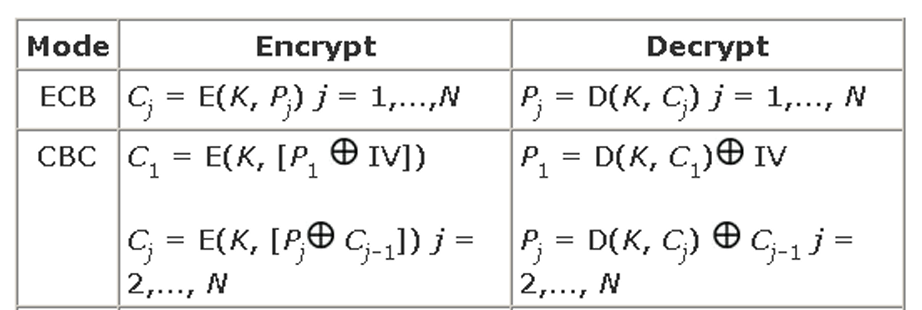

Chào bạn, để nắm vững chương **Mã hóa đối xứng** này phục vụ cho thi cử và áp dụng thực tế, bạn không cần nhớ từng dòng code hay lịch sử dông dài.

Dưới đây là bản **tổng hợp cốt lõi và trọng tâm nhất** (Cheat Sheet) của chương này:

---

### 1. Nguyên lý cơ bản

- **Định nghĩa:** Người gửi và người nhận dùng **chung 1 khóa bí mật** ($K$).
- **Mô hình:**
  - Mã hóa: $C = E_K(P)$
  - Giải mã: $P = D_K(C)$
- **Hai tính chất "sống còn" (Claude Shannon):**
  1.  **Khuếch tán (Diffusion):** Làm loang vết thống kê của bản rõ ra toàn bộ bản mã (liên quan đến Hoán vị/Permutation).
  2.  **Nhầm lẫn (Confusion):** Làm mất mối liên hệ giữa bản mã và khóa (liên quan đến Thay thế/Substitution).
- **Nguyên tắc Kerckhoffs:** Sự an toàn phải nằm ở **Khóa**, thuật toán được phép công khai.

---

### 2. Hai chuẩn mã hóa quan trọng (DES và AES)

Đây là phần trọng tâm nhất, thường xuyên bị hỏi so sánh.

| Đặc điểm             | **DES (Cũ - Data Encryption Standard)**          | **AES (Mới - Advanced Encryption Standard)**                      |
| :------------------- | :----------------------------------------------- | :---------------------------------------------------------------- |
| **Cấu trúc**         | **Feistel Network** (Chia đôi khối, xử lý 1 nửa) | **SPN** (Substitution-Permutation Network - Xử lý cả khối)        |
| **Kích thước khối**  | 64 bits                                          | **128 bits**                                                      |
| **Kích thước khóa**  | 56 bits (Quá ngắn, dễ bị Brute-force)            | 128, 192, hoặc 256 bits (An toàn)                                 |
| **Số vòng lặp**      | 16 vòng                                          | 10 (key 128), 12 (key 192), 14 (key 256)                          |
| **Thành phần chính** | Hoán vị (P), Thay thế (S-box), XOR               | **4 bước biến đổi:** SubBytes, ShiftRows, MixColumns, AddRoundKey |
| **Trạng thái**       | Không an toàn -> Dùng **3DES** (chậm) để vá      | **Chuẩn an toàn hiện tại**, hiệu năng cao                         |

**Chi tiết 4 bước của AES (Phải nhớ):**

1.  **SubBytes:** Thay thế phi tuyến (dùng S-box) $\rightarrow$ Tạo tính **Confusion**.
2.  **ShiftRows:** Dịch hàng $\rightarrow$ Tạo tính **Diffusion**.
3.  **MixColumns:** Trộn cột (nhân ma trận trong $GF(2^8)$) $\rightarrow$ Tạo tính **Diffusion**.
4.  **AddRoundKey:** Cộng khóa (XOR) $\rightarrow$ Bước duy nhất dùng khóa.
    Dựa trên tài liệu bạn cung cấp, trình tự thực hiện cốt lõi của Triple-DES (3DES) là **Mã hóa - Giải mã - Mã hóa** (viết tắt là **E-D-E**).

Cụ thể, quy trình này vận hành theo hai trường hợp sử dụng khóa như sau:

**1. Triple-DES với 2 khóa (K1 và K2)**
Đây là cấu hình phổ biến (được chuẩn hóa trong ANSI X9.17 & ISO8732). Trình tự thực hiện là:

1.  **Mã hóa** bản rõ bằng khóa **K1**.
2.  **Giải mã** kết quả vừa có bằng khóa **K2**.
3.  **Mã hóa** kết quả đó một lần nữa bằng khóa **K1**.

- Công thức: $C = E_{K1}(D_{K2}(E_{K1}(P)))$.

**2. Triple-DES với 3 khóa (K1, K2 và K3)**
Để tăng cường bảo mật cao hơn (tránh một số tấn công lý thuyết), người ta dùng 3 khóa riêng biệt nhưng vẫn giữ nguyên trình tự E-D-E:

1.  **Mã hóa** bản rõ bằng khóa **K1**.
2.  **Giải mã** kết quả bằng khóa **K2**.
3.  **Mã hóa** kết quả bằng khóa **K3**.

- Công thức: $C = E_{K3}(D_{K2}(E_{K1}(P)))$.

**Tại sao bước ở giữa lại là Giải mã (Decrypt) thay vì Mã hóa?**
Mặc dù việc giải mã bằng một khóa _sai_ (K2 khác K1) thực chất chỉ làm dữ liệu rối tung thêm (tương đương với việc mã hóa về mặt an toàn), nhưng mục đích chính của thiết kế E-D-E là để đảm bảo **tương thích ngược**:

- Nếu ta gán **K1 = K2**, bước giải mã thứ hai sẽ hủy bỏ bước mã hóa thứ nhất ($D_{K1}(E_{K1}(P)) = P$).
- Khi đó, toàn bộ quy trình chỉ còn lại một lần mã hóa cuối cùng ($E_{K1}$), giúp hệ thống Triple-DES hoạt động y hệt như chuẩn DES đơn (Single DES) cũ.

## **Tóm lại để làm trắc nghiệm:** Hãy nhớ kỹ từ khóa **E-D-E** (Encrypt - Decrypt - Encrypt). Nếu đề bài hỏi về trường hợp K1=K2, đáp án là nó trở về DES thông thường.

### 3. Toán học nền tảng (Cơ sở của AES)

- **Phép XOR:** Là phép cộng cơ bản trong máy tính ($1+1=0$).
- **Trường hữu hạn (Finite Field):** AES hoạt động trên trường **$GF(2^8)$** (tương ứng 1 byte = 8 bit).
- **Đa thức bất quy tắc:** Dùng để chia lấy dư trong phép nhân đa thức (giúp kết quả luôn nằm gọn trong 1 byte).
- **Thuật toán Euclid mở rộng:** Dùng để tìm **nghịch đảo** (cần thiết để thiết kế S-box hoặc RSA sau này).

---

### 4. Các chế độ hoạt động (Modes of Operation)

Dùng để mã hóa dữ liệu lớn hơn 1 khối (file, video, stream).

| Chế độ                          | Nguyên tắc                              | Ưu điểm                                              | Nhược điểm                                                                      |
| :------------------------------ | :-------------------------------------- | :--------------------------------------------------- | :------------------------------------------------------------------------------ |
| **ECB** (Electronic Code Book)  | Mã hóa từng khối độc lập.               | Đơn giản, nhanh.                                     | **Rất yếu.** Mẫu bản rõ lặp lại $\rightarrow$ bản mã lặp lại (lộ cấu trúc ảnh). |
| **CBC** (Cipher Block Chaining) | $C_i = E(P_i \oplus C_{i-1})$. Dùng IV. | An toàn, phổ biến.                                   | Phải mã hóa **tuần tự** (chậm), lỗi lan truyền.                                 |
| **CTR** (Counter)               | Mã hóa bộ đếm, rồi XOR với bản rõ.      | **Nhanh nhất** (Song song hóa), truy cập ngẫu nhiên. | **Cấm dùng lại** cặp (Key, Counter) (chết người).                               |
| **CFB / OFB**                   | Giả lập mã dòng (Stream cipher).        | Tốt cho truyền bit lẻ (telnet), đường truyền nhiễu.  | Ít dùng hơn CTR ngày nay.                                                       |

Dựa trên tài liệu bạn cung cấp (đặc biệt là các trang từ đến trong "C2.pdf"), dưới đây là nội dung chi tiết về **5 chế độ hoạt động (Modes of Operation)** của mã hóa khối mà bạn cần nắm chắc.

Các chế độ này được sinh ra vì thuật toán mã hóa khối (như DES, AES) chỉ xử lý các khối dữ liệu cố định (ví dụ 64 bit hoặc 128 bit). Để mã hóa một lượng dữ liệu tùy ý trong thực tế, ta cần các chế độ này.

Trước khi đi vào từng chế độ, bạn cần biết về **Padding (Thêm vào thông điệp):** Nếu dữ liệu không đủ kích thước khối, hệ thống phải thêm vào các byte (byte 0, byte khoảng trắng, hoặc byte chỉ số lượng thêm vào theo chuẩn PKCS) để lấp đầy khối cuối cùng.

---

### 1. Electronic Code Book (ECB) - Quyển mã điện tử

Đây là chế độ cơ bản nhất.

- **Cơ chế:** Thông điệp được chia thành các khối độc lập. Mỗi khối được mã hóa riêng biệt với cùng một khóa ($C_i = E_K(P_i)$).
- **Ưu điểm:**
  - Đơn giản.
  - Có thể xử lý **song song** (mã hóa/giải mã nhiều khối cùng lúc).
- **Nhược điểm (Rất quan trọng):**
  - **Yếu:** Các khối bản rõ giống nhau sẽ tạo ra các khối bản mã giống hệt nhau.
  - Dễ bị phân tích mẫu (pattern), ví dụ như khi mã hóa dữ liệu đồ họa/hình ảnh, người ta vẫn có thể nhìn thấy hình dáng của ảnh gốc.
- **Ứng dụng:** Chỉ dùng khi có rất ít khối cần gửi.

### 2. Cipher Block Chaining (CBC) - Mã hóa khối liên kết

Đây là chế độ phổ biến để khắc phục điểm yếu của ECB.

- **Cơ chế:** Các khối được móc xích với nhau. Trước khi mã hóa, khối bản rõ hiện tại được **XOR** với khối bản mã trước đó ($C_i = E_K(P_i \oplus C_{i-1})$). Khối đầu tiên cần một **Vector khởi tạo (IV - Initial Vector)**.
- **Ưu điểm:**
  - Bảo mật tốt hơn ECB: Bất kỳ thay đổi nhỏ nào trên một khối bản rõ sẽ ảnh hưởng lan truyền đến tất cả các khối mã sau đó.
  - Thích hợp mã hóa dữ liệu lớn.
- **Nhược điểm:**
  - Cần quản lý IV: IV phải được biết bởi cả hai bên. Nếu IV gửi dạng bản rõ, kẻ tấn công có thể sửa đổi nó. IV nên được cố định hoặc gửi kèm dưới dạng đã mã hóa.
  - Không thể mã hóa song song (vì khối sau phải chờ kết quả khối trước).

### 3. Cipher FeedBack (CFB) - Phản hồi mã

Chế độ này biến mã hóa khối thành **mã hóa dòng (stream cipher)**.

- **Cơ chế:** Xem thông điệp như một dòng các bit. Đầu ra của khối mã hóa trước đó được đưa quay lại (feedback) làm đầu vào cho khối tiếp theo. Kết quả mã hóa được XOR với bản rõ để tạo ra bản mã.
- **Ưu điểm:**
  - Thích hợp cho dữ liệu dạng dòng bit/byte (stream).
  - Là chế độ phổ biến nhất của mã hóa dòng.
- **Nhược điểm:**
  - **Lỗi lan truyền:** Nếu xảy ra lỗi trên đường truyền, nó sẽ lan truyền và làm sai lệch nhiều khối sau đó.
  - Cần đường truyền tin cậy.

### 4. Output FeedBack (OFB) - Phản hồi đầu ra

Tương tự CFB nhưng cơ chế phản hồi khác biệt để tránh lan truyền lỗi.

- **Cơ chế:** Đầu ra của hàm mã hóa (Output) được đưa quay lại làm đầu vào cho bước tiếp theo (độc lập với bản rõ/bản mã). Dòng khóa (keystream) này sau đó mới XOR với bản rõ,.
- **Ưu điểm:**
  - **Không lan truyền lỗi:** Lỗi trên một bit truyền đi chỉ ảnh hưởng đến bit đó khi giải mã, không làm hỏng các bit sau.
- **Nhược điểm:**
  - Dễ bị tổn thương nếu kẻ tấn công thay đổi dòng thông điệp (modification attack).
  - Nên sử dụng phản hồi đầy đủ (Full feedback OFB-64/128) để an toàn hơn.

### 5. Counter (CTR) - Bộ đếm

Đây là chế độ hiện đại, được xem là chuẩn khi dùng với AES.

- **Cơ chế:** Là một phiên bản của OFB, nhưng thay vì phản hồi đầu ra, nó mã hóa một giá trị **Bộ đếm (Counter)**. Giá trị Counter + Khóa sẽ được mã hóa để tạo ra dòng khóa, sau đó XOR với bản rõ.
- **Ưu điểm vượt trội:**
  - **Hiệu quả cao:** Có thể thực hiện mã hóa **song song** (cả phần cứng và phần mềm) vì các counter độc lập nhau.
  - Truy cập ngẫu nhiên: Có thể giải mã một khối bất kỳ mà không cần giải mã các khối trước.
  - Thích hợp cho mạng tốc độ cao,.
- **Nhược điểm (Cực kỳ quan trọng):**
  - Tuyệt đối **không tái sử dụng** cặp (Khóa, Counter). Nếu dùng lại, hệ thống sẽ bị bẻ gãy.

---

### Tóm tắt so sánh để dễ nhớ:

1.  **ECB:** Đơn giản, nhanh, nhưng lộ mẫu (không an toàn cho dữ liệu lớn).
2.  **CBC:** An toàn, phổ biến, cần IV, lỗi lan truyền.
3.  **CFB:** Biến mã khối thành mã dòng, lỗi lan truyền.
4.  **OFB:** Mã dòng, lỗi **không** lan truyền.
5.  **CTR:** Mã dòng (dựa trên bộ đếm), hỗ trợ **xử lý song song**, nhanh nhất, cấm dùng lại Counter.

**Gợi ý hình tượng (Analogy):**
Hãy tưởng tượng việc mã hóa giống như việc dịch một cuốn sách:

- **ECB:** Dịch từng trang độc lập. Nếu trang 10 và trang 20 có nội dung giống hệt nhau, bản dịch cũng giống hệt nhau -> Lộ thông tin.
- **CBC:** Nội dung bản dịch trang 2 phụ thuộc vào trang 1. Phải dịch xong trang 1 mới dịch được trang 2. Rất chặt chẽ nhưng chậm hơn.
- **CTR:** Bạn có một máy tạo ra dòng chữ ngẫu nhiên (dựa trên số trang). Bạn chỉ cần lấy trang sách gốc "trộn" với dòng chữ ngẫu nhiên đó. Vì số trang đã biết trước, bạn có thể thuê 10 người dịch 10 trang cùng lúc (Song song).

---

Chào bạn, dưới đây là lời giải chi tiết cho toàn bộ câu hỏi và bài tập trong hình ảnh bạn cung cấp, thuộc môn **Mật mã và An ninh mạng (Chương II: Mã hóa đối xứng)**.

---

# I. CÂU HỎI (LÝ THUYẾT)

**1. Hai hàm cơ bản của mô hình mã hóa là gì?**

- **Trả lời:** Hai hàm cơ bản là **Mã hóa (Encryption)** và **Giải mã (Decryption)**.

**2. Các thành phần thiết yếu của mô hình mã hóa đối xứng là gì?**

- **Trả lời:** Có 5 thành phần chính:
  1.  **Bản rõ (Plaintext):** Thông điệp gốc đầu vào.
  2.  **Thuật toán mã hóa (Encryption Algorithm):** Các phép biến đổi lên bản rõ.
  3.  **Khóa bí mật (Secret Key):** Thông tin đầu vào độc lập với bản rõ và thuật toán, dùng để kiểm soát việc mã hóa/giải mã.
  4.  **Bản mã (Ciphertext):** Thông điệp đã được xáo trộn đầu ra.
  5.  **Thuật toán giải mã (Decryption Algorithm):** Phép biến đổi ngược để khôi phục bản rõ từ bản mã.

**3. Bao nhiêu khóa là cần thiết để hai bên giao tiếp với nhau dùng mã hóa đối xứng?**

- **Trả lời:** Cần **1 khóa duy nhất** (khóa bí mật) được chia sẻ giữa hai bên (hoặc các khóa có thể dễ dàng suy ra từ nhau).

**4. Khác biệt giữa mã hóa khối và mã hóa dòng là gì?**

- **Trả lời:**
  - **Mã hóa khối (Block Cipher):** Xử lý đầu vào theo từng khối dữ liệu có kích thước cố định (ví dụ: 64 bits hoặc 128 bits) cùng một lúc để tạo ra khối bản mã tương ứng.
  - **Mã hóa dòng (Stream Cipher):** Xử lý dữ liệu đầu vào liên tục theo từng phần tử nhỏ (từng bit hoặc từng byte) một cách tuần tự.

**5. Mã hóa hoán vị là gì?**

- **Trả lời:** Là kỹ thuật mã hóa trong đó các phần tử của bản rõ (bit hoặc ký tự) được **sắp xếp lại vị trí** (đảo lộn trật tự) nhưng không thay đổi giá trị của chính các phần tử đó.

**6. Mã hóa nhân (Product cipher) là gì?**

- **Trả lời:** Là việc kết hợp hai hoặc nhiều phép biến đổi cơ bản (như thay thế và hoán vị) thực hiện tuần tự để tạo ra một hệ mã an toàn hơn so với việc chỉ dùng từng phép biến đổi riêng lẻ. (Ví dụ điển hình là mạng SPN dùng trong AES hoặc cấu trúc Feistel trong DES).

**7. Hãy cho biết chiều dài khối và khóa sử dụng với DES.**

- **Trả lời:**
  - Chiều dài khối (Block size): **64 bits**.
  - Chiều dài khóa (Key length): Đầu vào là 64 bits nhưng thực tế sử dụng là **56 bits** (8 bits dùng để kiểm tra chẵn lẻ - parity bits).

**8. Mục đích của các S-box trong DES là gì?**

- **Trả lời:** S-box (Substitution box) thực hiện phép thế phi tuyến. Mục đích chính là tạo ra sự **hỗn loạn (confusion)**, làm cho mối quan hệ giữa bản rõ/khóa và bản mã trở nên phức tạp, phi tuyến tính, giúp chống lại các phương pháp thám mã (như thám mã tuyến tính).

**9. Bao nhiêu khóa được dùng với 3DES?**

- **Trả lời:** 3DES (Triple DES) thường sử dụng **2 khóa** (K1, K2 với K1=K3) hoặc **3 khóa** (K1, K2, K3) riêng biệt.

**10. Có bao nhiêu chế độ hoạt động cho DES?**

- **Trả lời:** Theo chuẩn FIPS 81 ban đầu có 4 chế độ, sau này bổ sung thêm CTR. Tổng cộng có **5 chế độ** phổ biến: ECB, CBC, CFB, OFB, CTR.

---

# II. CÂU HỎI TRẮC NGHIỆM

**1. Hệ mã Caesar mã hóa $x \in [0; 25]$ thành $y = x + 3 \mod 26$. Giá trị bản rõ là 10 thì giá trị bản mã là:**

- **Giải:** $y = (10 + 3) \mod 26 = 13$.
- **Đáp án:** **c. 13**

**2. Hệ mã Affine mã hóa $x \in [0; 25]$ thành $y = 3x + 5 \mod 26$. Giá trị bản mã là 10, tìm bản rõ:**

- **Giải:**
  - Phương trình: $10 \equiv 3x + 5 \pmod{26}$
  - $\Leftrightarrow 3x \equiv 5 \pmod{26}$
  - Ta cần tìm nghịch đảo của 3 theo modulo 26. Vì $3 \times 9 = 27 \equiv 1 \pmod{26}$, nên nghịch đảo là 9.
  - Nhân cả hai vế với 9: $x \equiv 9 \times 5 = 45 \pmod{26}$.
  - $x = 45 - 26 = 19$.
- **Đáp án:** **c. 19**

**3. Đối với mã hóa DES, phát biểu nào là sai?**

- **Phân tích:**
  - a. DES sử dụng khóa có chiều dài 64 bits. -> **Sai**. (Input là 64 bits nhưng khóa thực tế chỉ có 56 bits).
  - b. Dữ liệu được mã hóa trong các khối có chiều dài 64 bits. -> Đúng.
  - c. S-box là hàm thay thế không tuyến tính... -> Đúng.
  - d. DES dùng bộ tạo khóa... chiều dài 48 bits. -> Đúng (Khóa con mỗi vòng là 48 bits).
- **Đáp án:** **a. DES sử dụng khóa có chiều dài 64 bits.**

**4. Hệ mã Double DES (2DES) không an toàn do tấn công gì?**

- **Giải:** Double DES bị phá vỡ bởi tấn công "Gặp nhau ở giữa" (Meet-in-the-middle attack), làm giảm độ phức tạp từ $2^{112}$ xuống còn khoảng $2^{57}$.
- **Đáp án:** **b. Tấn công “meet in the midle”**

**5. Chế độ hoạt động nào sau đây mã hóa các khối một cách riêng biệt?**

- **Giải:** ECB (Electronic Codebook) mã hóa từng khối độc lập với nhau, không phụ thuộc vào kết quả của khối trước đó.
- **Đáp án:** **a. ECB**

---

# III. BÀI TẬP

**Câu 1:**

- **Đề bài:** Affine cipher $y = k_1x + k_2 \mod 256$. Điều kiện để $(k_1, k_2)$ hợp lệ (ánh xạ 1-1) và số lượng khóa.
- **Giải:**
  - Để hàm số là ánh xạ 1-1 (đơn ánh) trên vành $Z_{256}$, $k_1$ phải nguyên tố cùng nhau với 256. Tức là $\text{gcd}(k_1, 256) = 1$.
  - Vì $256 = 2^8$, ước số nguyên tố duy nhất là 2. Do đó, $k_1$ chỉ cần là **số lẻ** (không chia hết cho 2).
  - **Các giá trị $k_1$ hợp lệ:** Các số lẻ trong khoảng $[1, 255]$ (ví dụ: 1, 3, 5,..., 255).
  - **Các giá trị $k_2$ hợp lệ:** Bất kỳ số nguyên nào trong khoảng $[0, 255]$.
  - **Số lượng khóa:**
    - Số lượng $k_1$ (số lượng số lẻ trong 256 số): $256 / 2 = 128$.
    - Số lượng $k_2$: 256.
    - Tổng số khóa: $128 \times 256 = 32,768$.

**Câu 2:**

- **Đề bài:** Mô tả sơ đồ khối cho việc thay thế trong dòng đầu tiên của S-box $S_1$.
- **Giải:** (Mô tả sơ đồ vì không thể vẽ trực tiếp):
  - Đầu vào của một S-box là **6 bit** ($b_1 b_2 b_3 b_4 b_5 b_6$).
  - **Bit chọn hàng (Row bits):** Bit đầu ($b_1$) và bit cuối ($b_6$) kết hợp lại tạo thành địa chỉ hàng (từ 0 đến 3). Trong trường hợp đề bài nói "dòng đầu tiên", nghĩa là $b_1 b_6 = 00$.
  - **Bit chọn cột (Column bits):** 4 bit ở giữa ($b_2 b_3 b_4 b_5$) tạo thành địa chỉ cột (từ 0 đến 15).
  - **Cơ chế:** Giá trị thập phân của $b_2 b_3 b_4 b_5$ được dùng làm chỉ số cột để tra cứu trong dòng đầu tiên của bảng $S_1$.
  - **Đầu ra:** Giá trị tại vị trí (Hàng 0, Cột $X$) được chuyển đổi thành **4 bit** nhị phân.

**Câu 3:**

- **Đề bài:** Tính giá trị các bit 1, 16, 33, 48 của đầu ra ở vòng thứ nhất của hàm **giải mã** DES. Giả sử khối mã hóa (C) và khóa (K) tất cả đều là bit 1.
- **Giải chi tiết:**
  1.  **Dữ liệu đầu vào:** Ciphertext $C = All\_1s$. Key $K = All\_1s$.
  2.  **Khóa con (Subkey):** Vì khóa K toàn bit 1, qua các phép hoán vị (PC-1, dịch trái, PC-2) vẫn giữ nguyên tính chất toàn bit 1 (chỉ mất đi 8 bit kiểm tra và bị xáo trộn vị trí, nhưng 1 đảo đi đâu vẫn là 1). Vậy khóa con giải mã vòng 1 ($K_{16}$) = **48 bit 1**.
  3.  **Trạng thái đầu vào giải mã:**
      - Qua hoán vị khởi tạo $IP$, chuỗi toàn 1 vẫn là chuỗi toàn 1.
      - Chia đôi: $L_0 = 1...1$ (32 bit 1), $R_0 = 1...1$ (32 bit 1).
  4.  **Tính toán vòng 1 giải mã:**
      - $L_1 = R_0 = \text{All 1s}$.
      - $R_1 = L_0 \oplus F(R_0, K_{16})$.
  5.  **Tính hàm F:**
      - $E(R_0)$: Mở rộng $R_0$ (toàn 1) thành 48 bit (vẫn toàn 1).
      - $XOR\_Key$: $E(R_0) \oplus K_{16} = (1...1) \oplus (1...1) = 0...0$ (48 bit 0).
      - **S-box Input:** Toàn bộ là 0. Điều này nghĩa là tất cả 8 S-box đều nhận đầu vào `000000`.
      - **S-box Output (Tra bảng chuẩn DES với input 0):**
        - $S_1(0) = 14 \rightarrow 1110$
        - $S_2(0) = 15 \rightarrow 1111$
        - $S_3(0) = 10 \rightarrow 1010$
        - $S_4(0) = 7 \rightarrow 0111$
        - $S_5(0) = 2 \rightarrow 0010$
        - $S_6(0) = 12 \rightarrow 1100$
        - $S_7(0) = 4 \rightarrow 0100$
        - $S_8(0) = 13 \rightarrow 1101$
      - Chuỗi ra S-box (32 bit): `1110 1111 1010 0111 0010 1100 0100 1101`.
      - **Hoán vị P (P-Permutation):** Ta cần xác định bit tại vị trí tương ứng để XOR với $L_0$.
  6.  **Xác định các bit đầu ra (Bit 1, 16, 33, 48):**
      - Đầu ra vòng 1 là ghép của $L_1$ (bit 1-32) và $R_1$ (bit 33-64).
      - **Bit 1 và Bit 16:** Nằm trong $L_1$. Vì $L_1 = R_0 = \text{All 1s}$, nên:
        - **Bit 1 = 1**
        - **Bit 16 = 1**
      - **Bit 33 và Bit 48:** Tương ứng với **Bit 1** và **Bit 16** của $R_1$.
        - $R_1 = L_0 \oplus P(S\_out) = 1 \oplus P(S\_out)$. (Phép đảo bit).
        - Cần tìm Bit 1 và Bit 16 của $P(S\_out)$.
        - Theo bảng hoán vị P chuẩn của DES:
          - Bit 1 của P lấy từ bit thứ 16 của đầu vào S-out.
          - Bit 16 của P lấy từ bit thứ 21 của đầu vào S-out.
        - Tra cứu chuỗi S-out ở bước 5:
          - Bit thứ 16 (bit cuối của $S_4$ output `0111`): là **1**.
          - Bit thứ 21 (bit đầu của $S_6$ output `1100`): là **1**.
        - Vậy:
          - $R_1$[bit 1] = $1 \oplus 1 = 0$.
          - $R_1$[bit 16] = $1 \oplus 1 = 0$.
        - Kết luận:
          - **Bit 33 = 0**
          - **Bit 48 = 0**
- **Kết quả cuối cùng:** Bit 1: **1**, Bit 16: **1**, Bit 33: **0**, Bit 48: **0**.

**Câu 4: Điền vào bảng các chế độ hoạt động**

| Mode    | Encrypt (Mã hóa)                                                          | Decrypt (Giải mã)                                                         |
| :------ | :------------------------------------------------------------------------ | :------------------------------------------------------------------------ |
| **CFB** | $C_j = P_j \oplus S_j$   (với $S_j$ là $s$ bit đầu của $E_K(C_{j-1})$) | $P_j = C_j \oplus S_j$   (với $S_j$ là $s$ bit đầu của $E_K(C_{j-1})$) |
| **OFB** | $C_j = P_j \oplus O_j$   (với $O_j = E_K(O_{j-1})$)                    | $P_j = C_j \oplus O_j$   (với $O_j = E_K(O_{j-1})$)                    |
| **CTR** | $C_j = P_j \oplus E_K(T_j)$   (với $T_j$ là Counter/Nonce)             | $P_j = C_j \oplus E_K(T_j)$   (với $T_j$ là Counter/Nonce)             |

