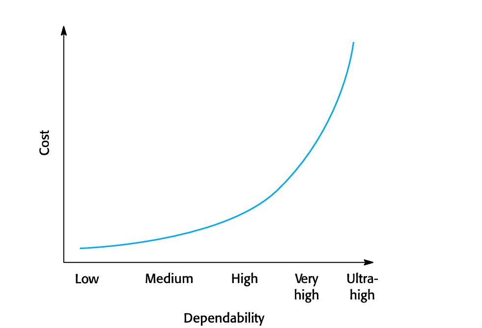
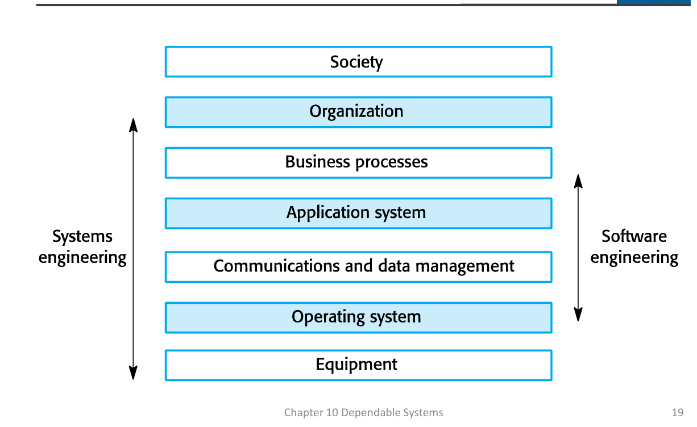

#### **Slide 2: Topics covered**
*   **Nội dung:** Liệt kê 5 chủ đề chính sẽ được trình bày trong chương:
    1.  Thuộc tính độ tin cậy (Dependability properties)
    2.  Hệ thống kinh tế-xã hội (Sociotechnical systems)
    3.  Dư thừa và đa dạng (Redundancy and diversity)
    4.  Quy trình đáng tin cậy (Dependable processes)
    5.  Phương pháp hình thức và độ tin cậy (Formal methods and dependability)
*   **Ý nghĩa ôn tập:** Đây là **cấu trúc đề cương** của chương. Bạn nên đảm bảo nắm được các điểm chính của từng mục.

#### **Slide 3: System dependability**
*   **Nội dung:** Định nghĩa Độ tin cậy của Hệ thống.
    *   Là thuộc tính hệ thống quan trọng nhất đối với nhiều hệ thống máy tính.
    *   Phản ánh **mức độ tin cậy (trust)** của người dùng vào hệ thống.
    *   Phản ánh sự tự tin của người dùng rằng hệ thống sẽ hoạt động như mong đợi và **không "hỏng" (fail)** trong quá trình sử dụng bình thường.
    *   Bao gồm các thuộc tính liên quan: **Độ tin cậy (reliability), Khả dụng (availability),** và **An ninh (security)**. Các thuộc tính này **phụ thuộc lẫn nhau (inter-dependent)**.
*   **Điểm chính (Exam Focus):** Định nghĩa cốt lõi của Dependability (**trust**). Kể tên 3 thuộc tính cơ bản và mối quan hệ qua lại của chúng.

#### **Slide 4: Importance of dependability**
*   **Nội dung:** Tầm quan trọng của độ tin cậy (hậu quả khi hệ thống không đáng tin cậy):
    *   Hỏng hóc hệ thống có thể gây ra **ảnh hưởng rộng rãi** đến nhiều người.
    *   Hệ thống không đáng tin cậy (unreliable, unsafe, insecure) có thể bị **người dùng từ chối**.
    *   Chi phí hỏng hóc có thể rất cao (tổn thất kinh tế, thiệt hại vật chất).
    *   Hệ thống không đáng tin cậy có thể gây **mất mát thông tin** và chi phí phục hồi cao.
*   **Điểm chính (Exam Focus):** Nắm các lý do vì sao phải đầu tư vào Dependability (liên quan đến chi phí và rủi ro).

#### **Slide 5: Causes of failure**
*   **Nội dung:** Liệt kê 3 nguyên nhân chính gây ra hỏng hóc hệ thống:
    1.  **Hỏng hóc phần cứng (Hardware failure):** Lỗi thiết kế, sản xuất, hoặc hết tuổi thọ.
    2.  **Hỏng hóc phần mềm (Software failure):** Lỗi trong đặc tả, thiết kế, hoặc cài đặt (code).
    3.  **Hỏng hóc vận hành (Operational failure):** **Lỗi do người vận hành (Human operators)**. Đây hiện là **nguyên nhân lớn nhất** gây ra hỏng hóc trong các hệ thống kinh tế-xã hội.
*   **Điểm chính (Exam Focus):** Nhớ 3 nguyên nhân và lưu ý **lỗi vận hành** là nguyên nhân đơn lẻ lớn nhất hiện nay.

---

### **Phần 2: Các Thuộc tính Độ tin cậy (Dependability Properties)**
#### **Slide 7: The principal dependability properties (Diagram)**
*   **Nội dung:** Sơ đồ phân loại 5 thuộc tính độ tin cậy chính:
    1.  **Availability (Khả dụng):** Khả năng cung cấp dịch vụ khi được yêu cầu.
    2.  **Reliability (Độ tin cậy):** Khả năng cung cấp dịch vụ **như đã được đặc tả**.
    3.  **Safety (An toàn):** Khả năng vận hành **mà không gây ra lỗi thảm khốc**.
    4.  **Security (An ninh):** Khả năng tự bảo vệ khỏi sự xâm nhập có chủ đích hoặc ngẫu nhiên.
    5.  **Resilience (Khả năng phục hồi/Kiên cường):** Khả năng **chống chịu và phục hồi** sau các sự kiện gây hại.
*   **Điểm chính (Exam Focus):** Đây là sơ đồ VÀNG. Học thuộc 5 thuộc tính này cùng với định nghĩa ngắn gọn của chúng.

#### **Slide 8 & 9: Principal properties (Definitions)**
*   **Nội dung:** Chi tiết hóa 5 định nghĩa:
    *   **Availability:** Xác suất hệ thống **hoạt động (up and running)** và có thể cung cấp dịch vụ.
    *   **Reliability:** Xác suất hệ thống **cung cấp dịch vụ một cách chính xác** như người dùng mong đợi.
    *   **Safety:** Đánh giá mức độ hệ thống có thể **gây thiệt hại** cho con người hoặc môi trường.
    *   **Security:** Đánh giá mức độ hệ thống có thể **chống lại xâm nhập** ngẫu nhiên hoặc có chủ đích.
    *   **Resilience:** Đánh giá khả năng hệ thống **duy trì tính liên tục** của các dịch vụ quan trọng khi có sự kiện gây rối (như hỏng thiết bị, tấn công mạng).

#### **Slide 10: Other dependability properties**
*   **Nội dung:** Giới thiệu 3 thuộc tính bổ sung:
    *   **Repairability (Khả năng sửa chữa):** Mức độ hệ thống có thể **được sửa chữa** khi hỏng hóc xảy ra.
    *   **Maintainability (Khả năng bảo trì):** Mức độ hệ thống có thể **được thích nghi** với các yêu cầu mới.
    *   **Error tolerance (Khả năng chịu lỗi đầu vào):** Mức độ lỗi đầu vào của người dùng có thể **được tránh và chịu đựng**.

#### **Slide 11: Dependability attribute dependencies**
*   **Nội dung:** Giải thích mối quan hệ phức tạp giữa các thuộc tính:
    *   Hoạt động **An toàn (Safe)** phụ thuộc vào việc hệ thống phải **Khả dụng (available)** và hoạt động **Đáng tin cậy (reliably)**.
    *   Một hệ thống có thể **không đáng tin cậy (unreliable)** vì dữ liệu bị **hỏng (corrupted)** do tấn công bên ngoài (vấn đề **Security** ảnh hưởng đến **Reliability**).
    *   Các cuộc tấn công **Từ chối dịch vụ (Denial of service - DoS)** nhằm mục đích làm cho hệ thống **không khả dụng (unavailable)** (vấn đề **Security** ảnh hưởng đến **Availability**).
    *   Nếu hệ thống bị virus, bạn không thể tự tin vào **Độ tin cậy (reliability)** hoặc **An toàn (safety)** của nó.
*   **Điểm chính (Exam Focus):** Hiểu được tính **liên kết** của các thuộc tính. Cải thiện một thuộc tính có thể cải thiện hoặc gây rủi ro cho thuộc tính khác.

#### **Slide 12 & 13: Dependability achievement**
*   **Nội dung:** Các chiến lược để đạt được độ tin cậy:
    *   Tránh đưa vào **lỗi ngẫu nhiên (accidental errors)** khi phát triển.
    *   Thiết kế quy trình **Kiểm chứng & Thẩm định (V & V)** hiệu quả để phát hiện lỗi còn sót lại.
    *   Thiết kế hệ thống **chịu lỗi (fault tolerant)** để tiếp tục hoạt động khi lỗi xảy ra.
    *   Thiết kế các cơ chế **bảo vệ** chống lại các cuộc tấn công bên ngoài.
    *   **Cấu hình** hệ thống chính xác.
    *   Bao gồm khả năng **nhận biết và chống lại** tấn công mạng.
    *   Bao gồm cơ chế **phục hồi (recovery)** để khôi phục dịch vụ sau khi hỏng hóc.
*   **Điểm chính (Exam Focus):** Liệt kê các biện pháp chính (phòng ngừa - tránh lỗi, phát hiện - V&V, phục hồi - chịu lỗi/recovery).

#### **Slide 14 & 15: Dependability costs & Cost/dependability curve**
*   **Nội dung:**
    *   Chi phí độ tin cậy có xu hướng **tăng theo cấp số nhân (exponentially)** khi yêu cầu mức độ tin cậy cao hơn.
    *   Hai lý do:
        1.  Sử dụng các kỹ thuật phát triển và phần cứng **đắt tiền hơn**.
        2.  **Tăng cường kiểm thử và xác nhận** để thuyết phục khách hàng và cơ quan quản lý.
    *   Biểu đồ minh họa đường cong chi phí tăng vọt từ mức **Very high** đến **Ultra-high**.
*   **Điểm chính (Exam Focus):** Khái niệm **tăng chi phí theo cấp số nhân** và **hai lý do** giải thích điều này.

#### **Slide 16: Dependability economics**
*   **Nội dung:** Phân tích kinh tế về độ tin cậy:
    *   Đôi khi, việc chấp nhận rủi ro và **trả chi phí hỏng hóc** có thể hiệu quả chi phí hơn là đầu tư quá mức để đạt độ tin cậy cực cao.
    *   Tuy nhiên, điều này phụ thuộc vào yếu tố xã hội, chính trị, và **uy tín kinh doanh**.
    *   Đối với các hệ thống kinh doanh thông thường, mức độ tin cậy vừa phải có thể là đủ.

---

### **Phần 3: Hệ thống Kinh tế-Xã hội (Sociotechnical Systems - STS)**

#### **Slide 17 & 18: Sociotechnical systems & Systems and software**
*   **Nội dung:**
    *   Kỹ thuật phần mềm là một phần của quy trình **kỹ thuật hệ thống (systems engineering)** rộng lớn hơn.
    *   Hệ thống phần mềm không phải là hệ thống cô lập mà là thành phần thiết yếu của các hệ thống rộng hơn có mục đích **con người, xã hội hoặc tổ chức**.
    *   **Ví dụ:** Hệ thống dự báo thời tiết bao gồm phần cứng, phần mềm, quy trình dự báo, người dùng, và các tổ chức liên quan.

#### **Slide 19: The sociotechnical systems stack (Diagram)**
*   **Nội dung:** Giới thiệu **Mô hình chồng các hệ thống kinh tế-xã hội (STS stack)**, từ dưới lên trên:
    1.  Equipment (Thiết bị)
    2.  Operating system (Hệ điều hành)
    3.  Communications and data management (Quản lý truyền thông và dữ liệu)
    4.  Application system (Hệ thống ứng dụng)
    5.  Business processes (Quy trình kinh doanh)
    6.  Organization (Tổ chức)
    7.  Society (Xã hội)
    *   **Kỹ thuật Hệ thống (Systems Engineering)** bao phủ toàn bộ stack.
    *   **Kỹ thuật Phần mềm (Software Engineering)** tập trung vào các lớp giữa (HĐH, Truyền thông/Dữ liệu, Ứng dụng).
*   **Điểm chính (Exam Focus):** Học thuộc 7 lớp và phạm vi tương ứng của SE và SysE.

#### **Slide 20 & 21: Layers in the STS stack**
*   **Nội dung:** Định nghĩa chi tiết 7 lớp trong STS stack.

#### **Slide 22: Holistic system design**
*   **Nội dung:**
    *   Có sự **tương tác và phụ thuộc** giữa các lớp (thay đổi ở một lớp sẽ lan truyền sang các lớp khác).
    *   Để đảm bảo độ tin cậy, cần có **góc nhìn hệ thống (systems perspective)**:
        *   Kiểm soát các hỏng hóc phần mềm trong các lớp bao quanh của STS stack.
        *   Hiểu cách các lỗi và hỏng hóc ở các lớp lân cận có thể **ảnh hưởng đến phần mềm**.

#### **Slide 23, 24, 25: Regulation and compliance**
*   **Nội dung:** Quy định và Tuân thủ:
    *   Chính phủ ban hành quy định để đảm bảo **an toàn và an ninh** cho công dân.
    *   Nhiều hệ thống quan trọng là **hệ thống được quy định (regulated systems)** (ví dụ: hạt nhân, ATC, thiết bị y tế) và cần được **cơ quan quản lý bên ngoài** phê duyệt trước khi đi vào hoạt động.
    *   Cần phải tạo ra một **Hồ sơ an toàn và độ tin cậy (safety and dependability case)** mở rộng để được chứng nhận (**certification**).
    *   Việc phát triển tài liệu cho chứng nhận có thể **tốn kém tương đương** với việc phát triển hệ thống.
*   **Điểm chính (Exam Focus):** Biết khái niệm *Regulated Systems* và vai trò của *Safety Case* và *Certification*.

---

### **Phần 4: Dư thừa và Đa dạng (Redundancy and Diversity)**

#### **Slide 27: Redundancy and diversity**
*   **Nội dung:** Định nghĩa hai khái niệm chính để đạt được khả năng chịu lỗi:
    *   **Redundancy (Dư thừa):** Giữ nhiều hơn một phiên bản của các thành phần quan trọng để có bản **dự phòng (backup)** khi một cái hỏng.
    *   **Diversity (Đa dạng):** Cung cấp cùng một chức năng bằng **nhiều cách khác nhau** trong các thành phần khác nhau, để chúng **không hỏng cùng một lúc** (**tránh lỗi chế độ chung - 'common-mode' failures**).
    *   *Ví dụ về đa dạng:* Các thành phần được triển khai bằng các ngôn ngữ lập trình khác nhau để lỗi trình biên dịch không ảnh hưởng đến tất cả.
*   **Điểm chính (Exam Focus):** Phân biệt rõ ràng **Redundancy (Backup)** và **Diversity (Cách khác nhau)**. Khái niệm **Common-mode failures** là cực kỳ quan trọng.

#### **Slide 28: Diversity and redundancy examples**
*   **Nội dung:**
    *   **Redundancy:** Dùng để đảm bảo **Khả dụng (Availability)** (ví dụ: máy chủ dự phòng trong e-commerce).
    *   **Diversity:** Dùng để cung cấp **Khả năng phục hồi (Resilience)** chống lại tấn công bên ngoài (ví dụ: dùng Windows và Linux cho các server khác nhau).

#### **Slide 29: Process diversity and redundancy**
*   **Nội dung:** Áp dụng dư thừa và đa dạng cho các **hoạt động quy trình** (như Kiểm chứng & Thẩm định):
    *   Hoạt động như validation không nên chỉ dựa vào một phương pháp (như testing).
    *   Nhiều hoạt động quy trình khác nhau, bổ sung cho nhau, giúp **kiểm tra chéo** và tránh lỗi quy trình.

#### **Slide 30: Problems with redundancy and diversity**
*   **Nội dung:** Những vấn đề khi sử dụng R&D:
    *   Tăng **độ phức tạp** của hệ thống.
    *   Tăng nguy cơ lỗi do **tương tác và phụ thuộc không lường trước** giữa các thành phần dư thừa.
    *   Một số kỹ sư ủng hộ sự **đơn giản (simplicity)** và **V&V mở rộng** là giải pháp hiệu quả hơn.
    *   *Ví dụ điển hình:* Airbus FCS (Redundant/Diverse) đối lập với Boeing 777 FCS (No software diversity).
*   **Điểm chính (Exam Focus):** Mối lo ngại về **tăng độ phức tạp** và **lỗi tương tác**.

---

### **Phần 5: Quy trình Đáng tin cậy (Dependable Processes)**

#### **Slide 32: Dependable processes**
*   **Nội dung:**
    *   Để giảm thiểu lỗi phần mềm, cần có quy trình phần mềm **xác định rõ ràng, có thể lặp lại (well-defined, repeatable)**.
    *   Quy trình lặp lại được là quy trình không phụ thuộc vào kỹ năng cá nhân.
    *   Cơ quan quản lý sử dụng thông tin về quy trình để kiểm tra.
    *   Cần tập trung nỗ lực đáng kể vào **Kiểm chứng và Thẩm định (Verification and Validation - V&V)**.

#### **Slide 33: Dependable process characteristics**
*   **Nội dung:** Hai đặc điểm chính:
    *   **Explicitly defined (Định nghĩa rõ ràng):** Có mô hình quy trình xác định. Dữ liệu phải được thu thập để chứng minh đã tuân thủ.
    *   **Repeatable (Lặp lại được):** Không dựa vào diễn giải và đánh giá cá nhân. Có thể được lặp lại trên các dự án và với các thành viên nhóm khác nhau.

#### **Slide 34: Attributes of dependable processes (Table)**
*   **Nội dung:** Bảng tóm tắt 5 thuộc tính của quy trình đáng tin cậy:
    *   **Auditable (Kiểm toán được):** Dễ hiểu, người ngoài có thể kiểm tra và đề xuất cải tiến.
    *   **Diverse (Đa dạng):** Bao gồm các hoạt động V&V dư thừa và đa dạng.
    *   **Documentable (Tài liệu hóa được):** Có mô hình quy trình và tài liệu được sản xuất trong các hoạt động.
    *   **Robust (Vững chắc):** Có khả năng phục hồi sau các thất bại của hoạt động quy trình.
    *   **Standardized (Tiêu chuẩn hóa):** Có bộ tiêu chuẩn phát triển phần mềm toàn diện.

#### **Slide 35 & 36: Dependable process activities**
*   **Nội dung:** Liệt kê các hoạt động chính trong quy trình đáng tin cậy:
    *   Xem xét yêu cầu (**Requirements reviews**).
    *   Quản lý yêu cầu (**Requirements management**).
    *   **Đặc tả hình thức (Formal specification)** (mô hình toán học).
    *   **Mô hình hóa hệ thống (System modeling)**.
    *   **Kiểm tra (inspections)** thiết kế và chương trình.
    *   **Phân tích tĩnh (Static analysis)** (kiểm tra tự động mã nguồn).
    *   Lập kế hoạch và quản lý kiểm thử (**Test planning and management**) (đảm bảo độ phủ yêu cầu).

#### **Slide 37 & 38: Dependable processes and agility**
*   **Nội dung:** Xung đột giữa Quy trình Đáng tin cậy và Phương pháp Agile:
    *   Phần mềm đáng tin cậy yêu cầu **chứng nhận** và do đó cần **tài liệu quy trình và sản phẩm**.
    *   Phân tích yêu cầu **từ đầu (Up-front requirements analysis)** là cần thiết để phát hiện xung đột yêu cầu có thể ảnh hưởng đến an toàn/an ninh.
    *   Điều này **xung đột** với cách tiếp cận Agile (co-development của yêu cầu và hệ thống, **tối thiểu hóa tài liệu**).
    *   **Kết luận:** Có thể sử dụng một quy trình Agile có sửa đổi (thêm iterative development, test-first, user involvement) **miễn là nhóm tuân thủ và tài liệu hóa hành động của họ**. **"Agile thuần túy" là không thực tế** cho kỹ thuật hệ thống đáng tin cậy.
*   **Điểm chính (Exam Focus):** Mâu thuẫn giữa *tài liệu/chứng nhận/Up-front analysis* (Dependable) và *minimal documentation/co-development* (Agile).

---

### **Phần 6: Phương pháp Hình thức và Độ tin cậy (Formal methods)**

#### **Slide 40: Formal specification**
*   **Nội dung:**
    *   **Phương pháp hình thức (Formal methods)** là các cách tiếp cận dựa trên **biểu diễn toán học (mathematical representation)** và phân tích phần mềm.
    *   Bao gồm: Đặc tả hình thức, Phân tích và chứng minh đặc tả, Phát triển chuyển đổi, và Xác minh chương trình.
    *   Giúp giảm đáng kể một số loại lỗi lập trình và có thể **hiệu quả chi phí** cho hệ thống đáng tin cậy.

#### **Slide 41: Formal approaches**
*   **Nội dung:** Hai cách tiếp cận hình thức chính:
    *   **Verification-based approaches (Dựa trên xác minh):** Chứng minh các biểu diễn khác nhau (ví dụ: đặc tả và chương trình) là **tương đương (equivalent)**. Chứng minh được sự vắng mặt của lỗi cài đặt.
    *   **Refinement-based approaches (Dựa trên tinh chỉnh):** Biểu diễn hệ thống được **chuyển đổi có hệ thống** thành biểu diễn cấp thấp hơn (ví dụ: đặc tả được chuyển đổi tự động thành cài đặt).

#### **Slide 42: Use of formal methods**
*   **Nội dung:** Lợi ích chính là **giảm số lượng lỗi** trong hệ thống. Lĩnh vực áp dụng chính là **kỹ thuật hệ thống đáng tin cậy**, nơi phải tránh chi phí hỏng hóc cao.

#### **Slide 43: Classes of error**
*   **Nội dung:** Các loại lỗi mà FM giúp tránh:
    *   Lỗi và thiếu sót trong Đặc tả và Thiết kế (nhờ **Model checking**).
    *   Sự **không nhất quán** giữa đặc tả và chương trình (nhờ **Program proving**).

#### **Slide 44: Benefits of formal specification**
*   **Nội dung:** Các lợi ích cụ thể:
    *   Yêu cầu được **phân tích chi tiết**, giúp phát hiện vấn đề, mâu thuẫn và thiếu sót.
    *   Có thể được **phân tích tự động** để phát hiện sự không nhất quán.
    *   Có thể chuyển đổi thành chương trình 'đúng' (ví dụ: B method).
    *   Giảm chi phí kiểm thử nếu chương trình được **xác minh hình thức (formally verified)**.

#### **Slide 45: Acceptance of formal methods**
*   **Nội dung:** Tại sao FM có tác động hạn chế trong thực tế:
    *   Chủ sở hữu vấn đề **không thể hiểu** đặc tả hình thức.
    *   Khó đánh giá lợi ích, khiến quản lý **không sẵn lòng đầu tư**.
    *   Kỹ sư phần mềm **không quen thuộc** và do đó miễn cưỡng đề xuất sử dụng.
    *   Vẫn **khó mở rộng** cho các hệ thống lớn.
    *   **Không tương thích** với các phương pháp phát triển Agile.

---

### **Phần 7: Tóm tắt (Key Points)**

#### **Slide 46 & 47: Key points**
*   **Nội dung:** Tóm tắt 5 điểm quan trọng nhất của chương:
    1.  Độ tin cậy quan trọng vì thất bại có thể dẫn đến thiệt hại kinh tế, vật chất và đe dọa sinh mạng con người.
    2.  Độ tin cậy là sự **tin tưởng** của người dùng, với 5 thuộc tính chính: **Availability, Reliability, Safety, Security, và Resilience**.
    3.  **Hệ thống kinh tế-xã hội (Sociotechnical systems)** bao gồm phần cứng, phần mềm và con người, nằm trong một tổ chức.
    4.  Sử dụng **quy trình đáng tin cậy, lặp lại được** với V&V ở mọi giai đoạn là điều cần thiết.
    5.  Sử dụng **dư thừa và đa dạng** là thiết yếu.
    6.  **Phương pháp hình thức** giúp giảm lỗi đặc tả và cài đặt bằng cách sử dụng **mô hình hình thức** làm cơ sở cho sự phát triển.
Đây là phần giải thích chi tiết và chuyên sâu cho 3 điểm tư duy quan trọng mà bạn cần nắm vững để master chương này, kèm theo các ví dụ minh họa cụ thể.

---

### **1. Chiều Lan Truyền Lỗi trong STS Stack (Holistic System Design)**

Sự phụ thuộc lẫn nhau giữa 7 lớp trong STS Stack (Slide 19, 22) tạo ra một "chiều lan truyền lỗi" phức tạp, nơi lỗi ở lớp trên (trừu tượng) có thể tạo ra lỗi ở lớp dưới (kỹ thuật), dẫn đến sự cố hệ thống.

| Lớp xảy ra Lỗi | Lớp bị ảnh hưởng (Lỗi lan truyền) | Thuộc tính Dependability bị ảnh hưởng | Ví dụ cụ thể |
| :--- | :--- | :--- | :--- |
| **Society** (Luật/Quy định) | **Business Processes & Application System** | **Security, Safety** (Lỗi yêu cầu) | **Lỗi:** Quy định mới về quyền riêng tư (Society) không được cập nhật kịp thời vào quy trình xử lý dữ liệu (Business Process). **Hậu quả:** Hệ thống ứng dụng (Application System) tiếp tục thu thập dữ liệu bất hợp pháp. **Ảnh hưởng:** Vi phạm **Security** (bảo mật dữ liệu) và có thể gây tổn thất kinh tế/pháp lý. |
| **Organization** (Chiến lược/Mục tiêu) | **Business Processes & Application System** | **Reliability, Availability** (Lỗi ưu tiên) | **Lỗi:** Tổ chức cắt giảm ngân sách đào tạo người dùng và bảo trì (Organization). **Hậu quả:** Quy trình bảo trì bị bỏ qua (Business Process), dẫn đến lỗi cấu hình hệ thống ứng dụng. **Ảnh hưởng:** Hệ thống chạy không ổn định, giảm **Reliability** và **Availability**. |
| **Business Processes** (Quy trình công việc) | **Application System** | **Reliability, Safety** (Lỗi logic nghiệp vụ) | **Lỗi:** Quy trình yêu cầu 3 bước kiểm tra thuốc, nhưng do lỗi quy trình thiết kế, chỉ quy định 2 bước. **Hậu quả:** Lập trình viên thiết kế Application System theo quy trình lỗi này. **Ảnh hưởng:** Thuốc có thể được cấp phát sai, gây ra sự kiện **Unsafe** (thiệt hại thảm khốc), làm suy giảm **Safety** và **Reliability**. |
| **Operating System** (HĐH) | **Application System** | **Availability, Reliability, Security** (Lỗi nền tảng) | **Lỗi:** HĐH bị lỗi bộ nhớ (kernel bug) hoặc có lỗ hổng bảo mật. **Hậu quả:** Application System chạy trên đó bị treo hoặc bị hacker tấn công. **Ảnh hưởng:** Mất dịch vụ (**Availability**) hoặc kết quả sai (**Reliability**). |

---

### **2. Phân Biệt 3 Loại "Lỗi" (Causes of Failure - Slide 5)**

Việc phân biệt 3 nguyên nhân gây hỏng hóc là cực kỳ quan trọng để xác định biện pháp khắc phục.

| Loại Lỗi | Định nghĩa | Biện pháp khắc phục chính (Slide 12, 13) | Ví dụ Minh họa |
| :--- | :--- | :--- | :--- |
| **Hardware Failure** (Hỏng hóc Phần cứng) | Lỗi thiết kế, sản xuất, hoặc hết **tuổi thọ tự nhiên** của linh kiện. | **Redundancy** (Sử dụng thiết bị dự phòng) và **Fault Tolerance** (Khả năng chịu lỗi). | Ổ cứng (HDD) bị cháy chip điều khiển sau 5 năm hoạt động. |
| **Software Failure** (Hỏng hóc Phần mềm) | Lỗi do sai sót trong **Specification** (đặc tả), **Design** (thiết kế), hoặc **Implementation** (cài đặt/code). | **Dependable processes** (V&V, Review, Static analysis), **Formal methods** (Tránh lỗi), **Fault Tolerance** (Phần mềm đa dạng). | Code bị lỗi chia cho số 0; Logic tính toán sai do hiểu sai yêu cầu. |
| **Operational Failure** (Hỏng hóc Vận hành) | **Lỗi do con người** (Human operators) mắc lỗi (misinterpretation, configuration errors, bad decisions). **Là nguyên nhân đơn lẻ lớn nhất hiện nay.** | **User Interface Design** (Giảm khả năng mắc lỗi), **Recovery Mechanisms** (Phục hồi sau lỗi vận hành), **Training** (Đào tạo vận hành), **Dependable Processes** (Qui trình vận hành rõ ràng). | Người điều hành trung tâm điện hạt nhân nhấn sai nút hoặc nhập sai tham số nhiệt độ giới hạn. |

---

### **3. Lợi ích và Hạn chế của Formal Methods (FM)**

FM là cách tiếp cận dựa trên toán học (Slide 40) được sử dụng để giảm thiểu lỗi trong các hệ thống an toàn và quan trọng.

#### **Lợi ích Chính (Slide 42, 44)**

1.  **Phát hiện sớm lỗi Yêu cầu/Thiết kế:** Việc phát triển đặc tả hình thức buộc yêu cầu phải được **phân tích chi tiết**, giúp phát hiện *vấn đề, mâu thuẫn và thiếu sót* trong yêu cầu (giúp **tránh giới thiệu lỗi**).
2.  **Xác minh tính đúng đắn:** Có thể **phân tích tự động** đặc tả hình thức để tìm sự không nhất quán, hoặc sử dụng **Program proving** để chứng minh chương trình là tương đương với đặc tả, loại bỏ lỗi cài đặt.
3.  **Giảm chi phí kiểm thử:** Nếu chương trình được xác minh hình thức, chi phí cho một số loại **kiểm thử (testing)** có thể được giảm bớt.

#### **Hạn chế và Lý do Ít được Chấp nhận (Slide 45)**

| Hạn chế | Giải thích |
| :--- | :--- |
| **Vấn đề về Ngôn ngữ/Hiểu biết** | **Chủ sở hữu vấn đề (Problem owners)** (khách hàng, quản lý) **không thể hiểu** đặc tả hình thức, nên họ không thể đánh giá nó có chính xác đại diện cho yêu cầu của họ hay không. |
| **Kinh tế** | Dễ đánh giá **chi phí** phát triển FM nhưng khó đánh giá **lợi ích** (vì lợi ích là việc *tránh được* các lỗi tiềm năng). Quản lý không muốn đầu tư. |
| **Văn hóa Kỹ thuật** | **Kỹ sư phần mềm không quen thuộc** với phương pháp này, dẫn đến sự miễn cưỡng áp dụng. |
| **Khả năng mở rộng (Scalability)** | FM vẫn **khó mở rộng (scale up)** để áp dụng hiệu quả cho các hệ thống lớn. |
| **Xung đột với Agile** | **Không tương thích** với các phương pháp phát triển Agile, vốn ưu tiên co-development, thay đổi nhanh và **tối thiểu hóa tài liệu**. |