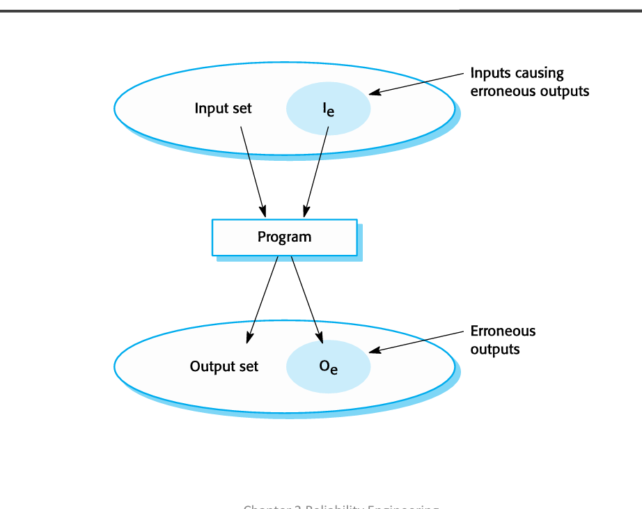
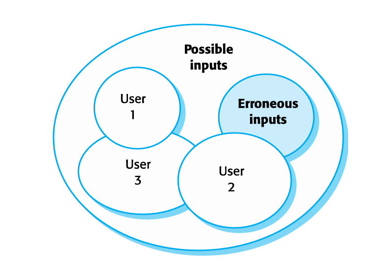

Chào bạn, đây là tài liệu giải thích chi tiết từng slide cho Chapter 11 (trong sách Software Engineering của Ian Sommerville, đôi khi slide ghi là Chapter 2 do cách đánh số của giáo trình cụ thể) về **Reliability Engineering (Kỹ nghệ độ tin cậy)**.

Vì bạn được mang tài liệu vào phòng thi, tôi sẽ giải thích trọng tâm vào các khái niệm, từ khóa và ví dụ để bạn dễ dàng tra cứu và trả lời câu hỏi tự luận hoặc trắc nghiệm.

---

#### **Slide 1: Chapter 11 – Reliability Engineering**
*   **Nội dung:** Đây là trang bìa giới thiệu chương. Chủ đề chính là kỹ thuật để đảm bảo và đo lường độ tin cậy của phần mềm.

#### **Slide 2: Topics covered (Các chủ đề bao gồm)**
*   **Nội dung:** Slide này tóm tắt 5 nội dung chính bạn cần nắm vững trong chương này:
    1.  **Availability and reliability:** Phân biệt giữa tính sẵn sàng và độ tin cậy.
    2.  **Reliability requirements:** Cách viết yêu cầu về độ tin cậy.
    3.  **Fault-tolerant architectures:** Các kiến trúc hệ thống có khả năng chịu lỗi.
    4.  **Programming for reliability:** Các nguyên tắc lập trình để tăng độ tin cậy.
    5.  **Reliability measurement:** Cách đo lường độ tin cậy.

#### **Slide 3: Software reliability (Độ tin cậy phần mềm)**
*   **Nội dung:**
    *   Khách hàng luôn mong phần mềm chạy tốt, nhưng với các phần mềm **không quan trọng (non-critical)**, họ có thể chấp nhận lỗi nhỏ.
    *   Tuy nhiên, với các **hệ thống quan trọng (critical systems)**, độ tin cậy phải cực cao.
    *   **Ví dụ:** Hệ thống y tế, viễn thông, điện lực, hàng không vũ trụ.
*   **Lưu ý thi:** Nếu đề hỏi về "Critical systems", hãy nhớ ví dụ về y tế hoặc hàng không để minh họa.

#### **Slide 4: Faults, errors and failures (Khuyết điểm, Lỗi hành vi và Thất bại)**
*   **Nội dung:** Đây là 3 khái niệm cực kỳ quan trọng và dễ nhầm lẫn. Bạn cần phân biệt rõ:
    *   **Human error/Mistake (Sai lầm của con người):** Hành vi của lập trình viên gây ra lỗi (VD: Cộng sai giờ).
    *   **System fault (Khuyết điểm/Lỗi hệ thống):** Là đoạn mã sai nằm trong source code (VD: Code cộng giờ nhưng quên kiểm tra trường hợp qua nửa đêm).
    *   **System error (Lỗi trạng thái):** Trạng thái sai của hệ thống khi chạy qua đoạn code lỗi (VD: Giờ hiển thị là 24:XX thay vì 00:XX).
    *   **System failure (Thất bại hệ thống):** Hệ thống không thực hiện được chức năng như người dùng mong đợi (VD: Không gửi được dữ liệu thời tiết do giờ bị sai).
*   **Mẹo nhớ:** Con người sai -> Code có Fault -> Chạy ra Error -> Dẫn đến Failure.

#### **Slide 5: Faults and failures (Mối quan hệ giữa Faults và Failures)**
*   **Nội dung:**
    *   Failure thường do Error, Error thường do Fault.
    *   **Tuy nhiên:**
        *   Có **Fault** chưa chắc dẫn đến **Error** (nếu đoạn code sai đó không bao giờ được chạy).
        *   Có **Error** chưa chắc dẫn đến **Failure** (nếu hệ thống có cơ chế tự phát hiện và sửa lỗi kịp thời).

#### **Slide 6-7: Fault management/Reliability achievement (Quản lý lỗi/Đạt độ tin cậy)**
*   **Nội dung:** 3 phương pháp để quản lý lỗi:
    1.  **Fault avoidance (Tránh lỗi):** Phát triển cẩn thận để không tạo ra lỗi ngay từ đầu (quy trình chặt chẽ, giảm sai sót con người).
    2.  **Fault detection (Phát hiện lỗi):** Dùng kiểm thử (Verification & Validation) để tìm và sửa lỗi trước khi giao cho khách.
    3.  **Fault tolerance (Chịu lỗi):** Thiết kế hệ thống sao cho dù có lỗi xảy ra (khi đang chạy), hệ thống vẫn không bị sập (failure).

#### **Slide 8: The increasing costs of residual fault removal**
*   **Nội dung:** Biểu đồ cho thấy càng muốn loại bỏ hết các lỗi nhỏ còn sót lại (residual errors), chi phí càng tăng vọt theo cấp số nhân.
*   **Ý nghĩa:** Không thể sửa hết 100% lỗi, phải cân nhắc giữa chi phí và độ tin cậy mong muốn.

#### **Slide 9: Availability and reliability**
*   **Nội dung:** Slide chuyển tiếp sang phần định nghĩa.

#### **Slide 10: Availability and reliability (Định nghĩa chi tiết)**
*   **Nội dung:**
    *   **Reliability (Độ tin cậy):** Xác suất hệ thống chạy **không bị lỗi (failure-free)** trong một khoảng thời gian xác định, môi trường xác định. (Nhấn mạnh vào việc *không hỏng*).
    *   **Availability (Tính sẵn sàng):** Xác suất hệ thống đang **hoạt động (operational)** tại một thời điểm bất kỳ khi được yêu cầu. (Nhấn mạnh vào việc *có mặt để dùng*).
    *   Cả hai đều đo bằng con số định lượng (VD: 0.999).

#### **Slide 11: Reliability and specifications (Độ tin cậy và Đặc tả)**
*   **Nội dung:**
    *   Về mặt lý thuyết: "Failure" là làm sai so với đặc tả (specification).
    *   Thực tế: Đặc tả có thể sai hoặc thiếu. Nếu hệ thống làm đúng đặc tả sai -> Người dùng vẫn coi là "Failure".
    *   **Kết luận:** Cảm nhận của người dùng (Perceived reliability) quan trọng hơn định nghĩa lý thuyết.

#### **Slide 12: Perceptions of reliability (Cảm nhận về độ tin cậy)**
*   **Nội dung:** Người dùng đánh giá độ tin cậy dựa trên:
    1.  **Môi trường:** Dùng sai môi trường dự kiến sẽ dễ lỗi hơn.
    2.  **Hậu quả:** Lỗi nhỏ (cần gạt nước hỏng khi trời nắng) thường bị bỏ qua. Lỗi nghiêm trọng (hỏng động cơ) sẽ bị đánh giá là hệ thống kém tin cậy, dù tần suất xảy ra ít.

#### **Slide 13: A system as an input/output mapping**
*   **Nội dung:** Hình minh họa. Nếu đầu vào (Input set) rơi vào tập $I_e$ (Inputs causing erroneous outputs), hệ thống sẽ tạo ra đầu ra lỗi ($O_e$). Mục tiêu là làm nhỏ tập $I_e$ này lại.

#### **Slide 14: Availability perception (Cảm nhận về tính sẵn sàng)**
*   **Nội dung:** Availability thường tính bằng % (VD: 99.95%). Tuy nhiên, con số này chưa đủ vì chưa xét đến:
    *   **Số lượng người bị ảnh hưởng:** Sập mạng lúc 3h sáng (ít người dùng) ít nghiêm trọng hơn sập lúc 9h sáng (giờ cao điểm).
    *   **Thời gian sập:** Nhiều lần sập ngắn (vài giây) dễ chịu hơn 1 lần sập dài (vài tiếng).

#### **Slide 15: Software usage patterns**
*   **Nội dung:** Biểu đồ minh họa. Mỗi người dùng (User 1, 2, 3) dùng các phần khác nhau của phần mềm. Có thể User 1 không bao giờ gặp lỗi vì họ không dùng trúng phần tính năng chứa lỗi ($I_e$).

#### **Slide 16: Reliability in use (Độ tin cậy trong thực tế sử dụng)**
*   **Nội dung:**
    *   Sửa 10% lỗi trong code chưa chắc tăng 10% độ tin cậy. Vì nếu sửa lỗi ở phần code *ít ai dùng*, thì người dùng không cảm nhận được sự cải thiện.
    *   Người dùng hay "né" các tính năng họ biết là bị lỗi, nên họ vẫn thấy phần mềm tin cậy dù code đầy lỗi.

#### **Slide 17: Reliability requirements**
*   **Nội dung:** Chuyển sang phần Yêu cầu về độ tin cậy.

#### **Slide 18: System reliability requirements (Yêu cầu độ tin cậy hệ thống)**
*   **Nội dung:** Phân loại yêu cầu:
    1.  **Functional (Chức năng):** Yêu cầu hệ thống phải có chức năng check lỗi, phục hồi lỗi.
    2.  **Non-functional (Phi chức năng):** Các con số định lượng (số lần lỗi chấp nhận được, thời gian uptime).

#### **Slide 19: Reliability metrics (Các chỉ số đo lường)**
*   **Nội dung:** 3 chỉ số chính (để thi trắc nghiệm rất quan trọng):
    1.  **POFOD** (Probability of failure on demand).
    2.  **ROCOF** (Rate of occurrence of failures) / **MTTF** (Mean time to failure).
    3.  **Availability** (Availability).

#### **Slide 20: Probability of failure on demand (POFOD)**
*   **Nội dung:**
    *   Xác suất lỗi khi có **một yêu cầu** được gửi đến.
    *   Dùng cho: Hệ thống hoạt động ngắt quãng, lâu lâu mới dùng một lần (intermittent).
    *   **Ví dụ:** Hệ thống dập lửa, phanh khẩn cấp, hệ thống bảo vệ nhà máy hóa chất.
    *   *Mẹo:* Cứ cái gì "bấm nút mới chạy" hoặc "có biến mới chạy" -> Dùng POFOD.

#### **Slide 21: Rate of fault occurrence (ROCOF)**
*   **Nội dung:**
    *   Tần suất lỗi theo thời gian (VD: 2 lỗi trong 1000 giờ).
    *   Dùng cho: Hệ thống xử lý liên tục lượng lớn giao dịch.
    *   **Ví dụ:** Hệ thống xử lý thẻ tín dụng, đặt vé máy bay.
    *   **MTTF (Mean Time To Failure):** Nghịch đảo của ROCOF. Thời gian trung bình giữa các lần lỗi. Dùng cho hệ thống chạy giao dịch dài (VD: CAD systems).

#### **Slide 22: Availability (Tính sẵn sàng)**
*   **Nội dung:**
    *   Tỷ lệ thời gian hệ thống hoạt động tốt. (Tính cả thời gian sửa chữa).
    *   Dùng cho: Hệ thống chạy liên tục 24/7 (Non-stop).
    *   **Ví dụ:** Tổng đài điện thoại, đèn tín hiệu giao thông.

#### **Slide 23: Availability specification (Bảng quy đổi)**
*   **Nội dung:** Minh họa ý nghĩa các con số 0.9, 0.99, 0.999...
    *   0.9 (90%): Sập 144 phút/ngày -> Rất tệ.
    *   0.9999: Sập < 1 phút/tuần -> Rất tốt.

#### **Slide 24: Non-functional reliability requirements**
*   **Nội dung:** Các yêu cầu phi chức năng (dùng các chỉ số trên) thường phổ biến ở hệ thống an toàn (safety-critical), ít gặp ở hệ thống kinh doanh (business) trừ khi đòi hỏi dịch vụ 24/7.

#### **Slide 25: Benefits of reliability specification (Lợi ích)**
*   **Nội dung:**
    *   Làm rõ nhu cầu khách hàng.
    *   Biết khi nào thì dừng kiểm thử (khi đạt chỉ số đề ra).
    *   So sánh các giải pháp thiết kế.
    *   Cần thiết cho việc chứng nhận hệ thống (certification) với cơ quan quản lý (VD: Hàng không).

#### **Slide 26: Specifying reliability requirements (Cách xác định)**
*   **Nội dung:**
    *   Phân loại lỗi: Lỗi nghiêm trọng cần xác suất thấp hơn lỗi nhỏ.
    *   Phân loại dịch vụ: Dịch vụ quan trọng (Critical services) cần độ tin cậy cao hơn.

#### **Slide 27-29: ATM reliability specification (Ví dụ máy ATM)**
*   **Nội dung:** Phân tích case study ATM.
    *   Mối quan tâm: Giao dịch chính xác và Máy luôn sẵn sàng (Available).
    *   Ở đây **Availability** quan trọng hơn Reliability (vì máy nuốt thẻ hay tính sai tiền thì nguy hiểm, nhưng thường ATM quan trọng là phải rút được tiền).
    *   **Slide 28:** Dịch vụ Database (cơ sở dữ liệu) quan trọng nhất -> Cần Availability 0.9999 (vì sập DB là sập cả mạng lưới).
    *   **Slide 29:** Dịch vụ tại từng máy ATM lẻ -> Availability 0.999 là đủ (vì máy có thể hết tiền, kẹt giấy, hỏng cơ khí).

#### **Slide 30: Insulin pump reliability specification (Ví dụ bơm Insulin)**
*   **Nội dung:**
    *   Dùng chỉ số **POFOD** (vì bơm thuốc là hành động theo yêu cầu/chu kỳ).
    *   Lỗi tạm thời (người dùng tự sửa được): POFOD 0.002.
    *   Lỗi vĩnh viễn (phải gửi về hãng): POFOD thấp hơn 0.00002.

#### **Slide 31: Functional reliability requirements**
*   **Nội dung:** Các yêu cầu chức năng để hỗ trợ độ tin cậy:
    1.  **Checking:** Kiểm tra đầu vào/ra.
    2.  **Recovery:** Tự phục hồi sau lỗi.
    3.  **Redundancy:** Có tính năng dự phòng.
    4.  **Process:** Quy trình phát triển chuẩn.

#### **Slide 32: Examples of functional reliability requirements**
*   **Nội dung:** Ví dụ cụ thể cho slide 31 (RR1: check input range, RR2: backup database ở tòa nhà khác...).

#### **Slide 33: Fault-tolerant architectures (Kiến trúc chịu lỗi)**
*   **Nội dung:** Tiêu đề phần mới.

#### **Slide 34: Fault tolerance (Khả năng chịu lỗi)**
*   **Nội dung:**
    *   Hệ thống vẫn chạy tiếp dù phần mềm có lỗi.
    *   Bắt buộc với hệ thống yêu cầu Availability cao hoặc chi phí hỏng hóc lớn.

#### **Slide 35: Fault-tolerant system architectures**
*   **Nội dung:** Dựa trên nguyên tắc **Dư thừa (Redundancy)** và **Đa dạng (Diversity)**.
    *   Ví dụ: Điều khiển bay, lò phản ứng hạt nhân, viễn thông.

#### **Slide 36-38: Protection systems (Hệ thống bảo vệ)**
*   **Nội dung:**
    *   Là hệ thống **chuyên biệt**, độc lập với hệ thống điều khiển chính.
    *   Nhiệm vụ: Giám sát, nếu thấy nguy hiểm -> Dừng hệ thống khẩn cấp (Emergency shutdown).
    *   Đặc điểm: Phải **Dư thừa** (redundant) và **Đa dạng** (diverse) so với hệ thống chính. Đơn giản hơn để dễ kiểm tra.

#### **Slide 39-41: Self-monitoring architectures (Kiến trúc tự giám sát)**
*   **Nội dung:**
    *   Dùng kiến trúc **Đa kênh (Multi-channel)**.
    *   Cùng một phép tính được chạy trên nhiều kênh khác nhau.
    *   So sánh kết quả: Nếu giống nhau -> OK. Nếu khác nhau -> Báo lỗi.
    *   **Slide 41:** Yêu cầu phần cứng và phần mềm ở các kênh phải **Khác nhau (Diverse)** để tránh việc tất cả cùng sai một lỗi giống hệt nhau (common mode failure).

#### **Slide 42-43: Airbus flight control system architecture**
*   **Nội dung:** Minh họa thực tế máy bay Airbus.
    *   Dùng 5 máy tính riêng biệt.
    *   Sử dụng vi xử lý khác nhau, hãng sản xuất chip khác nhau.
    *   Phần mềm viết bằng các ngôn ngữ khác nhau bởi các đội (team) khác nhau. -> **Tối đa hóa sự Đa dạng (Diversity).**

#### **Slide 44: N-version programming (Lập trình phiên bản N)**
*   **Nội dung:**
    *   Nhiều phiên bản phần mềm (thường là 3) chạy song song trên các máy tính khác nhau.
    *   Dùng cơ chế **Bỏ phiếu (Voting system)**: Kết quả nào chiếm đa số thì lấy (VD: 2 vs 1 thì lấy theo 2).
    *   Dựa trên ý tưởng TMR (Triple-modular redundancy) của phần cứng.

#### **Slide 45-46: Hardware fault tolerance & Triple modular redundancy (TMR)**
*   **Nội dung:** Giải thích kỹ thuật TMR trong phần cứng. 3 linh kiện giống hệt nhau, cùng xử lý, so sánh đầu ra. Hỏng 1 cái thì 2 cái kia vẫn "thắng".

#### **Slide 47-48: N-version programming (Chi tiết)**
*   **Nội dung:**
    *   Các phiên bản phải được làm bởi các **đội (teams) khác nhau**.
    *   Giả định: Các đội khác nhau sẽ không mắc cùng một lỗi.
    *   Thực tế: Các đội vẫn có thể hiểu sai đặc tả giống nhau -> dẫn đến lỗi giống nhau.

#### **Slide 49: Software diversity (Đa dạng phần mềm)**
*   **Nội dung:** Các cách để đạt sự đa dạng:
    *   Ngôn ngữ lập trình khác nhau (C vs Java).
    *   Phương pháp thiết kế khác nhau.
    *   Thuật toán khác nhau.

#### **Slide 50-51: Problems with design diversity & Specification dependency**
*   **Nội dung:** Vấn đề lớn nhất của phương pháp này là **Đặc tả (Specification)**.
    *   Nếu Đặc tả sai ngay từ đầu -> Tất cả các phiên bản đều sai theo (Specification dependency).
    *   Đây là điểm yếu cốt tử của N-version programming.

#### **Slide 52: Improvements in practice**
*   **Nội dung:** Thực tế, N-version programming chỉ cải thiện độ tin cậy khoảng 5-9 lần (không cao như lý thuyết kỳ vọng), nhưng chi phí phát triển lại rất cao (gấp nhiều lần). Cần cân nhắc kỹ trước khi dùng.

#### **Slide 53: Programming for reliability**
*   **Nội dung:** Chuyển sang phần Kỹ thuật lập trình.

#### **Slide 54: Dependable programming**
*   **Nội dung:** Các thói quen lập trình tốt để giảm lỗi, phát hiện lỗi và chịu lỗi.

#### **Slide 55: Good practice guidelines (8 nguyên tắc vàng)**
*   **Nội dung:** Danh sách 8 nguyên tắc (Bạn nên học thuộc tiêu đề 8 cái này):
    1.  Hạn chế tầm nhìn thông tin (Limit visibility).
    2.  Kiểm tra mọi đầu vào (Check inputs).
    3.  Xử lý mọi ngoại lệ (Exception handlers).
    4.  Giảm dùng các cấu trúc dễ gây lỗi (Minimize error-prone constructs).
    5.  Cung cấp khả năng khởi động lại (Restart capabilities).
    6.  Kiểm tra biên mảng (Check array bounds).
    7.  Dùng timeouts (Include timeouts).
    8.  Đặt tên cho hằng số (Name constants).

#### **Slide 56: (1) Limit the visibility**
*   **Nội dung:** Dùng tính đóng gói (encapsulation), private, abstract data types để các thành phần khác không vô tình sửa đổi dữ liệu quan trọng.

#### **Slide 57-58: (2) Check all inputs & Validity checks**
*   **Nội dung:** Đừng tin tưởng input. Luôn kiểm tra:
    *   Range (Vùng giá trị).
    *   Size (Kích thước chuỗi/file).
    *   Representation (Kiểu dữ liệu).
    *   Reasonableness (Tính hợp lý).

#### **Slide 59-61: (3) Exception handling**
*   **Nội dung:**
    *   Sử dụng `try-catch` (exception handling) thay vì `if-else` để bắt lỗi.
    *   Giúp code gọn hơn và không bỏ sót các tình huống bất ngờ (như mất điện, mất mạng).

#### **Slide 62-65: (4) Minimize the use of error-prone constructs**
*   **Nội dung:** Tránh dùng các thứ dễ gây lú lẫn cho lập trình viên:
    *   Con trỏ (Pointers) -> dễ trỏ sai vùng nhớ.
    *   Số thực (Floating-point) -> so sánh không chính xác.
    *   Goto (nhảy vô điều kiện).
    *   Đệ quy (Recursion) -> dễ tràn bộ nhớ stack.
    *   Kế thừa (Inheritance) quá sâu -> khó hiểu luồng code.
    *   Aliasing (Nhiều tên cùng trỏ 1 biến).

#### **Slide 66: (5) Provide restart capabilities**
*   **Nội dung:** Với hệ thống chạy lâu, cần có tính năng lưu trạng thái (Save state) để nếu sập thì mở lại làm tiếp được, không bắt người dùng nhập lại từ đầu.

#### **Slide 67: (6) Check array bounds**
*   **Nội dung:** Đặc biệt với ngôn ngữ C/C++. Tránh lỗi tràn bộ đệm (buffer overflow) - lỗi kinh điển để hacker tấn công.

#### **Slide 68: (7) Include timeouts**
*   **Nội dung:** Khi gọi hệ thống khác (external call), luôn set thời gian chờ (timeout). Nếu quá giờ không thấy trả lời thì coi như lỗi và xử lý tiếp, tránh treo hệ thống mãi mãi.

#### **Slide 69: (8) Name all constants**
*   **Nội dung:** Không dùng "magic numbers" (số cứng trong code). Hãy đặt tên biến hằng số (VD: `TAX_RATE = 0.1` thay vì nhân thẳng với `0.1`). Dễ sửa và dễ hiểu.

#### **Slide 70: Reliability measurement**
*   **Nội dung:** Chuyển sang phần Đo lường.

#### **Slide 71: Reliability measurement (Dữ liệu cần thu thập)**
*   **Nội dung:** Để đo được các chỉ số (POFOD, ROCOF...), cần thu thập: Số lần lỗi, Tổng số giao dịch/thời gian chạy, Thời gian sửa lỗi (Repair time).

#### **Slide 72-73: Reliability testing / Statistical testing**
*   **Nội dung:**
    *   Khác với Defect testing (test để tìm bug), Reliability testing là test để **đo độ tin cậy**.
    *   Cần tập dữ liệu test mô phỏng y hệt cách người dùng sử dụng thực tế (Operational Profile).
    *   Chấp nhận để lỗi xảy ra để đếm số lượng lỗi -> tính toán ra chỉ số.

#### **Slide 74: Reliability measurement (Quy trình)**
*   **Nội dung:** Quy trình 4 bước:
    1.  Xác định Operational Profile (Hồ sơ vận hành).
    2.  Chuẩn bị test data set.
    3.  Chạy test.
    4.  Tính toán độ tin cậy quan sát được.

#### **Slide 75: Reliability measurement problems (Vấn đề khó khăn)**
*   **Nội dung:**
    *   Khó tạo ra Operational Profile chính xác (không biết người dùng sẽ dùng thế nào).
    *   Chi phí tạo dữ liệu test cao.
    *   Với hệ thống quá tin cậy (hiếm khi lỗi), cần test rất rất lâu mới thấy 1 lỗi -> khó thống kê (Statistical uncertainty).

#### **Slide 76-78: Operational profiles**
*   **Nội dung:**
    *   Là tập hợp dữ liệu đầu vào với tần suất xuất hiện khớp với thực tế.
    *   Thường được sinh tự động.
    *   Khó sinh tự động với các hệ thống tương tác (interactive systems) vì phụ thuộc hành vi con người.

#### **Slide 79-81: Key points (Tổng kết chương)**
*   **Nội dung:** Tóm tắt lại toàn bộ các ý chính đã học:
    *   Reliability management (Avoidance, Detection, Tolerance).
    *   Metrics (POFOD, ROCOF, Availability).
    *   Architecture (Protection system, N-version).
    *   Programming practices (8 guidelines).
    *   Measurement (Statistical testing, Operational profile).

---
**Lời khuyên khi mang tài liệu đi thi:**
1.  Đánh dấu (highlight) các định nghĩa **POFOD, ROCOF, Availability** (Slide 20-22) vì rất dễ có bài tập tính toán hoặc chọn chỉ số phù hợp.
2.  Nhớ vị trí của **8 nguyên tắc lập trình** (Slide 55) để trả lời câu hỏi tự luận về "Làm thế nào để code tin cậy hơn?".
3.  Hiểu rõ **N-version programming** và nhược điểm của nó (Slide 47-50).

Chúc bạn ôn thi tốt và đạt kết quả cao!