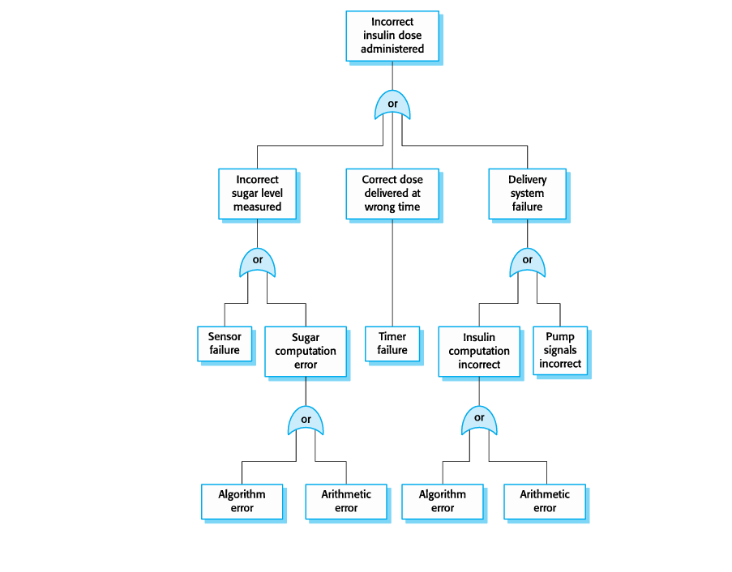
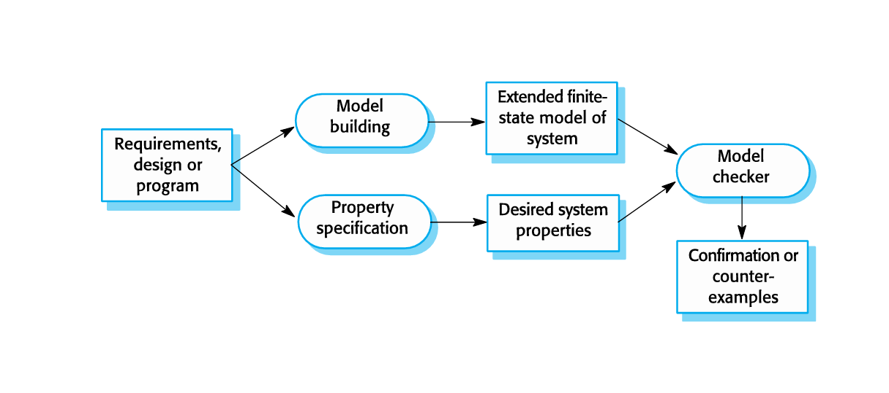
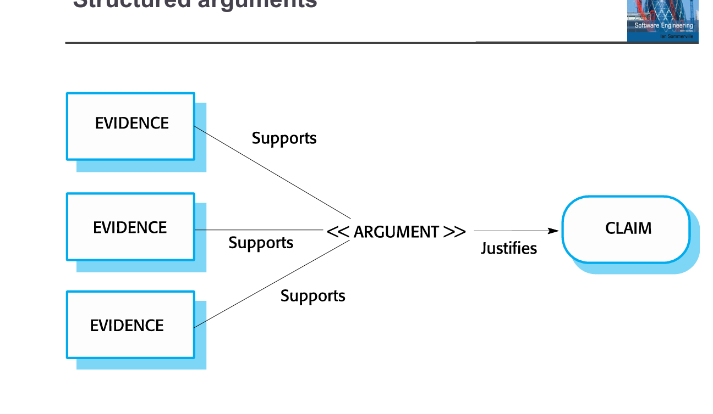

### Slide 3: Safety

**1) Tiêu đề slide:** Safety

**2) Tóm tắt ngắn:**
Định nghĩa cốt lõi: An toàn là khả năng hệ thống hoạt động mà không gây thương vong cho người hoặc môi trường.

**3) Giải thích chi tiết:**
*   **Định nghĩa:** Safety là thuộc tính của hệ thống đảm bảo không gây ra "human injury or death" (thương vong con người) và "damage to environment" (hại môi trường).
*   **Lưu ý:** Nó bao gồm cả khi hoạt động bình thường (*normally*) và bất thường (*abnormally*). Tức là dù hệ thống bị lỗi, nó cũng không được phép nổ hay giết người.
*   **Vai trò phần mềm:** Ngày nay hầu hết các thiết bị (máy bay, máy y tế) đều dùng phần mềm điều khiển (software-based control), nên an toàn phần mềm là then chốt.

**4) Ý nghĩa & ứng dụng thực tế:**
*   Khi thiết kế máy chụp X-quang: Dù phần mềm bị treo, máy cũng không được phát tia X quá liều làm chết bệnh nhân.

**5) Gợi ý câu hỏi thi:**
*   *(Trung bình)* Tại sao "Safety" lại quan tâm đến cả trường hợp hệ thống hoạt động bất thường (abnormally)?
    *   *Đáp án:* Vì tai nạn thường xảy ra khi hệ thống gặp lỗi, hệ thống an toàn phải xử lý được lỗi đó mà không gây hại (Fail-safe).

**6) Những lỗi hay nhầm lẫn thường gặp:**
*   Nhầm lẫn giữa **Safety** (An toàn tính mạng/môi trường) và **Reliability** (Độ tin cậy - chạy đúng tính năng).

**7) Nhắc lại bằng 1 câu:**
An toàn là không gây chết người hay hỏng môi trường, kể cả khi hệ thống bị lỗi.

---

### Slide 4: Software in safety-critical systems

**1) Tiêu đề slide:** Software in safety-critical systems

**2) Tóm tắt ngắn:**
Phần mềm có hai vai trò: Trực tiếp điều khiển hành vi an toàn và Giám sát các thành phần phần cứng khác.

**3) Giải thích chi tiết:**
*   **Software behaviour:** Hành vi của phần mềm ảnh hưởng trực tiếp đến độ an toàn (ví dụ: phần mềm phanh ABS trên ô tô).
*   **Monitoring:** Phần mềm thường dùng để giám sát phần cứng. Ví dụ: Phần mềm theo dõi động cơ máy bay. Nếu phần mềm giám sát này bị "chết" hoặc báo sai, phi công không biết động cơ hỏng -> tai nạn. Do đó, phần mềm giám sát cũng là *safety-critical*.

**4) Ý nghĩa & ứng dụng thực tế:**
*   Thiết kế Watchdog Timer: Một đoạn code nhỏ chuyên canh chừng xem hệ thống chính có bị treo không để reset.

**5) Gợi ý câu hỏi thi:**
*   *(Khó)* Tại sao phần mềm chỉ làm nhiệm vụ "giám sát" (monitoring) lại được coi là safety-critical?
    *   *Đáp án:* Vì nếu nó thất bại trong việc cảnh báo lỗi phần cứng, con người sẽ không có hành động kịp thời, dẫn đến tai nạn.

**6) Những lỗi hay nhầm lẫn thường gặp:**
*   Nghĩ rằng chỉ phần mềm điều khiển (control) mới quan trọng, còn phần mềm hiển thị (display/monitoring) thì không.

**7) Nhắc lại bằng 1 câu:**
Phần mềm vừa là "tài xế" (điều khiển) vừa là "bảo vệ" (giám sát) trong hệ thống an toàn.

---

### Slide 5: Safety and reliability

**1) Tiêu đề slide:** Safety and reliability

**2) Tóm tắt ngắn:**
Phân biệt **Reliability** (Độ tin cậy) và **Safety** (An toàn). Chúng liên quan nhưng khác nhau. Hệ thống tin cậy chưa chắc đã an toàn.

**3) Giải thích chi tiết:**
*   **Reliability (Độ tin cậy):** Làm đúng theo đặc tả kỹ thuật (Specification). Tức là bảo A làm A, bảo B làm B, không bị crash, uptime 99.9%.
*   **Safety (An toàn):** Không gây hại.
*   **Mâu thuẫn:** Nếu đặc tả kỹ thuật (Specification) bị sai (ví dụ: đặc tả yêu cầu "khi nhiệt độ > 100 độ thì đóng van xả áp"), thì một phần mềm *Reliable* sẽ đóng van đúng như lệnh -> Nồi hơi nổ -> *Unsafe*.
*   **Kết luận:** Reliability là điều kiện cần nhưng chưa đủ cho Safety.

**4) Ý nghĩa & ứng dụng thực tế:**
*   Khi viết Spec: Phải cực kỳ cẩn thận. Viết sai Spec thì Dev code càng giỏi (Reliable cao), hệ thống càng nguy hiểm.

**5) Gợi ý câu hỏi thi:**
*   *(Khó - Scenario)* Một phần mềm điều khiển vũ khí hoạt động chính xác 100% theo lệnh của người dùng, nhưng người dùng lỡ tay bấm nhầm nút bắn vào đồng đội. Hệ thống này có Reliable không? Có Safe không?
    *   *Đáp án:* Reliable (vì làm đúng lệnh/spec), nhưng Unsafe (vì gây thương vong, thiếu cơ chế chặn bắn nhầm).

**6) Những lỗi hay nhầm lẫn thường gặp:**
*   Cho rằng cứ test hết bug (high reliability) là hệ thống sẽ an toàn.

**7) Nhắc lại bằng 1 câu:**
Reliability là làm đúng lời dặn; Safety là không gây họa (kể cả khi lời dặn bị sai).

**8) Mnemonics:**
*   **R**eliability = **R**ight according to Spec.
*   **S**afety = **S**urvival (No harm).

---

### Slide 6: Safety-critical systems (Title slide)

**1) Tiêu đề slide:** Safety-critical systems
**2) Tóm tắt ngắn:** Chuyển sang phần phân loại hệ thống.
**3) Giải thích:** Slide tiêu đề chuyển mục.
**7) Nhắc lại bằng 1 câu:** Bắt đầu tìm hiểu hệ thống an toàn trọng yếu là gì.

---

### Slide 7: Safety critical systems

**1) Tiêu đề slide:** Safety critical systems

**2) Tóm tắt ngắn:**
Định nghĩa hệ thống an toàn trọng yếu: Là hệ thống bắt buộc phải an toàn *mọi lúc*. Ví dụ: Máy bay, nhà máy hóa chất, xe hơi.

**3) Giải thích chi tiết:**
*   **Essential:** Không phải là "nên có" mà là "bắt buộc".
*   **Always safe:** Không chấp nhận rủi ro gây hại trong bất kỳ hoàn cảnh nào.
*   **Ví dụ:**
    *   Máy bay (Aircraft control): Sai sót là rơi.
    *   Nhà máy hóa chất (Process control): Sai sót là rò rỉ khí độc/nổ.
    *   Xe hơi (Automobile): Phanh, động cơ.

**4) Ý nghĩa & ứng dụng thực tế:**
*   Lương kỹ sư làm mảng này thường rất cao nhưng áp lực lớn vì trách nhiệm liên quan đến tính mạng con người.

**5) Gợi ý câu hỏi thi:**
*   *(Dễ)* Kể tên 2 ví dụ về hệ thống Safety-critical.
    *   *Đáp án:* Hệ thống phanh xe hơi, hệ thống điều khiển lò phản ứng hạt nhân.

**7) Nhắc lại bằng 1 câu:**
Hệ thống mà "hỏng là chết người" gọi là Safety-critical systems.

---

### Slide 8: Safety criticality

**1) Tiêu đề slide:** Safety criticality

**2) Tóm tắt ngắn:**
Phân loại: **Primary** (Sơ cấp - trực tiếp) và **Secondary** (Thứ cấp - gián tiếp).

**3) Giải thích chi tiết:**
*   **Primary safety-critical systems:** Phần mềm nhúng (embedded). Nếu nó hỏng -> Phần cứng hỏng theo -> Gây hại ngay lập tức.
    *   *Ví dụ:* Bơm insulin (hỏng là bơm quá liều -> sốc thuốc).
*   **Secondary safety-critical systems:** Phần mềm quản lý/gián tiếp. Nếu nó hỏng -> Đưa ra dữ liệu sai -> Con người/hệ thống khác ra quyết định sai -> Gây hại sau đó.
    *   *Ví dụ:* Hệ thống y bạ điện tử (Mentcare). Ghi nhầm dị ứng thuốc -> Bác sĩ kê đơn dựa trên đó -> Bệnh nhân uống và bị sốc phản vệ.
    *   *Ví dụ:* Hệ thống điều khiển hạ tầng (đèn giao thông).

**4) Ý nghĩa & ứng dụng thực tế:**
*   Khi đánh giá rủi ro: Primary cần phản ứng thời gian thực (real-time). Secondary cần độ chính xác dữ liệu (data integrity).

**5) Gợi ý câu hỏi thi:**
*   *(Trung bình)* Phân biệt Primary và Secondary safety-critical systems?
    *   *Đáp án:* Primary: lỗi phần mềm gây hại trực tiếp qua phần cứng. Secondary: lỗi phần mềm tạo ra thông tin sai, dẫn đến hành động sai gây hại gián tiếp.

**6) Những lỗi hay nhầm lẫn thường gặp:**
*   Nghĩ rằng phần mềm quản lý dữ liệu (database) không liên quan đến an toàn tính mạng.

**7) Nhắc lại bằng 1 câu:**
Primary giết người bằng phần cứng; Secondary giết người bằng thông tin sai.

---

### Slide 9: Hazards

**1) Tiêu đề slide:** Hazards

**2) Tóm tắt ngắn:**
Định nghĩa **Hazard** (Mối nguy): Tình huống/sự kiện *có thể* dẫn đến tai nạn. Hazard chưa phải là tai nạn.

**3) Giải thích chi tiết:**
*   **Hazard (Mối nguy):** Là nguyên nhân tiềm tàng.
    *   *Ví dụ:* Van bị kẹt, Tính toán sai tọa độ, Không phát hiện dị ứng.
*   **Quan trọng:** Hazard không chắc chắn dẫn đến Accident (Tai nạn).
    *   *Ví dụ:* Van bị kẹt (Hazard) nhưng có van phụ mở ra kịp thời -> Không nổ (Không có Accident).
*   **Mục tiêu:** Ngăn Hazard biến thành Accident.

**4) Ý nghĩa & ứng dụng thực tế:**
*   Phòng cháy chữa cháy: "Rò rỉ gas" là Hazard. "Nổ nhà" là Accident. Ta cài cảm biến gas để phát hiện Hazard trước khi nó thành Accident.

**5) Gợi ý câu hỏi thi:**
*   *(Dễ)* Hazard có phải là Accident không?
    *   *Đáp án:* Không, Hazard là điều kiện/sự kiện có thể dẫn đến Accident.

**6) Những lỗi hay nhầm lẫn thường gặp:**
*   Dùng từ "Risk" thay cho "Hazard". Risk là con số (xác suất), Hazard là sự vật/hiện tượng.

**7) Nhắc lại bằng 1 câu:**
Hazard là kẻ châm ngòi, Accident là vụ nổ; nhiệm vụ là dập ngòi trước khi nổ.

---

### Slide 10: Safety achievement

**1) Tiêu đề slide:** Safety achievement

**2) Tóm tắt ngắn:**
3 chiến lược để đạt được an toàn: Tránh (Avoidance), Phát hiện & Loại bỏ (Detection & Removal), Giới hạn thiệt hại (Damage limitation).

**3) Giải thích chi tiết:**
*   **Hazard avoidance:** Thiết kế sao cho Hazard *không thể* xảy ra. (Ví dụ: Dùng nút bấm 2 tay để tránh kẹt tay vào máy dập -> Không thể kẹt tay).
*   **Hazard detection and removal:** Hazard đã xảy ra, nhưng hệ thống phát hiện và xử lý trước khi có tai nạn. (Ví dụ: Van bị kẹt -> Hệ thống xả van phụ).
*   **Damage limitation:** Tai nạn đã xảy ra, nhưng giảm thiểu hậu quả. (Ví dụ: Túi khí trên ô tô bung ra khi đâm xe).

**4) Ý nghĩa & ứng dụng thực tế:**
*   Đây là tư duy phòng thủ nhiều lớp (Defense in Depth). Luôn ưu tiên Avoidance trước.

**5) Gợi ý câu hỏi thi:**
*   *(Trung bình)* Túi khí ô tô thuộc loại chiến lược nào?
    *   *Đáp án:* Damage limitation (Giới hạn thiệt hại).
*   *(Khó)* Dùng ngôn ngữ lập trình an toàn bộ nhớ (như Rust) thay vì C++ để tránh lỗi tràn bộ nhớ là chiến lược nào?
    *   *Đáp án:* Hazard avoidance (Tránh ngay từ đầu).

**7) Nhắc lại bằng 1 câu:**
Tránh đừng để bị bệnh -> Có bệnh thì chữa sớm -> Không chữa được thì kéo dài sự sống.

---

### Slide 11: Safety terminology

**1) Tiêu đề slide:** Safety terminology

**2) Tóm tắt ngắn:**
Bảng định nghĩa các thuật ngữ chuẩn: Accident, Hazard, Damage, Hazard severity, Hazard probability, Risk.

**3) Giải thích chi tiết:**
*   **Accident (Mishap):** Sự kiện không mong muốn gây chết người/hỏng hóc. (Kết quả cuối cùng).
*   **Hazard:** Điều kiện tiềm ẩn gây ra accident. (Nguyên nhân).
*   **Damage:** Mức độ thiệt hại (đo bằng số người chết, số tiền mất).
*   **Hazard severity:** Đánh giá mức độ nghiêm trọng nhất có thể (Catastrophic - thảm khốc vs Minor - nhỏ).
*   **Hazard probability:** Xác suất xảy ra hazard (Probable - hay gặp vs Implausible - khó tin).
*   **Risk (Rủi ro):** Tích hợp của Xác suất (Probability) và Mức độ nghiêm trọng (Severity).
    *   $$Risk \approx Probability \times Severity$$

**4) Ý nghĩa & ứng dụng thực tế:**
*   Ma trận rủi ro (Risk Matrix) dùng trong quản lý dự án dựa trên các thuật ngữ này.

**5) Gợi ý câu hỏi thi:**
*   *(Dễ)* Risk được đánh giá dựa trên hai yếu tố nào?
    *   *Đáp án:* Hazard probability (xác suất) và Hazard severity (mức độ nghiêm trọng).

**6) Những lỗi hay nhầm lẫn thường gặp:**
*   Nghĩ Risk chỉ là xác suất. Thực tế Risk phải bao gồm cả hậu quả. (Xác suất cao mà hậu quả thấp thì Risk thấp).

**7) Nhắc lại bằng 1 câu:**
Thuộc lòng bảng này: Accident là kết quả, Hazard là nguyên nhân, Risk là thước đo kết hợp xác suất và hậu quả.

---

### Slide 12: Normal accidents

**1) Tiêu đề slide:** Normal accidents

**2) Tóm tắt ngắn:**
Tai nạn trong hệ thống phức tạp thường do sự kết hợp của nhiều lỗi nhỏ, không phải do một lỗi đơn lẻ (single point of failure). An toàn tuyệt đối là không thể.

**3) Giải thích chi tiết:**
*   **Resilience:** Hệ thống an toàn thường được thiết kế để chịu được lỗi đơn lẻ (ví dụ: hỏng 1 động cơ vẫn bay được).
*   **Combination of malfunctions:** Tai nạn xảy ra khi nhiều lỗi nhỏ kết hợp theo cách không ngờ tới (Lỗi phần mềm + Lỗi cảm biến + Người dùng thao tác sai cùng lúc).
*   **Kết luận:** Trong hệ thống phần mềm phức tạp, không thể lường trước mọi tổ hợp lỗi -> Tai nạn là điều tất yếu (inevitable).

**4) Ý nghĩa & ứng dụng thực tế:**
*   Lý thuyết "Swiss Cheese Model" (Mô hình phô mai Thụy Sĩ). Tai nạn xảy ra khi các lỗ hổng trên các lớp bảo vệ xếp thẳng hàng.

**5) Gợi ý câu hỏi thi:**
*   *(Khó)* Tại sao tác giả nói "Achieving complete safety is impossible" (Đạt an toàn tuyệt đối là không thể)?
    *   *Đáp án:* Vì không thể dự đoán trước tất cả các tổ hợp lỗi có thể xảy ra trong một hệ thống phức tạp.

**7) Nhắc lại bằng 1 câu:**
Tai nạn thường là một chuỗi đen đủi của nhiều lỗi nhỏ hợp lại; an toàn tuyệt đối là ảo tưởng.

### Slide 14: Safety specification

**1) Tiêu đề slide:** Safety specification

**2) Tóm tắt ngắn:**
Yêu cầu an toàn thường là **"Shall not"** (Không được phép làm gì). Gồm yêu cầu bảo vệ (Protection) và yêu cầu chức năng an toàn (Functional safety).

**3) Giải thích chi tiết:**
*   **Goal:** Xác định yêu cầu bảo vệ để ngăn tai nạn.
*   **Shall not requirements:** Định nghĩa tình huống cấm kỵ.
    *   *Ví dụ:* "Hệ thống *không được* xả tia X khi cửa phòng mở".
*   **Functional safety requirements:**
    *   Tính năng kiểm tra/phục hồi (Checking/recovery features).
    *   Tính năng bảo vệ chống lỗi và tấn công bên ngoài.

**4) Ý nghĩa & ứng dụng thực tế:**
*   Khi viết SRS (Software Requirement Specification), hãy thêm mục "Negative Requirements" (Yêu cầu phủ định).

**5) Gợi ý câu hỏi thi:**
*   *(Trung bình)* Đặc điểm nhận dạng của Safety requirements là gì?
    *   *Đáp án:* Thường dùng từ khóa "shall not" (không được phép).

**6) Những lỗi hay nhầm lẫn thường gặp:**
*   Chỉ viết yêu cầu hệ thống *làm gì* (shall do) mà quên viết hệ thống *không được làm gì* (shall not do).

**7) Nhắc lại bằng 1 câu:**
Yêu cầu an toàn là danh sách những điều cấm kỵ (Taboo list) của hệ thống.

---
### Slide 16: Hazard identification

**1) Tiêu đề slide:** Hazard identification

**2) Tóm tắt ngắn:**
Bước đầu tiên: Liệt kê các loại hazard (Vật lý, Điện, Sinh học, Dịch vụ...).

**3) Giải thích chi tiết:**
*   **Phương pháp:** Brainstorming dựa trên các danh mục gợi ý:
    *   **Physical:** Kẹt tay, rơi vỡ, nổ.
    *   **Electrical:** Giật điện, chập cháy, hết pin.
    *   **Biological:** Nhiễm khuẩn (trong y tế), dị ứng.
    *   **Service failure:** Ngừng hoạt động, tính toán sai.

**4) Ý nghĩa & ứng dụng thực tế:**
*   Dùng checklist này để không bỏ sót. Ví dụ làm máy y tế mà quên check mục "Biological" (khử trùng) là chết người.

**5) Gợi ý câu hỏi thi:**
*   *(Dễ)* Liệt kê 3 loại Hazard thường gặp?
    *   *Đáp án:* Physical, Electrical, Biological.

**7) Nhắc lại bằng 1 câu:**
"Điểm danh" tất cả các rủi ro có thể xảy ra theo từng nhóm.

---

### Slide 17: Example: Insulin pump

**1) Tiêu đề slide:** Example: Insulin pump

**2) Tóm tắt ngắn:**
Ví dụ cụ thể về Hazard identification cho máy bơm Insulin (thiết bị y tế cài trên người bị tiểu đường).

**3) Giải thích chi tiết:**
*   **Service failure:** Bơm quá liều (Overdose - tụt đường huyết chết), Bơm thiếu liều (Underdose - tăng đường huyết).
*   **Electrical:** Hết pin, nhiễu điện từ.
*   **Physical:** Kim tiêm bị tuột, máy bị vỡ.
*   **Biological:** Nhiễm trùng chỗ tiêm, Dị ứng vật liệu máy.

**4) Ý nghĩa & ứng dụng thực tế:**
*   Minh họa cách áp dụng lý thuyết slide 16 vào thực tế. Một thiết bị nhỏ có đủ mọi loại hazard.

**7) Nhắc lại bằng 1 câu:**
Một cái máy bơm bé tí cũng có thể giết người bằng điện, bằng thuốc, hoặc bằng vi khuẩn.

---

### Slide 18: Hazard assessment

**1) Tiêu đề slide:** Hazard assessment

**2) Tóm tắt ngắn:**
Đánh giá mức độ rủi ro để phân loại: Không chấp nhận được (Intolerable), ALARP (Càng thấp càng tốt), Chấp nhận được (Acceptable).

**3) Giải thích chi tiết:**
*   **Mục đích:** Hiểu xác suất (Likelihood) và hậu quả (Consequences).
*   **Phân loại:**
    *   **Intolerable (Không thể dung thứ):** Cấm tuyệt đối (Ví dụ: Nổ hạt nhân).
    *   **ALARP (As Low As Reasonably Practical):** Giảm thiểu tối đa trong giới hạn chi phí/thời gian cho phép. (Ví dụ: Giảm tỉ lệ lỗi xuống 0.001% là tốn 1 triệu đô, chấp nhận được. Giảm xuống 0% tốn 1 tỷ đô -> Vô lý -> Dừng ở mức ALARP).
    *   **Acceptable:** Rủi ro nhỏ, không đáng tốn tiền sửa.

**4) Ý nghĩa & ứng dụng thực tế:**
*   Khái niệm **ALARP** cực kỳ quan trọng trong luật pháp và kinh tế kỹ thuật. Bạn không cần làm hệ thống hoàn hảo, chỉ cần "Reasonably Practical" (Hợp lý thực tiễn).

**5) Gợi ý câu hỏi thi:**
*   *(Trung bình)* ALARP là viết tắt của gì và ý nghĩa?
    *   *Đáp án:* As Low As Reasonably Practical. Nghĩa là giảm rủi ro xuống mức thấp nhất có thể mà chi phí bỏ ra vẫn hợp lý.

**6) Những lỗi hay nhầm lẫn thường gặp:**
*   Cố gắng loại bỏ *mọi* rủi ro (Zero risk bias) -> Tốn kém vô ích.

**7) Nhắc lại bằng 1 câu:**
Chia rủi ro làm 3 giỏ: Cấm kỵ, Cố gắng giảm (ALARP), và Kệ nó (Acceptable).

---

### Slide 19: The risk triangle

**1) Tiêu đề slide:** The risk triangle

**2) Tóm tắt ngắn:**
Hình tam giác ngược minh họa 3 vùng rủi ro: Đỉnh rộng (Intolerable), Giữa (ALARP), Đáy nhọn (Negligible/Acceptable).

**3) Giải thích chi tiết:**
*   **Vùng trên cùng (Rộng nhất):** Rủi ro cao, không chấp nhận được. Phải thiết kế lại để đẩy nó xuống dưới.
*   **Vùng giữa (ALARP):** Chỉ chấp nhận rủi ro nếu chi phí giảm thiểu nó quá lớn so với lợi ích.
*   **Vùng dưới (Nhỏ nhất):** Rủi ro không đáng kể.

**4) Ý nghĩa & ứng dụng thực tế:**
*   Đây là công cụ trực quan để báo cáo với sếp hoặc khách hàng. "Hiện tại rủi ro này đang nằm ở vùng đỏ (Intolerable), chúng ta phải chi tiền để đẩy nó xuống vùng ALARP".

**7) Nhắc lại bằng 1 câu:**
Hình ảnh hóa của slide 18: Trên cùng là "Cấm", Giữa là "Cân nhắc", Dưới là "OK".

---

### Slide 20: Hazard assessment (Estimation)

**1) Tiêu đề slide:** Hazard assessment

**2) Tóm tắt ngắn:**
Ước lượng Xác suất và Mức độ nghiêm trọng. Vì khó có con số chính xác nên dùng các giá trị tương đối (Hiếm, Rất cao, Thường xuyên...).

**3) Giải thích chi tiết:**
*   **Khó khăn:** Không thể biết chính xác "10^-6" hay "10^-7".
*   **Giải pháp:** Dùng định tính (Qualitative).
    *   Probability: Frequent, Probable, Occasional, Remote, Implausible.
    *   Severity: Catastrophic, Critical, Marginal, Negligible.
*   **Mục tiêu:** Loại bỏ các rủi ro ở nhóm: *Likely to arise* (Dễ xảy ra) HOẶC *High severity* (Hậu quả lớn).

**4) Ý nghĩa & ứng dụng thực tế:**
*   Tạo bảng ma trận (Risk Matrix) 5x5 để chấm điểm.

**7) Nhắc lại bằng 1 câu:**
Không cần con số chính xác, chỉ cần biết nó là "Hay gặp" hay "Hiếm", "Chết người" hay "Xước da".

---

### Slide 21: Risk classification for the insulin pump

**1) Tiêu đề slide:** Risk classification for the insulin pump

**2) Tóm tắt ngắn:**
Bảng phân loại thực tế cho máy bơm Insulin.

**3) Giải thích chi tiết:**
*   **Ví dụ 1:** *Insulin overdose* (Quá liều).
    *   Prob: Medium. Severity: High (Chết người). -> Risk: High.
    *   Acceptability: **Intolerable** (Không chấp nhận được -> Phải sửa ngay).
*   **Ví dụ 4:** *Power failure* (Hết pin).
    *   Prob: High (Pin nào chả hết). Severity: Low (Hết pin thì người dùng tự tiêm tay được, máy báo động). -> Risk: Low.
    *   Acceptability: **Acceptable** (Chấp nhận được, chỉ cần báo động).
*   **Ví dụ 3:** *Hardware monitoring failure*.
    *   Risk: Low -> **ALARP**.

**4) Ý nghĩa & ứng dụng thực tế:**
*   Đây là output của bước Risk Assessment. Bảng này quyết định tính năng nào cần đầu tư nhiều tiền nhất (tính năng chống Overdose).

**5) Gợi ý câu hỏi thi:**
*   *(Dễ - Dựa vào bảng)* Tại sao "Power failure" có Probability là High nhưng Risk lại là Low?
    *   *Đáp án:* Vì Severity (Hậu quả) của nó là Low (người dùng không chết).

**7) Nhắc lại bằng 1 câu:**
Bảng phong thần cho các lỗi: Kẻ nào tội nặng (Intolerable) phải bị xử lý triệt để.

---

### Slide 22: Hazard analysis

**1) Tiêu đề slide:** Hazard analysis

**2) Tóm tắt ngắn:**
Đi tìm nguyên nhân gốc rễ (Root causes). Có 2 phương pháp: Quy nạp (Inductive - Bottom-up) và Diễn dịch (Deductive - Top-down).

**3) Giải thích chi tiết:**
*   **Inductive (Bottom-up):** Bắt đầu từ lỗi nhỏ (ví dụ: tụ điện hỏng) -> Suy ra hậu quả lớn (hệ thống ngừng). (Từ dưới lên).
    *   *Kỹ thuật:* FMEA (Failure Modes and Effects Analysis).
*   **Deductive (Top-down):** Bắt đầu từ thảm họa (ví dụ: Nổ máy) -> Suy ngược lại xem cái gì gây ra. (Từ trên xuống).
    *   *Kỹ thuật:* FTA (Fault-tree analysis).

**4) Ý nghĩa & ứng dụng thực tế:**
*   Muốn biết "Nếu con ốc này lỏng thì sao?" -> Dùng Bottom-up.
*   Muốn biết "Tại sao máy bay rơi?" -> Dùng Top-down.

**5) Gợi ý câu hỏi thi:**
*   *(Khó)* Phân biệt Inductive và Deductive trong phân tích Hazard?
    *   *Đáp án:* Inductive đi từ lỗi chi tiết lên hậu quả (Bottom-up). Deductive đi từ hậu quả/mối nguy xuống tìm nguyên nhân (Top-down).

**7) Nhắc lại bằng 1 câu:**
Có 2 cách làm thám tử: Từ dấu vết suy ra thủ phạm (Top-down) hoặc Từ nghi phạm suy ra tội ác (Bottom-up).

---

### Slide 23: Fault-tree analysis

**1) Tiêu đề slide:** Fault-tree analysis

**2) Tóm tắt ngắn:**
Phân tích cây lỗi (FTA) là kỹ thuật Top-down (Deductive). Dùng Hazard làm gốc, tìm nguyên nhân, nối bằng cổng AND/OR.

**3) Giải thích chi tiết:**
*   **Top-down:** Đặt Hazard ở trên cùng (Root).
*   **System states:** Tìm các trạng thái hệ thống gây ra hazard đó.
*   **Logic gates:**
    *   **OR:** Chỉ cần 1 nguyên nhân xảy ra là Hazard xảy ra (Rất nguy hiểm).
    *   **AND:** Cần tất cả nguyên nhân cùng xảy ra thì Hazard mới xảy ra (An toàn hơn).

**4) Ý nghĩa & ứng dụng thực tế:**
*   Đây là kỹ thuật phổ biến nhất. Mục tiêu của thiết kế an toàn là biến các cổng OR thành cổng AND (để khó xảy ra tai nạn hơn).

**5) Gợi ý câu hỏi thi:**
*   *(Trung bình)* Trong cây lỗi, cổng logic nào (AND/OR) thể hiện rủi ro cao hơn?
    *   *Đáp án:* Cổng OR (vì chỉ cần 1 điều kiện sai là tai nạn xảy ra).

**7) Nhắc lại bằng 1 câu:**
Vẽ cây gia phả của tai nạn: Bố mẹ nào (nguyên nhân) đẻ ra đứa con hư (Hazard).

---

### Slide 24: An example of a software fault tree (Diagram)

**1) Tiêu đề slide:** An example of a software fault tree

**2) Tóm tắt ngắn:**
Sơ đồ cây lỗi cho việc "Incorrect insulin dose administered" (Tiêm sai liều).

**3) Giải thích chi tiết:**
*   **Đỉnh (Root):** Incorrect insulin dose administered.
*   **Tầng 2 (Cổng OR):** Xảy ra khi:
    *   Hoặc đo đường huyết sai (Incorrect sugar level).
    *   Hoặc bơm đúng liều nhưng sai thời điểm (Correct dose wrong time).
    *   Hoặc hệ thống bơm bị hỏng (Delivery system failure).
*   **Tầng 3 (Phân tích nhánh "Incorrect sugar level"):** Lại là cổng OR:
    *   Sensor failure (Lỗi cảm biến).
    *   Sugar computation error (Lỗi tính toán phần mềm).
*   **Tầng 4 (Phân tích nhánh "Sugar computation error"):** Cổng OR:
    *   Algorithm error (Lỗi thuật toán).
    *   Arithmetic error (Lỗi số học - chia cho 0, tràn số).

**4) Ý nghĩa & ứng dụng thực tế:**
*   Nhìn vào cây này, ta thấy lỗi phần mềm (Algorithm/Arithmetic) nằm ở đáy. Muốn chặn lỗi đỉnh, phải chặn các lá ở đáy.

**7) Nhắc lại bằng 1 câu:**
Một ví dụ trực quan: Mọi con đường đều dẫn đến "Tiêm sai liều".

---

### Slide 25: An example of a software fault tree (Text)

**1) Tiêu đề slide:** An example of a software fault tree

**2) Tóm tắt ngắn:**
Diễn giải bằng lời cho sơ đồ slide 24. Xác định nguyên nhân gốc rễ liên quan đến phần mềm.

**3) Giải thích chi tiết:**
*   **3 điều kiện dẫn đến tai nạn (Top level):** Đo sai, Bơm hỏng, Bơm sai giờ.
*   **Root causes (Phần mềm):** Qua phân tích cây, ta tìm ra 2 thủ phạm phần mềm:
    *   Algorithm error (Viết code logic sai).
    *   Arithmetic error (Tính toán sai, ví dụ Overflow).

**4) Ý nghĩa & ứng dụng thực tế:**
*   Từ phân tích này, đội Dev biết phải tập trung review code thuật toán và kiểm tra các biến số học.

**7) Nhắc lại bằng 1 câu:**
Kết luận từ cây lỗi: Code sai thuật toán hoặc tính sai số học là kẻ thù cần diệt.

---

### Slide 26: Risk reduction

**1) Tiêu đề slide:** Risk reduction

**2) Tóm tắt ngắn:**
Nhắc lại 3 chiến lược giảm thiểu rủi ro (đã nói ở Slide 10): Avoidance, Detection/Removal, Limitation.

**3) Giải thích chi tiết:**
*   Slide này nhấn mạnh lại các chiến lược này dưới góc độ "Risk Reduction" (Giảm thiểu rủi ro) sau khi đã phân tích xong Hazard.

**7) Nhắc lại bằng 1 câu:**
Có bệnh (tìm ra Hazard rồi) thì phải chữa bằng 3 bài thuốc: Tránh, Diệt, hoặc Đỡ đòn.

---

### Slide 27: Strategy use

**1) Tiêu đề slide:** Strategy use

**2) Tóm tắt ngắn:**
Trong hệ thống thực tế, thường phối hợp cả 3 chiến lược (Mix of strategies).

**3) Giải thích chi tiết:**
*   Không ai chỉ dùng 1 cách.
*   **Ví dụ:** Nhà máy hóa chất.
    *   Thiết kế bình chứa chịu áp lực cao (Avoidance).
    *   Có cảm biến áp suất để mở van xả nếu áp cao (Detection/Correction).
    *   Có tường bao quanh để nếu nổ thì không văng mảnh ra khu dân cư (Damage limitation).

**4) Ý nghĩa & ứng dụng thực tế:**
*   Nguyên lý "Defense in Depth" (Phòng thủ chiều sâu). Đừng bao giờ tin tưởng tuyệt đối vào 1 lớp bảo vệ.

**5) Gợi ý câu hỏi thi:**
*   *(Dễ)* Trong các hệ thống critical, người ta thường sử dụng một chiến lược duy nhất hay phối hợp?
    *   *Đáp án:* Phối hợp (Mix of strategies).

**7) Nhắc lại bằng 1 câu:**
Đừng bỏ tất cả trứng vào một giỏ; hãy dùng nhiều lớp khiên bảo vệ.

---

### Slide 28: Insulin pump - software risks

**1) Tiêu đề slide:** Insulin pump - software risks

**2) Tóm tắt ngắn:**
Áp dụng chiến lược giảm rủi ro cho 2 lỗi phần mềm đã tìm ra ở Slide 25: Arithmetic error và Algorithmic error.

**3) Giải thích chi tiết:**
*   **Arithmetic error (Lỗi số học):**
    *   *Nguyên nhân:* Tràn biến (Overflow), chia cho 0.
    *   *Giải pháp:* Dùng Exception handler (trình xử lý ngoại lệ) cho mọi phép toán.
*   **Algorithmic error (Lỗi thuật toán logic):**
    *   *Nguyên nhân:* Logic sai.
    *   *Giải pháp:* Kiểm tra chéo (Sanity check). So sánh liều sắp tiêm với liều trước đó hoặc liều tối đa (MaxSafeDose). Nếu cao bất thường -> Giảm liều ngay.

**4) Ý nghĩa & ứng dụng thực tế:**
*   Đây là kỹ thuật "Defensive Programming" (Lập trình phòng thủ). Luôn nghi ngờ kết quả tính toán của chính mình.

**5) Gợi ý câu hỏi thi:**
*   *(Khó - Code scenario)* Để phòng ngừa Algorithmic error trong bơm Insulin, slide gợi ý phương pháp gì?
    *   *Đáp án:* So sánh liều lượng tính toán với liều an toàn tối đa (Safe maximum doses) hoặc liều trước đó để phát hiện bất thường.

**7) Nhắc lại bằng 1 câu:**
Với lỗi tính toán: bắt lỗi (catch exception); Với lỗi thuật toán: kiểm tra chéo kết quả (sanity check).
Chào bạn, đây là phần phân tích chi tiết **50% nội dung còn lại** (từ Slide 29 đến Slide 56) của tài liệu về **Safety Engineering**. Phần này đi sâu vào các kỹ thuật kiểm chứng (Verification), phân tích tĩnh (Static Analysis) và cách xây dựng hồ sơ an toàn (Safety Cases).

---

### Slide 29: Examples of safety requirements

**1) Tiêu đề slide:** Examples of safety requirements

**2) Tóm tắt ngắn:**
Danh sách các yêu cầu an toàn cụ thể (SR1 - SR6) cho máy bơm insulin.

**3) Giải thích chi tiết:**
*   **SR1 & SR2 (Limit):** Giới hạn liều đơn (single dose) và liều tổng trong ngày (daily cumulative dose). Đây là yêu cầu "Shall not" (Không được vượt quá).
*   **SR3 (Self-check):** Yêu cầu phần cứng tự kiểm tra (hardware diagnostic) ít nhất 4 lần/giờ.
*   **SR4 (Exception handling):** Phải có trình xử lý cho *mọi* ngoại lệ đã xác định.
*   **SR5 (Alarm):** Báo động âm thanh khi có lỗi phần cứng/phần mềm.
*   **SR6 (Fail-safe):** Khi có báo động, *ngừng bơm ngay lập tức* cho đến khi người dùng reset. Đây là trạng thái an toàn (Safe state).

**4) Ý nghĩa & ứng dụng thực tế:**
*   Đây là cách viết Requirement chuẩn cho hệ thống an toàn. Rất cụ thể, định lượng (4 lần/giờ) và định nghĩa rõ hành vi khi có lỗi (ngừng bơm).

**5) Gợi ý câu hỏi thi:**
*   *(Trung bình)* SR6 trong ví dụ thể hiện nguyên lý thiết kế nào?
    *   *Đáp án:* Fail-safe (Hỏng thì phải chuyển về trạng thái an toàn, ở đây là ngừng bơm).

**7) Nhắc lại bằng 1 câu:**
Ví dụ mẫu mực: Cấm quá liều, tự khám bệnh, và hỏng là phải dừng ngay.

---

### Slide 30: Hazard analysis

**1) Tiêu đề slide:** Hazard analysis

**2) Tóm tắt ngắn:**
Giới thiệu **Hazard Log** (Nhật ký rủi ro) để theo dõi các mối nguy trong suốt vòng đời dự án.

**3) Giải thích chi tiết:**
*   **Hazard log:** Là một tài liệu sống (live document). Nó không chỉ làm một lần rồi bỏ, mà được cập nhật liên tục từ khi thiết kế đến khi vận hành. Dùng để truy vết (track) xem rủi ro đã được xử lý chưa.

**7) Nhắc lại bằng 1 câu:**
Sổ Nam Tào ghi chép mọi rủi ro để không ai bị bỏ sót.

---

### Slide 31: A simplified hazard log entry

**1) Tiêu đề slide:** A simplified hazard log entry

**2) Tóm tắt ngắn:**
Minh họa một trang trong Hazard Log ghi nhận lỗi "Insulin overdose".

**3) Giải thích chi tiết:**
*   **Các trường thông tin quan trọng:**
    *   *Identified Hazard:* Tên mối nguy (Quá liều).
    *   *Criticality class:* Mức độ nghiêm trọng (1 - Cao nhất).
    *   *Identified risk:* High.
    *   *Fault tree identified:* Đã phân tích cây lỗi chưa? (YES).
    *   *People involved:* Ai tìm ra (Jane), ai kiểm tra (James Brown). -> Tính giải trình (Accountability).

**4) Ý nghĩa & ứng dụng thực tế:**
*   Trong các vụ kiện tụng khi tai nạn xảy ra, Hazard Log là bằng chứng quan trọng nhất để xem kỹ sư có tắc trách hay không.

**5) Gợi ý câu hỏi thi:**
*   *(Dễ)* Mục đích của việc ghi tên người chịu trách nhiệm (Safety Engineer/Checker) trong Hazard Log là gì?
    *   *Đáp án:* Để đảm bảo tính giải trình (Accountability) và truy vết trách nhiệm.

**7) Nhắc lại bằng 1 câu:**
Bằng chứng giấy trắng mực đen về việc ai đã tìm ra lỗi và ai đã sửa nó.

---

### Slide 32: Safety reviews

**1) Tiêu đề slide:** Safety reviews

**2) Tóm tắt ngắn:**
Quy trình rà soát (Review) dựa trên Hazard register. Nhóm review sẽ đánh giá xem hệ thống đã xử lý an toàn các mối nguy chưa.

**3) Giải thích chi tiết:**
*   **Driven by hazard register:** Lấy danh sách rủi ro làm đề bài.
*   **Team consensus:** Không phải quyết định cá nhân, mà là một nhóm chuyên gia cùng phán xét xem giải pháp đó đã đủ an toàn chưa.

**7) Nhắc lại bằng 1 câu:**
Hội đồng thẩm định ngồi lại để "soi" từng rủi ro trong danh sách.

---

### Slide 33: Formal verification

**1) Tiêu đề slide:** Formal verification

**2) Tóm tắt ngắn:**
Sử dụng các phương pháp toán học (Formal methods) để chứng minh tính đúng đắn của hệ thống. Đây là kỹ thuật kiểm chứng tĩnh (static) tối thượng.

**3) Giải thích chi tiết:**
*   **Mathematical specification:** Viết đặc tả hệ thống bằng ngôn ngữ toán học (logic, tập hợp...) thay vì văn bản thường.
*   **Static verification:** Không cần chạy chương trình, mà dùng toán để chứng minh logic chương trình khớp với đặc tả.
*   **Công dụng:** Phát hiện lỗi thiết kế và lỗi code (design & programming errors) cực kỳ hiệu quả mà test thường có thể bỏ sót.

**4) Ý nghĩa & ứng dụng thực tế:**
*   Thường chỉ dùng cho các phần cốt lõi nhất (kernel) của hệ thống cực kỳ quan trọng (tàu vũ trụ, chip xử lý) vì rất tốn kém và khó làm.

**5) Gợi ý câu hỏi thi:**
*   *(Khó)* Tại sao gọi Formal verification là "Static verification technique"?
    *   *Đáp án:* Vì nó phân tích cấu trúc logic và toán học của hệ thống mà không cần thực thi (chạy) mã nguồn.

**7) Nhắc lại bằng 1 câu:**
Dùng toán học để chứng minh code đúng tuyệt đối (như chứng minh định lý hình học).

---

### Slide 34: Formal methods cannot guarantee safety

**1) Tiêu đề slide:** Formal methods cannot guarantee safety

**2) Tóm tắt ngắn:**
Hạn chế của phương pháp hình thức: Đặc tả có thể sai (do người dùng không hiểu toán) và Chứng minh có thể sai (do quá phức tạp).

**3) Giải thích chi tiết:**
*   **Specification vs Real requirements:** Toán học chỉ chứng minh code làm đúng theo *Spec*. Nhưng nếu *Spec* không phản ánh đúng nhu cầu thực tế (do người dùng không đọc hiểu được ký hiệu toán học để góp ý) -> Hệ thống vẫn sai.
*   **Proof errors:** Bản thân việc chứng minh toán học cho một chương trình lớn cũng rất phức tạp, dễ mắc lỗi trong quá trình chứng minh.

**4) Ý nghĩa & ứng dụng thực tế:**
*   Đừng thần thánh hóa toán học. Nếu đầu vào (Spec) rác thì đầu ra (Code) dù chứng minh đúng cũng là rác (Garbage In, Garbage Out).

**7) Nhắc lại bằng 1 câu:**
Toán học không sai, nhưng người viết đề bài (Spec) và người giải bài (Proof) có thể sai.

---

### Slide 35: Model checking

**1) Tiêu đề slide:** Model checking

**2) Tóm tắt ngắn:**
Tạo mô hình trạng thái hữu hạn (Finite state model) và dùng công cụ (Model checker) để duyệt *tất cả* các trạng thái có thể, tìm lỗi.

**3) Giải thích chi tiết:**
*   **Finite state model:** Coi phần mềm là một máy trạng thái (Chờ -> Bơm -> Dừng...).
*   **Explores all possible paths:** Công cụ tự động chạy thử mọi ngõ ngách, mọi kịch bản rẽ nhánh.
*   **Concurrent systems:** Rất mạnh trong việc kiểm tra hệ thống chạy song song (nhiều luồng), nơi mà con người rất khó test hết các tình huống xung đột (race conditions).

**4) Ý nghĩa & ứng dụng thực tế:**
*   Dùng để tìm Deadlock (tắc nghẽn) trong hệ thống đa luồng.
*   *Lưu ý:* "Computationally very expensive" - Tốn rất nhiều tài nguyên máy tính, nên chỉ áp dụng cho hệ thống vừa và nhỏ.

**5) Gợi ý câu hỏi thi:**
*   *(Trung bình)* Model checking đặc biệt hiệu quả với loại hệ thống nào?
    *   *Đáp án:* Concurrent systems (Hệ thống đồng thời/song song).

**7) Nhắc lại bằng 1 câu:**
Vét cạn mọi trường hợp (Brute-force) trên mô hình để đảm bảo không lọt lưới lỗi nào.

---

### Slide 36: Model checking (Diagram)

**1) Tiêu đề slide:** Model checking

**2) Tóm tắt ngắn:**
Sơ đồ quy trình Model Checking.

**3) Giải thích chi tiết:**
*   **Input:** Requirements/Design -> Chuyển thành 2 thứ:
    1.  **Model building:** Xây dựng mô hình trạng thái (Finite state model).
    2.  **Property specification:** Xác định tính chất cần kiểm tra (Ví dụ: "Không bao giờ được kẹt").
*   **Process:** Đưa cả 2 vào **Model checker** (Công cụ tự động).
*   **Output:**
    *   Hoặc là: Xác nhận đúng (Confirmation).
    *   Hoặc là: Đưa ra ví dụ phản bác (Counter-examples) -> Tức là tìm ra lỗi.

**7) Nhắc lại bằng 1 câu:**
Máy quét (Checker) so sánh Mô hình (Model) với Luật (Property) để tìm vi phạm.

---

### Slide 37: Static program analysis

**1) Tiêu đề slide:** Static program analysis

**2) Tóm tắt ngắn:**
Sử dụng công cụ phần mềm (Static analysers) để quét mã nguồn (source text) tìm lỗi mà không cần chạy chương trình.

**3) Giải thích chi tiết:**
*   **Parse the program text:** Công cụ đọc code như đọc văn bản.
*   **Supplement:** Nó bổ trợ cho việc Review (thanh tra) code, giúp con người đỡ tốn công soi từng dòng, nhưng không thay thế hoàn toàn con người.

**4) Ý nghĩa & ứng dụng thực tế:**
*   Các tool như SonarQube, Lint, FindBugs chính là Static Analysis. Dev hiện đại dùng hàng ngày.

**5) Gợi ý câu hỏi thi:**
*   *(Dễ)* Static analysis có yêu cầu chạy chương trình không?
    *   *Đáp án:* Không, nó phân tích trên mã nguồn (source text).

**7) Nhắc lại bằng 1 câu:**
Dùng "robot" đọc code và bắt lỗi cú pháp/logic cơ bản giúp lập trình viên.

---

### Slide 38: Automated static analysis checks

**1) Tiêu đề slide:** Automated static analysis checks

**2) Tóm tắt ngắn:**
Bảng liệt kê các loại lỗi mà Static Analysis có thể bắt được: Lỗi dữ liệu, Lỗi điều khiển, Lỗi vào/ra, Lỗi giao diện, Lỗi bộ nhớ.

**3) Giải thích chi tiết:**
*   **Data faults:** Biến dùng mà chưa khởi tạo (Used before initialization), Biến khai báo mà không dùng (Unused).
*   **Control faults:** Code không bao giờ chạy tới (Unreachable code), Vòng lặp vô tận.
*   **Interface faults:** Sai kiểu tham số hàm (Parameter mismatch).
*   **Storage management:** Rò rỉ bộ nhớ (Memory leaks), Con trỏ chưa gán (Unassigned pointers).

**4) Ý nghĩa & ứng dụng thực tế:**
*   Đây là những lỗi rất sơ đẳng nhưng con người hay quên. Máy phát hiện rất nhanh.
*   Đặc biệt quan trọng với C/C++ (ngôn ngữ hay dùng trong hệ thống nhúng).

**7) Nhắc lại bằng 1 câu:**
Danh sách các lỗi "ngớ ngẩn" mà máy tính giỏi phát hiện hơn con người.

---

### Slide 39: Use of static analysis

**1) Tiêu đề slide:** Use of static analysis

**2) Tóm tắt ngắn:**
Giá trị đặc biệt trong bảo mật (Security): Phát hiện lỗ hổng như tràn bộ đệm (buffer overflows). Hiện nay là quy trình bắt buộc.

**3) Giải thích chi tiết:**
*   **Vulnerability:** Lỗ hổng bảo mật thường đến từ việc không kiểm tra đầu vào (unchecked inputs). Static analysis soi ra chỗ nào nhận input mà thiếu hàm check.
*   **Routinely used:** Ngày nay, không ai commit code hệ thống an toàn mà không chạy Static Analysis.

**7) Nhắc lại bằng 1 câu:**
Công cụ đắc lực để chặn hacker (bảo mật) và chặn màn hình xanh (an toàn).

---

### Slide 40: Safety cases (Title slide)

**1) Tiêu đề slide:** Safety cases
**2) Tóm tắt ngắn:** Chuyển sang chủ đề về Hồ sơ an toàn.
**7) Nhắc lại bằng 1 câu:** Cách làm hồ sơ để xin giấy phép hoạt động.

---

### Slide 41: Safety and dependability cases

**1) Tiêu đề slide:** Safety and dependability cases

**2) Tóm tắt ngắn:**
Hồ sơ an toàn là tài liệu có cấu trúc, đưa ra lập luận (arguments) và bằng chứng (evidence) để thuyết phục cơ quan quản lý (Regulators) cấp phép.

**3) Giải thích chi tiết:**
*   **Structured documents:** Không phải văn xuôi tùy ý, mà phải theo cấu trúc chặt chẽ.
*   **Argument & Evidence:** Phải nói "Tôi an toàn vì lý do A" (Argument) và "Đây là kết quả test chứng minh A" (Evidence).
*   **Regulators:** Cơ quan chức năng (ví dụ FDA cho y tế, FAA cho hàng không). Họ và nhà phát triển phải thương lượng xem hồ sơ cần bao gồm những gì.

**4) Ý nghĩa & ứng dụng thực tế:**
*   Code xong chưa xong, giấy tờ thông qua mới là xong. Chi phí làm Safety Case có thể tốn ngang ngửa chi phí code.

**5) Gợi ý câu hỏi thi:**
*   *(Trung bình)* Tại sao cần có Safety Case?
    *   *Đáp án:* Để chứng minh với cơ quan quản lý (Regulators) rằng hệ thống đủ an toàn để đưa vào vận hành.

**7) Nhắc lại bằng 1 câu:**
Luận án bảo vệ trước hội đồng (Regulator) để chứng minh "con tôi" (hệ thống) vô hại.

---

### Slide 42: The system safety case

**1) Tiêu đề slide:** The system safety case

**2) Tóm tắt ngắn:**
Safety case là tập hợp bằng chứng thuyết phục. Hồ sơ an toàn phần mềm chỉ là một phần của hồ sơ an toàn toàn hệ thống (bao gồm cả phần cứng, quy trình...).

**3) Giải thích chi tiết:**
*   **Components:** Gồm chứng minh hình thức (formal proof), lý do thiết kế (design rationale), kết quả test...
*   **System context:** Phần mềm không chạy một mình. Hồ sơ phải tính đến cả việc phần cứng hỏng hay người dùng sai.

**7) Nhắc lại bằng 1 câu:**
Hồ sơ phần mềm nằm trong hồ sơ hệ thống; phải thuyết phục và có bằng chứng.

---

### Slide 43: The contents of a software safety case (Part 1)

**1) Tiêu đề slide:** The contents of a software safety case

**2) Tóm tắt ngắn:**
Mục lục của hồ sơ an toàn: Mô tả hệ thống, Yêu cầu an toàn, Phân tích Hazard, Phân tích thiết kế, V&V (Kiểm thử).

**3) Giải thích chi tiết:**
*   **Hazard and risk analysis:** Gồm Hazard Log và các phân tích (FTA, FMEA) đã làm.
*   **Design analysis:** Giải thích *tại sao* thiết kế này lại an toàn (Structured arguments).
*   **V&V (Verification & Validation):** Kết quả test, biên bản test, kết quả static analysis.

**4) Ý nghĩa & ứng dụng thực tế:**
*   Đây là dàn bài (template) cho tài liệu Safety Case.

**7) Nhắc lại bằng 1 câu:**
Phần 1 của hồ sơ: Tôi định làm gì, Rủi ro là gì, Tôi thiết kế thế nào, Tôi test ra sao.

---

### Slide 44: The contents of a software safety case (Part 2)

**1) Tiêu đề slide:** The contents of a software safety case

**2) Tóm tắt ngắn:**
Tiếp tục mục lục: Báo cáo review, Năng lực đội ngũ (Team competences), QA quy trình, Quản lý thay đổi (Change management).

**3) Giải thích chi tiết:**
*   **Team competences:** Phải chứng minh người làm dự án có đủ bằng cấp/kinh nghiệm. (Không để thực tập sinh code hệ thống lò phản ứng).
*   **Process QA:** Chứng minh quy trình làm việc chuẩn chỉ.
*   **Change management:** Mọi thay đổi code đều được ghi lại và đánh giá lại an toàn.

**4) Ý nghĩa & ứng dụng thực tế:**
*   Minh chứng rằng: Không chỉ sản phẩm tốt, mà người làm ra nó cũng giỏi và quy trình làm ra nó cũng chuẩn.

**5) Gợi ý câu hỏi thi:**
*   *(Dễ)* Tại sao "Team competences" lại nằm trong hồ sơ an toàn?
    *   *Đáp án:* Để chứng minh những người phát triển hệ thống có đủ trình độ và kinh nghiệm để đảm bảo an toàn.

**7) Nhắc lại bằng 1 câu:**
Phần 2 của hồ sơ: Ai làm, Làm đúng quy trình không, Sửa đổi có kiểm soát không.

---

### Slide 45: Structured arguments

**1) Tiêu đề slide:** Structured arguments

**2) Tóm tắt ngắn:**
Lập luận có cấu trúc: Dùng bằng chứng (evidence) để biện minh (justify) cho các khẳng định (assertions/claims) về an toàn.

**3) Giải thích chi tiết:**
*   Không nói suông "Hệ thống an toàn".
*   Phải nói: "Hệ thống an toàn (Claim) BỞI VÌ tôi có kết quả test này (Evidence) VÀ kết quả này chứng tỏ..." (Argument).

**7) Nhắc lại bằng 1 câu:**
Nói có sách, mách có chứng.

---

### Slide 46: Structured arguments (Diagram)

**1) Tiêu đề slide:** Structured arguments

**2) Tóm tắt ngắn:**
Mô hình hóa: Nhiều Evidence -> Support (Hỗ trợ) -> Argument (Lập luận) -> Justifies (Biện minh) -> Claim (Khẳng định).

**3) Giải thích chi tiết:**
*   Mũi tên đi từ Trái (Bằng chứng) sang Phải (Khẳng định).
*   **Claim:** Cái đích cần chứng minh (Ví dụ: Bơm không quá liều).
*   **Argument:** Sợi dây logic nối bằng chứng với đích đến.

**7) Nhắc lại bằng 1 câu:**
Cấu trúc tam đoạn luận: Bằng chứng + Lý lẽ => Kết luận.

---

### Slide 47: Insulin pump safety argument

**1) Tiêu đề slide:** Insulin pump safety argument

**2) Tóm tắt ngắn:**
Ví dụ áp dụng mô hình trên cho máy bơm Insulin.

**3) Giải thích chi tiết:**
*   **Claim:** Liều hiện tại (CurrentDose) không bao giờ > MaxDose.
*   **Evidence 1:** Test data (400 lần test đều đúng).
*   **Evidence 2:** Static analysis report (Không có lỗi biến số).
*   **Argument:** Kết hợp 2 bằng chứng trên -> Chứng tỏ Claim là đúng.

**4) Ý nghĩa & ứng dụng thực tế:**
*   Cách viết đoạn văn biện hộ trong hồ sơ Safety Case.

**7) Nhắc lại bằng 1 câu:**
Tôi khẳng định bơm an toàn vì tôi đã test 400 lần và máy quét code không thấy lỗi.

---

### Slide 48: Structured safety arguments

**1) Tiêu đề slide:** Structured safety arguments

**2) Tóm tắt ngắn:**
Hệ thống phân cấp các khẳng định (Claim hierarchy). Không cần chứng minh chương trình "đúng tính năng" (works as intended), chỉ cần chứng minh nó "an toàn" (safety).

**3) Giải thích chi tiết:**
*   **Safety vs Correctness:** Nhắc lại quan điểm quan trọng. Correctness là làm đúng việc A. Safety là không làm việc B (gây hại). Argument này chỉ tập trung vào việc không làm B.
*   **Hierarchy:** Chia nhỏ Claim lớn thành các Sub-claims (Claim con).
*   **Leaves (Lá):** Chứng minh từ các nhánh nhỏ nhất (Lá) -> Suy ra gốc (Root) an toàn.

**5) Gợi ý câu hỏi thi:**
*   *(Khó)* Structured safety argument tập trung chứng minh điều gì?
    *   *Đáp án:* Chứng minh hệ thống đáp ứng nghĩa vụ an toàn (safety obligations), không nhất thiết phải chứng minh nó hoạt động đúng tính năng mong đợi.

**7) Nhắc lại bằng 1 câu:**
Chia để trị: Xẻ nhỏ khẳng định lớn thành nhiều khẳng định nhỏ để dễ chứng minh.

---

### Slide 49: A safety claim hierarchy for the insulin pump (Diagram)

**1) Tiêu đề slide:** A safety claim hierarchy for the insulin pump

**2) Tóm tắt ngắn:**
Sơ đồ cây phân cấp các Claim.

**3) Giải thích chi tiết:**
*   **Top Claim:** Bơm không bơm liều không an toàn.
*   **Sub-claims:**
    1.  MaxDose được thiết lập đúng (cấu hình đúng).
    2.  MaxDose là con số an toàn cho bệnh nhân (bác sĩ chỉ định đúng).
    3.  Phần mềm không tính ra con số > MaxDose.
*   **Lá (Leaves) của nhánh 3:**
    *   Trong điều kiện thường: Tính đúng.
    *   Khi phần mềm lỗi: Vẫn không được vượt quá (Fail-safe).

**4) Ý nghĩa & ứng dụng thực tế:**
*   Giúp người đọc Safety Case dễ theo dõi logic toàn bài.

**7) Nhắc lại bằng 1 câu:**
Cây gia phả các lời hứa an toàn.

---

### Slide 50: Software safety arguments

**1) Tiêu đề slide:** Software safety arguments

**2) Tóm tắt ngắn:**
Kỹ thuật chứng minh: **Proof by contradiction** (Chứng minh bằng phản chứng). Giả sử hệ thống ở trạng thái không an toàn, rồi chỉ ra mâu thuẫn.

**3) Giải thích chi tiết:**
*   **Weaker than correctness:** Nhắc lại, chứng minh an toàn (Safe) dễ hơn chứng minh đúng đắn (Correct).
*   **Proof by contradiction (Phản chứng):**
    1.  Giả sử: $Unsafe\_State = TRUE$ (Ví dụ: Dose > MaxDose).
    2.  Dò ngược code (Trace back).
    3.  Thấy rằng code luôn gán $Dose = MaxDose$ nếu nó lớn hơn.
    4.  -> Mâu thuẫn với giả sử.
    5.  -> Kết luận: $Unsafe\_State$ không thể xảy ra.

**4) Ý nghĩa & ứng dụng thực tế:**
*   Đây là tư duy logic cốt lõi của toán học rời rạc ứng dụng vào kiểm thử.

**5) Gợi ý câu hỏi thi:**
*   *(Trung bình)* Kỹ thuật "Proof by contradiction" trong an toàn phần mềm thực hiện như thế nào?
    *   *Đáp án:* Giả sử trạng thái không an toàn xảy ra, sau đó chứng minh rằng logic của chương trình mâu thuẫn với giả sử đó.

**7) Nhắc lại bằng 1 câu:**
Giả sử "nó có tội", rồi tìm bằng chứng ngoại phạm để chứng minh "nó vô tội".

---

### Slide 51: Construction of a safety argument

**1) Tiêu đề slide:** Construction of a safety argument

**2) Tóm tắt ngắn:**
Các bước thực hiện chứng minh phản chứng: Xác định điều kiện an toàn -> Đi ngược từ cuối code lên đầu -> Giả sử điều kiện sai -> Tìm mâu thuẫn.

**3) Giải thích chi tiết:**
*   **Work backwards:** Đi từ dòng code cuối cùng (Exit) ngược lên trên. Vì ta quan tâm kết quả đầu ra.
*   **Contradict:** Chỉ ra rằng các phép gán (assignments) trong code làm cho giả thiết "Unsafe" trở nên vô lý.

**7) Nhắc lại bằng 1 câu:**
Quy trình "lội ngược dòng" dòng code để tìm bằng chứng an toàn.

---

### Slide 52: Insulin dose computation with safety checks

**1) Tiêu đề slide:** Insulin dose computation with safety checks

**2) Tóm tắt ngắn:**
Đoạn giả mã (Pseudocode) minh họa logic tính toán và kiểm tra an toàn.

**3) Giải thích chi tiết:**
*   `currentDose = computeInsulin()`: Tính toán ban đầu (có thể sai).
*   **Safety check 1:** Kiểm tra logic quá khứ (previousDose). Nếu liều mới tăng đột biến (gấp đôi liều cũ) -> Chặn lại.
*   **Safety check 2 (Quan trọng nhất):**
    *   Nếu `currentDose > maxDose` -> Gán `currentDose = maxDose`.
*   -> Đây chính là chốt chặn cuối cùng (Safe guard).

**4) Ý nghĩa & ứng dụng thực tế:**
*   Dù hàm `computeInsulin()` có trả về con số 1 tỷ đi nữa, thì dòng `if` cuối cùng cũng sẽ ép nó về `maxDose`. Đây là cách viết code an toàn (Defensive programming).

**7) Nhắc lại bằng 1 câu:**
Đoạn code "người gác cổng": Dù tính toán sai thế nào, qua cửa này đều bị chặn lại ở mức Max.

---

### Slide 53: Informal safety argument based on demonstrating contradictions (Diagram)

**1) Tiêu đề slide:** Informal safety argument based on demonstrating contradictions

**2) Tóm tắt ngắn:**
Sơ đồ minh họa lập luận phản chứng cho đoạn code Slide 52.

**3) Giải thích chi tiết:**
*   **Đỉnh (Giả thiết phản chứng):** `currentDose > maxDose`.
*   **Nhánh trái (Nếu if 2 không chạy):** Vô lý, vì điều kiện if 2 bao trùm mọi trường hợp.
*   **Nhánh phải (Nếu if 2 chạy):**
    *   Nếu vào `then`: `currentDose = 0` -> Mâu thuẫn với `> maxDose`.
    *   Nếu vào `else`: `currentDose = maxDose` -> Mâu thuẫn với `> maxDose`.
*   **Kết luận:** Mọi nhánh đều dẫn đến mâu thuẫn (Contradiction). Vậy giả thiết đỉnh là Sai -> Hệ thống An toàn.

**7) Nhắc lại bằng 1 câu:**
Sơ đồ chứng minh: Dù đi đường nào thì kết quả "Dose > Max" cũng là điều không thể.

---

### Slide 54: Program paths

**1) Tiêu đề slide:** Program paths

**2) Tóm tắt ngắn:**
Diễn giải chi tiết 3 đường đi (path) trong sơ đồ slide 53.

**3) Giải thích chi tiết:**
*   **Path 1 (Không vào if nào):** Chỉ xảy ra khi liều nằm trong khoảng an toàn (min <= dose <= max). -> An toàn.
*   **Path 2 (Vào if then):** Gán = 0. -> An toàn.
*   **Path 3 (Vào else):** Gán = max. -> An toàn.
*   **Kết luận:** Post conditions (Điều kiện hậu) luôn mâu thuẫn với Unsafe condition.

**7) Nhắc lại bằng 1 câu:**
Phân tích 3 trường hợp: Tốt, Thấp quá, Cao quá -> Cả 3 đều được xử lý về mức an toàn.

---

### Slide 55: Key points (1)

**1) Tiêu đề slide:** Key points

**2) Tóm tắt ngắn:**
Tổng kết chương (Phần 1): Hệ thống Safety-critical, Hazard-driven analysis, Quy trình chứng nhận.

**3) Giải thích chi tiết:**
*   Nhắc lại định nghĩa Safety-critical systems.
*   Nhắc lại quy trình phân tích mối nguy (Hazard-driven approach) và cây lỗi (Fault tree).
*   Nhấn mạnh tầm quan trọng của quy trình phát triển được chứng nhận (Certified process).

**7) Nhắc lại bằng 1 câu:**
Ôn tập: Hệ thống sống còn, Phân tích mối nguy, và Quy trình chuẩn.

---

### Slide 56: Key points (2)

**1) Tiêu đề slide:** Key points

**2) Tóm tắt ngắn:**
Tổng kết chương (Phần 2): Static analysis, Model checking, Safety cases.

**3) Giải thích chi tiết:**
*   **Static analysis:** Soi code tìm lỗi mà không chạy.
*   **Model checking:** Vét cạn các trạng thái để tìm lỗi.
*   **Safety cases:** Hồ sơ bằng chứng để trình cơ quan quản lý (Regulator).

**5) Gợi ý câu hỏi thi:**
*   *(Dễ)* Ba kỹ thuật chính để xác minh an toàn được nhắc đến trong phần tổng kết là gì?
    *   *Đáp án:* Static analysis, Model checking, và Safety cases (thực ra Safety Case là hồ sơ chứa kết quả của 2 cái kia).

**7) Nhắc lại bằng 1 câu:**
Ôn tập: Soi code tĩnh, Kiểm tra mô hình, và Làm hồ sơ pháp lý.