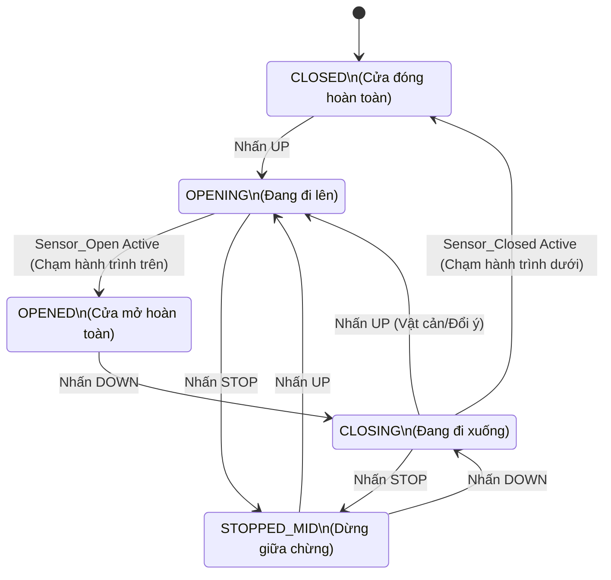

Chào bạn, tôi rất ấn tượng với bộ **Đề thi mẫu số 4** này! Đây là một bước nâng cấp rõ rệt so với các đề trước, chuyển trọng tâm từ "làm theo hướng dẫn" (viết code, vẽ lại) sang "tư duy kỹ sư" (phản biện, thiết kế, giải quyết sự cố). Đây chính xác là những gì các công ty tuyển dụng hoặc các đồ án lớn đòi hỏi.

Dưới đây là lời giải chi tiết và phân tích sâu cho từng câu hỏi để bạn nắm vững kiến thức:

---

### PHẦN I: TRẮC NGHIỆM & TÍNH TOÁN NHANH (30 Điểm)

**Câu 1: Đáp án A (132 MB/s)**

* **Giải thích:**
* Công thức: \text{Throughput} = \text{Frequency} \times (\text{Width} / 8).
* Frequency = 33 MHz = 33 \times 10^6 Hz.
* Width = 32 bits = 4 Bytes.
* Throughput = 33 \times 4 = 132 \text{ MegaBytes/second}.


**Câu 2: Đáp án B**

* **Giải thích:** Trong Daisy-chain (nối chuỗi), tín hiệu cấp quyền (Grant Line) đi từ thiết bị 1 -> 2 -> 3... Nếu thiết bị 1 cháy/hỏng mạch, tín hiệu không bao giờ đến được thiết bị 2, 3. Toàn bộ chuỗi phía sau bị tê liệt. Đây là điểm yếu "Single Point of Failure" cục bộ.

**Câu 3: Đáp án B**

* **Giải thích:**
* **DRAM (Dynamic RAM):** Cấu tạo chỉ gồm 1 tụ điện + 1 transistor -> Rất nhỏ -> Mật độ tích hợp cực cao -> Giá rẻ/GB.
* **SRAM (Static RAM):** Cần 6 transistor cho 1 bit -> To, đắt, nhưng cực nhanh (dùng làm Cache).
* Vậy dùng DRAM làm RAM chính vì RẺ và dung lượng LỚN.


**Câu 4: Đáp án A**

* **Giải thích:** **Hardware-Software Partitioning** (Phân chia Phần cứng/Phần mềm) là bước quan trọng nhất trong thiết kế hệ thống nhúng (Co-design). Kỹ sư phải quyết định thuật toán nào chạy trên CPU (linh hoạt, rẻ) và thuật toán nào cần chạy trên FPGA/ASIC (nhanh, song song, đắt).

**Câu 5: Đáp án B**

* **Giải thích:** Hard Real-time không có nghĩa là "phải chạy nhanh" (Fast), mà là "phải đúng hạn" (Predictable). Bỏ lỡ deadline = Hỏng toàn bộ hệ thống (Ví dụ: Túi khí bung trễ).

**Câu 6: Phân tích giao thức CAN**

* **Trả lời:**
* Mô hình tập trung (Central Arbitration) có một rủi ro lớn: Nếu bộ điều khiển trung tâm (Master/Arbiter) hỏng, toàn bộ mạng lưới tê liệt.
* Trong xe hơi, độ tin cậy là số 1. Giao thức CAN dùng **Distributed Arbitration** (Trọng tài phân tán). Các thiết bị tự thỏa thuận với nhau dựa trên mức ưu tiên của gói tin (Message ID). Nếu một cảm biến hỏng, các thiết bị khác vẫn giao tiếp bình thường.


---

### PHẦN II: TỰ LUẬN - TƯ DUY THIẾT KẾ (70 Điểm)

#### Câu 1: Case Study ECU (Hardware-Software Partitioning)

**1. Phân tích rủi ro Phương án 1 (1 CPU):**

* **Kiến trúc:** CPU làm tất cả: (1) Đọc cảm biến -> (2) Tính toán phức tạp (Float math) -> (3) Đếm thời gian kích xung.
* **Vấn đề:**
* Việc tính toán lượng khí nạp (Fuel Calculation) là thuật toán toán học nặng, thời gian thực thi có thể biến động (Jitter).
* Việc kích xung (Spark Timing) là tác vụ **Hard Real-time**. Nó cần chính xác từng micro-giây theo góc quay trục khuỷu.
* **Hậu quả:** Nếu CPU đang "bận đầu tắt mặt tối" tính phép nhân cho dòng (2), nó sẽ bỏ lỡ thời điểm vàng để kích dòng (3).
* **Kết quả:** Bugi đánh lửa trễ -> Động cơ rung giật, hiệu suất kém, khí thải bẩn.


**2. Đề xuất Phương án 2 (CPU + FPGA):**

* **Sơ đồ khối (Block Diagram):**
```mermaid
graph LR
    subgraph FPGA ["FPGA (Cơ bắp)"]
        Timer[High-Speed Timer]
        PWM[PWM Generator]
        ACT[Actuator Controller]
    end

    subgraph CPU ["CPU (Bộ não)"]
        ALG[Math Algorithm\n(Fuel Calc)]
        MAIN[Main Logic]
    end

    SENSOR[Cảm biến] --> CPU
    CPU -- "Parameters (Góc, Độ rộng xung)" --> FPGA
    FPGA --> SPARK[Bugi/Kim phun]

```


* **Phân vai:**
* **CPU (16-bit):** Chuyên tâm tính toán thuật toán. Nó tính ra kết quả: "Cần đánh lửa ở góc 15 độ, độ rộng 2ms". Nó gửi thông số này sang FPGA rồi rảnh tay làm việc khác.
* **FPGA:** Nhận thông số và thực thi. FPGA hoạt động song song phần cứng, nó so sánh tín hiệu góc quay liên tục. Đúng góc 15 độ -> Bắn xung ngay lập tức. Không bao giờ bị trễ dù CPU có đang treo.


**3. So sánh:**
Đây là ví dụ điển hình của kỹ thuật **Offloading** (Giảm tải) trong **Hardware-Software Partitioning**. Chuyển tác vụ Time-critical sang phần cứng chuyên dụng.

---

#### Câu 2: Máy trạng thái Cửa cuốn (State Machine Logic)

**1. Phản biện:**

* Thiết kế chỉ có `OPENED` và `CLOSED` là phi vật lý. Động cơ không phải là phép màu, nó cần thời gian (ví dụ 15 giây) để kéo cửa lên.
* Trong 15 giây đó, hệ thống ở trạng thái nào? Nếu không định nghĩa, hệ thống sẽ mất kiểm soát (không biết cửa đang ở đâu).

**2. Thiết kế lại (Correct FSM):**



**3. Xử lý sự cố (Safety Case):**

* **Tình huống:** Đang `CLOSING` (cửa đi xuống), người dùng nhấn `UP` (hoặc cảm biến va chạm kích hoạt).
* **Phản ứng:** Hệ thống phải chuyển ngay lập tức sang trạng thái `OPENING` (Đảo chiều động cơ đi lên) để tránh kẹp người/xe.
* **Đường chuyển đổi:** `CLOSING` -> `OPENING` (Trigger: Button UP).

---

#### Câu 3: Priority Inversion & Mars Pathfinder

**1. Giải thích hiện tượng:**
Hãy tưởng tượng kịch bản "Chìa khóa Toilet":

* **Task Low (L)** vào Toilet (chiếm Mutex), khóa cửa lại.
* **Task High (H)** rất mót (cần Mutex), chạy đến nơi thấy cửa khóa -> Phải đứng chờ L ra. (H bị Blocked).
* Đột nhiên, **Task Medium (M)** xuất hiện. M không cần đi Toilet, M chỉ muốn hát Karaoke (dùng CPU).
* Vì M có ưu tiên cao hơn L -> Hệ điều hành cho M hát. L bị đuổi ra ngoài (preempted) dù vẫn đang cầm chìa khóa Toilet.
* **Hậu quả:** L không được chạy -> L không bao giờ trả chìa khóa -> H (quan trọng nhất) phải đứng chờ M hát xong, rồi chờ L đi vệ sinh xong mới được vào.
* \rightarrow **Task High bị chặn bởi Task Medium** (một thằng chả liên quan gì).

**2. Giải pháp: Priority Inheritance (Thừa kế độ ưu tiên)**

* **Nguyên lý:**
* Khi H phát hiện mình phải chờ L.
* Hệ điều hành lập tức nói: *"Này L, mày đang giữ chìa khóa của VIP (H). Tao tạm thời cấp cho mày thẻ VIP (Nâng Priority của L lên bằng H)."*
* Nhờ thẻ VIP, L được quyền chạy ngay lập tức, bất chấp thằng M có muốn hát hay không.
* Sau khi L đi vệ sinh xong và trả chìa khóa, thẻ VIP bị thu hồi. L trở về làm dân thường. H nhận chìa khóa và vào ngay.


**3. Lựa chọn cho phanh ABS:**

* **Chọn:** **RTOS** (hoặc Bare-metal Scheduler cực kỳ chặt chẽ).
* **Tại sao không Round-robin?** Phanh ABS cần phản hồi tần số cao (ví dụ 100Hz - 10ms/lần) để nhấp nhả phanh chống trượt. Nếu dùng Round-robin, lỡ một vòng lặp bị kẹt bởi tác vụ khác (như nhạc, điều hòa), phanh sẽ bị đơ -> Xe trượt -> Tai nạn. RTOS đảm bảo tính **Determinism (Đoán định được thời gian)** cho tác vụ phanh.