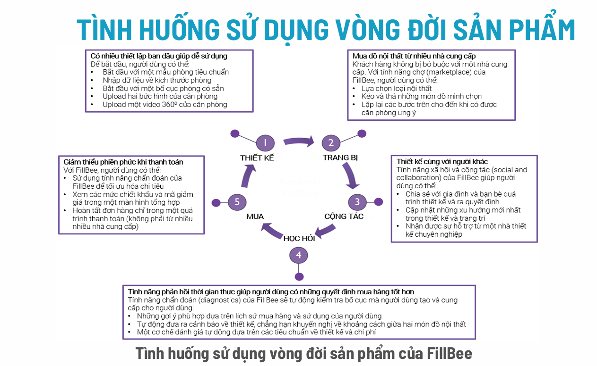
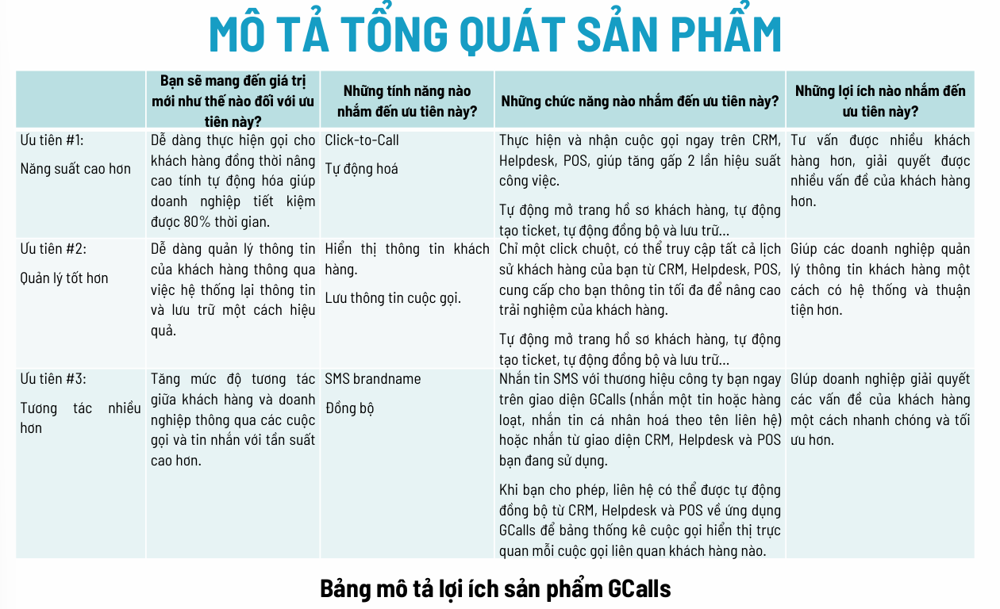
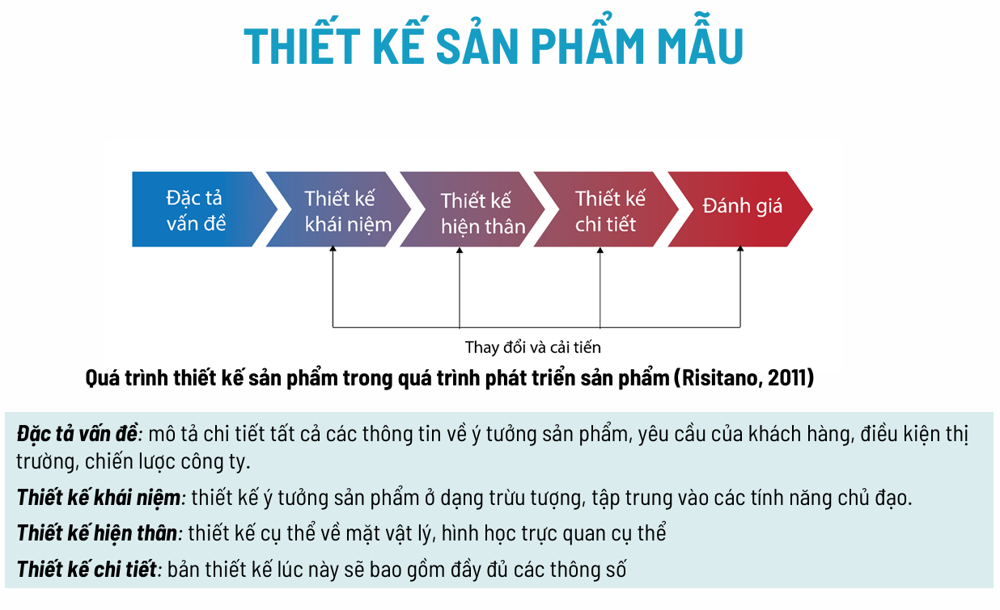
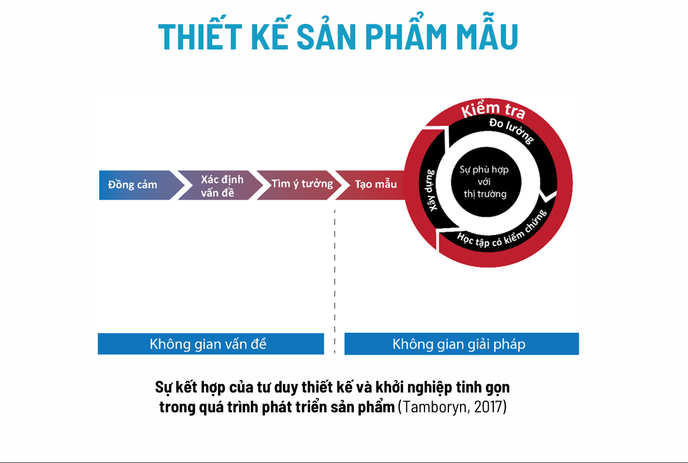

Chào bạn, tài liệu "Thiết kế sản phẩm" này tập trung vào quy trình biến một ý tưởng sơ khai thành một sản phẩm cụ thể, khả thi và có giá trị thương mại. Nội dung không đi sâu vào kỹ thuật vẽ hay gia công, mà tập trung vào **tư duy thiết kế (Design Thinking)** và **phát triển khách hàng**.

Dưới đây là phần giải thích chi tiết các nội dung cốt lõi trong slide để giúp bạn hiểu bài nhanh nhất:

### 1. Kiểm tra Ý tưởng Sản phẩm (Concept Testing)
Trước khi bắt tay vào sản xuất, bạn cần biết ý tưởng của mình có "đáng tiền" hay không.
* [cite_start]**Mục tiêu:** Đánh giá tiềm năng, thu thập phản hồi để hiệu chỉnh ý tưởng, tránh lãng phí nguồn lực[cite: 14].
* **Quy trình 3 bước:**
    1.  [cite_start]**Chọn phương pháp:** Phỏng vấn hoặc khảo sát khách hàng[cite: 17, 18].
    2.  [cite_start]**Thực hiện khảo sát:** Để có ý nghĩa thống kê, nên khảo sát tối thiểu 300 khách hàng mục tiêu[cite: 19, 20].
    3.  [cite_start]**Xác định ý tưởng tốt nhất:** Dựa trên số liệu để chọn ra ý tưởng có khả năng thành công cao nhất[cite: 21].

### 2. Tình huống sử dụng vòng đời sản phẩm (Life Cycle Use Case)
Bạn không chỉ bán sản phẩm, bạn bán một trải nghiệm xuyên suốt. Bạn cần vẽ ra hành trình của khách hàng từ lúc chưa biết đến sản phẩm cho đến khi vứt bỏ hoặc mua lại.
* **Quy trình:** Bạn phải vạch ra quy trình từ đầu đến cuối: Khách biết sản phẩm từ đâu? Mua thế nào? Lắp đặt ra sao? [cite_start]Sử dụng và cảm nhận giá trị thế nào?[cite: 36].
* [cite_start]**Các giai đoạn chính:** Nhận diện nhu cầu $\rightarrow$ Tìm lựa chọn $\rightarrow$ Phân tích $\rightarrow$ Mua $\rightarrow$ Trả tiền $\rightarrow$ Lắp đặt $\rightarrow$ Sử dụng $\rightarrow$ Xác nhận giá trị $\rightarrow$ Mua thêm $\rightarrow$ Giới thiệu cho người khác [cite: 37, 41-49].
* [cite_start]**Ví dụ:** Trong slide có ví dụ về **FillBee** (nội thất) và **GCalls** (tổng đài), cho thấy cách họ chi tiết hóa từng bước đi của khách hàng để tối ưu trải nghiệm[cite: 68, 110].

### 3. Mô tả và Lượng hóa Giá trị (Quan trọng)
Đây là phần giúp bạn chứng minh sản phẩm của mình "ngon" hơn đối thủ.
* **Mô tả sản phẩm:** Nên dùng hình ảnh, sơ đồ để tránh hiểu lầm. [cite_start]Cần chuyển từ "Tính năng" sang "Lợi ích" theo sự ưu tiên của khách hàng[cite: 112, 113].
* **Lượng hóa giá trị (Quantifying Value Proposition):**
    * Đừng chỉ nói chung chung là "tốt hơn". Hãy dùng con số.
    * [cite_start]**Phương pháp:** So sánh **Trạng thái hiện tại** (khi chưa có sản phẩm của bạn) và **Trạng thái khả dĩ** (khi đã dùng sản phẩm)[cite: 203].
    * [cite_start]**Ví dụ:** Thay vì nói "phần mềm giúp thiết kế nhanh hơn", hãy nói "giảm thời gian phát triển từ 16 tuần xuống còn 8 tuần" (như ví dụ SensAble)[cite: 260, 269]. [cite_start]Hoặc GCalls giúp tiết kiệm bao nhiêu phút cho mỗi cuộc gọi[cite: 279].

### 4. Thiết kế Sản phẩm mẫu (Prototyping)
Đừng đợi hoàn hảo mới tung ra. Hãy làm bản mẫu (prototype) sớm.
* **Định nghĩa:** Sản phẩm mẫu không nhất thiết phải là vật thật. [cite_start]Nó có thể là bản vẽ trên giấy, video mô phỏng, hay giao diện thiết kế[cite: 284].
* [cite_start]**Mục tiêu:** Để học hỏi (từ phản hồi khách hàng) và để giao tiếp (giữa các thành viên trong nhóm)[cite: 300].
* **Phân loại:**
    * [cite_start]Mức độ hữu hình: Mẫu vật lý (cầm nắm được) hoặc mẫu phân tích (mô hình toán học/máy tính)[cite: 305].
    * [cite_start]Mức độ hoàn thiện: Mẫu tập trung (một phần chức năng) hoặc mẫu toàn diện[cite: 306].

### 5. Tư duy Thiết kế (Design Thinking) & Khởi nghiệp tinh gọn
[cite_start]Slide nhấn mạnh việc kết hợp giữa **Design Thinking** (để tìm giải pháp sáng tạo) và **Lean Startup** (để kiểm chứng thị trường)[cite: 354].

[cite_start]Mô hình Tư duy thiết kế gồm 5 bước[cite: 335]:
1.  [cite_start]**Đồng cảm (Empathize):** Thấu hiểu người dùng thông qua **Bản đồ thấu cảm (Empathy Map)** - xem họ Nghĩ gì, Cảm thấy gì, Nghe gì, Nói gì, Làm gì, Nỗi đau và Mong muốn của họ là gì [cite: 356, 403-446].
2.  [cite_start]**Xác định vấn đề (Define):** Đưa ra tuyên bố vấn đề (Point of View) dựa trên nhu cầu tiềm ẩn của khách hàng[cite: 449, 451].
    * [cite_start]*Cấu trúc câu:* Khách hàng [Tên] cần [Động từ] bởi vì [Lý do sâu xa][cite: 459].
3.  [cite_start]**Tìm ý tưởng (Ideate):** Sáng tạo không giới hạn, đặt câu hỏi "Làm thế nào chúng ta có thể...?"[cite: 464, 467].
4.  [cite_start]**Tạo mẫu (Prototype):** Biến ý tưởng thành vật hữu hình để kiểm tra[cite: 469].
5.  [cite_start]**Kiểm tra (Test):** Đưa cho khách hàng trải nghiệm và quan sát, không giải thích nhiều, để khách hàng tự cảm nhận[cite: 484, 487].

### Tóm lại, để nắm vững chương này, bạn cần nhớ:
1.  **Hiểu khách hàng trước:** Dùng bản đồ thấu cảm.
2.  **Vẽ hành trình:** Khách hàng làm gì từ A-Z với sản phẩm?
3.  **Làm mẫu nhanh:** Vẽ ra, mô phỏng ngay để test.
4.  **Chứng minh bằng số:** Sản phẩm giúp khách tiết kiệm bao nhiêu tiền/thời gian so với cách cũ?

Bạn có muốn tôi lấy một ví dụ cụ thể về việc "Lượng hóa giá trị" cho một sản phẩm quen thuộc để dễ hình dung hơn không?