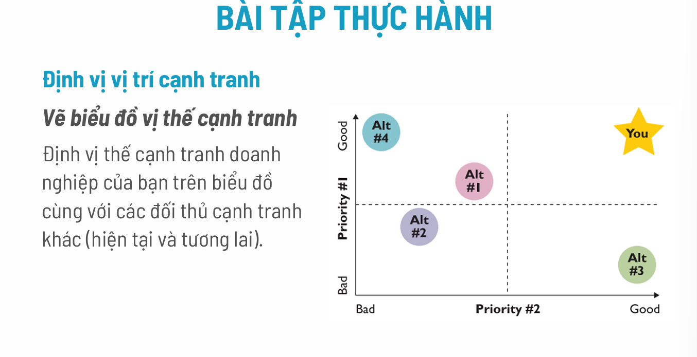

Chào bạn, tôi sẽ giải thích chi tiết chương **"Phân tích cạnh tranh"** trong tài liệu của bạn. Đây là một bước cực kỳ quan trọng trong khởi nghiệp để biết "mình đang đứng ở đâu" và "chiến trường khốc liệt thế nào".

Nội dung bài giảng được chia thành 4 trụ cột chính. Tôi sẽ đi sâu vào từng phần để bạn dễ nắm bắt:

---

### 1. Bản chất của Cạnh tranh (Slide 3)
Trước khi phân tích, bạn cần hiểu cạnh tranh là gì dưới hai góc độ:
*   **Góc độ Quản lý (Bên trong):** Là khả năng làm ra sản phẩm **tốt hơn** và **rẻ hơn** đối thủ.
*   **Góc độ Kinh tế (Bên ngoài):** Là sức mạnh để **chống lại** các đối thủ trên thị trường (không chỉ trong nước mà cả quốc tế), nơi nguồn lực và ý tưởng di chuyển tự do.

> **Tóm lại:** Cạnh tranh là việc bạn phải vừa tối ưu nội bộ, vừa đủ sức "đấm nhau" với bên ngoài để giành thị phần.

---

### 2. Phân tích ngành: Mô hình "5 Áp lực cạnh tranh" (Slide 4 - 12)
Đây là phần lý thuyết nặng nhất nhưng quan trọng nhất của Michael Porter. Mô hình này giúp trả lời câu hỏi: **"Ngành này có ngon ăn (dễ kiếm lời) không?"**.

Hãy tưởng tượng doanh nghiệp của bạn ở giữa vòng vây của 5 thế lực:

1.  **Mối đe dọa từ người mới vào ngành (Slide 5):**
    *   *Ý nghĩa:* Ngành này có dễ gia nhập không?
    *   *Phân tích:* Nếu rào cản thấp (không cần nhiều vốn, không cần công nghệ cao, luật pháp lỏng lẻo) -> Ai cũng nhảy vào làm được -> Cạnh tranh cao -> Lợi nhuận thấp.
    *   *Ngược lại:* Nếu rào cản cao (cần vốn khủng, công nghệ độc quyền) -> Bạn an toàn hơn.

2.  **Quyền thương lượng của nhà cung cấp (Slide 6):**
    *   *Ý nghĩa:* Bạn có bị người bán nguyên liệu "ép giá" không?
    *   *Phân tích:* Nếu chỉ có 1-2 nhà cung cấp độc quyền -> Họ tăng giá thì bạn phải chịu -> Lợi nhuận bạn giảm.

3.  **Quyền thương lượng của người mua (Slide 7):**
    *   *Ý nghĩa:* Khách hàng có quyền "ép giá" bạn không?
    *   *Phân tích:* Nếu bạn có ít khách hàng nhưng họ mua số lượng lớn, hoặc sản phẩm của bạn đại trà -> Khách hàng sẽ đòi giảm giá, đòi khuyến mãi -> Lợi nhuận giảm.

4.  **Mối đe dọa từ sản phẩm thay thế (Slide 8):**
    *   *Ý nghĩa:* Khách hàng không dùng hàng của bạn thì dùng cái gì khác (không phải của đối thủ trực tiếp)?
    *   *Ví dụ:* Bạn bán vé máy bay. Đối thủ trực tiếp là hãng bay khác. Nhưng sản phẩm thay thế là **tàu hỏa** hoặc **xe khách**. Nếu vé máy bay quá đắt, người ta đi tàu hỏa.

5.  **Cạnh tranh giữa các đối thủ hiện tại (Slide 9):**
    *   *Ý nghĩa:* Các ông lớn trong ngành đang đánh nhau thế nào?
    *   *Phân tích:* Nếu ngành có nhiều đối thủ ngang sức, tăng trưởng chậm -> Các bên sẽ đua nhau giảm giá, quảng cáo rầm rộ -> Chi phí tăng, lợi nhuận giảm.

**Kết luận phần này (Slide 10-11):** Bạn dùng mô hình này để chấm điểm. Nếu cả 5 áp lực đều **CAO**, thì ngành này "chua", khó kiếm lời. Nếu các áp lực **THẤP**, đây là thị trường màu mỡ để khởi nghiệp.

---

### 3. Xác định Giá trị cốt lõi (Slide 13 - 18)
Sau khi nhìn bên ngoài (thị trường), bạn phải nhìn vào bên trong (chính mình).

*   **Định nghĩa:** Giá trị cốt lõi là thứ "vũ khí bí mật" (tri thức, kỹ năng) giúp bạn làm tốt hơn đối thủ và quan trọng nhất là **Rất khó sao chép**.
*   **3 yếu tố của giá trị cốt lõi:** Phải Duy nhất - Phải Quan trọng - Phải phát triển được theo thời gian.
*   **Cách xây dựng:** Các slide 14-18 là bài tập thực hành. Nó khuyên bạn không nên tự nghĩ một mình mà phải:
    1.  Hỏi các thành viên trong team (giá trị cá nhân).
    2.  Tìm điểm chung để thành giá trị công ty.
    3.  Biến giá trị thành hành động cụ thể (Ví dụ: Giá trị là "Trung thực" thì hành động là "Không bao giờ nói sai tính năng sản phẩm").
    4.  Kiểm tra xem có cam kết thực hiện được không.

---

### 4. Định vị vị trí cạnh tranh (Slide 19 - 23)
Phần này giúp bạn xác định: "Trong mắt khách hàng, tôi khác biệt thế nào so với đối thủ?".

**Bước 1: Nhận diện đối thủ (Slide 19)**
*   *Trực tiếp:* Bán y chang bạn (Ví dụ: Pepsi vs Coca).
*   *Gián tiếp:* Giải quyết cùng nhu cầu nhưng cách khác (Ví dụ: GrabBike vs Xe ôm truyền thống).
*   *Tương lai:* Những kẻ chưa xuất hiện nhưng có tiềm năng đe dọa.

**Bước 2: Tình báo (Slide 21)**
Làm sao hiểu đối thủ?
*   Mua hàng của họ dùng thử.
*   Đi hội thảo ngành.
*   Đọc báo cáo, theo dõi website/social media của họ.
*   Hỏi chính khách hàng của mình xem họ nghĩ gì về đối thủ.

**Bước 3: Vẽ bản đồ định vị (Slide 22 - 23 - Rất quan trọng)**
*   Bạn vẽ một biểu đồ trục tung (đứng) và trục hoành (ngang).
*   Hai trục này là 2 yếu tố **quan trọng nhất** mà khách hàng quan tâm (Ví dụ: Giá cả và Chất lượng, hoặc Độ đơn giản và Độ linh hoạt).
*   **Mục tiêu:** Bạn phải đặt logo của mình vào một góc mà **không có hoặc ít đối thủ** (thường là góc trên cùng bên phải - vùng "Đại dương xanh").
*   *Ví dụ GCalls (Slide 23):* Họ chọn trục "Đơn giản" và "Linh hoạt". Các đối thủ khác hoặc quá phức tạp, hoặc quá cứng nhắc. GCalls đứng một mình một vị thế -> Đó là lợi thế cạnh tranh.

---

### 5. Phân tích SWOT (Slide 24)
Đây là bước tổng hợp cuối cùng để ra chiến lược:

*   **SW (Internal - Bên trong):**
    *   **S (Strengths):** Điểm mạnh (Bạn có gì giỏi hơn người khác? Giá trị cốt lõi là gì?).
    *   **W (Weaknesses):** Điểm yếu (Bạn thiếu vốn? Nhân sự yếu? Quy trình chưa có?).
*   **OT (External - Bên ngoài):**
    *   **O (Opportunities):** Cơ hội (Thị trường đang lên? Đối thủ đang suy yếu? Công nghệ mới?).
    *   **T (Threats):** Thách thức (Luật pháp thay đổi? Đối thủ mới nhảy vào? Kinh tế suy thoái?).

**Tư duy:** Dùng **S** để bắt lấy **O**. Dùng **S** để né **T**. Khắc phục **W** để không bỏ lỡ **O**.

---

### TÓM TẮT ĐỂ HIỂU BÀI:
Để làm bài tập hoặc áp dụng thực tế chương này, bạn hãy đi theo trình tự tư duy sau:
1.  **Nhìn ra ngoài (5 Forces):** Cái ngành này có dễ sống không? Ai đang nắm quyền (người mua hay người bán)?
2.  **Nhìn vào trong (Core Values):** Mình có cái gì đặc biệt mà thằng khác không bắt chước được?
3.  **Nhìn đối thủ (Positioning):** Vẽ biểu đồ ra, xem mình đứng ở đâu, có khác biệt không hay đang chen chúc chỗ đông người?
4.  **Tổng kết (SWOT):** Lên kế hoạch tận dụng điểm mạnh, né điểm yếu để chiến thắng.