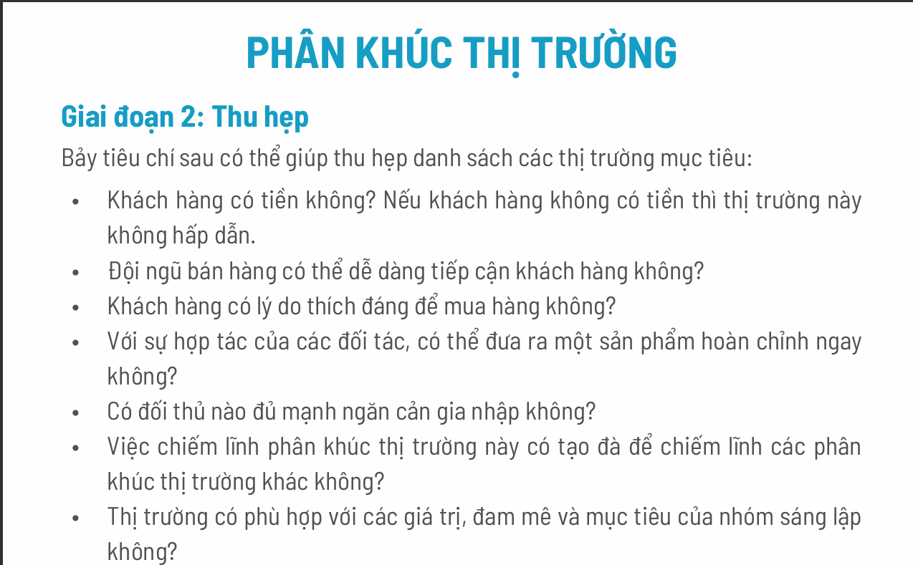
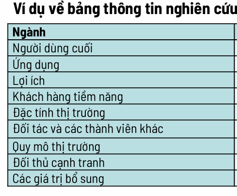
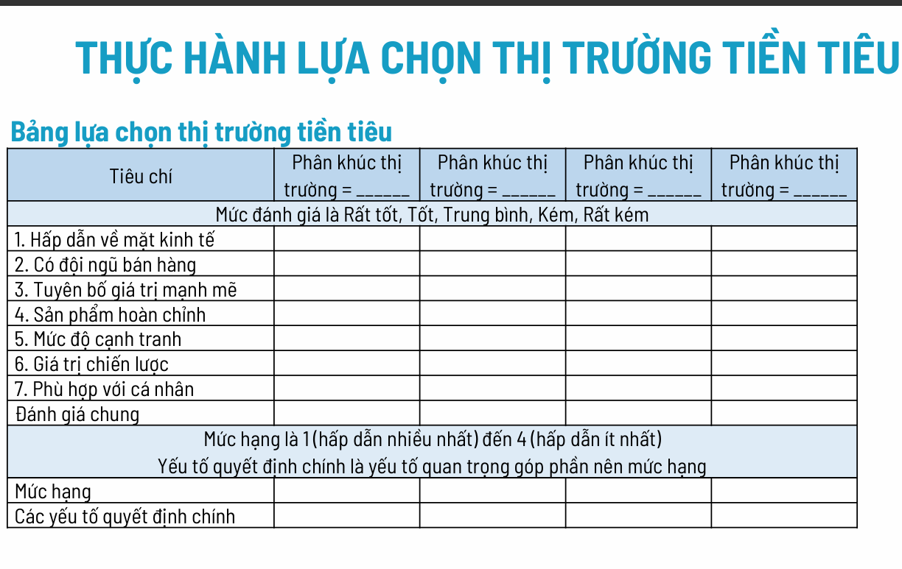
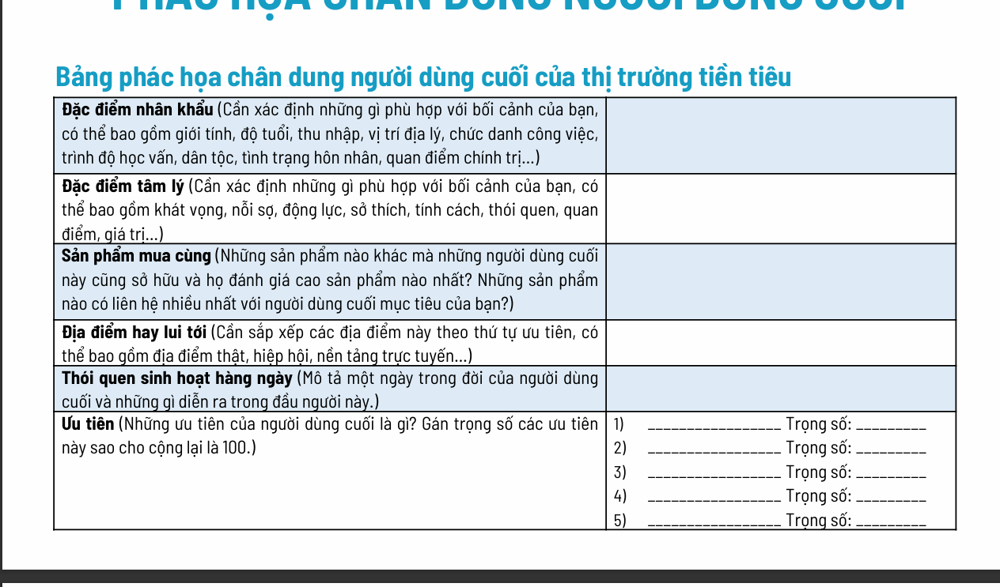

### 1. Phân khúc thị trường (Market Segmentation)
*(Từ trang 3 đến trang 7)*

**Khái niệm:** Bạn không thể bán hàng cho tất cả mọi người. Phân khúc thị trường là quá trình chia nhỏ thị trường lớn thành các nhóm nhỏ có điểm chung (nhu cầu giống nhau, phản ứng giống nhau với quảng cáo).

**Quy trình 3 bước (Trang 4-7):**
1.  **Phát ý tưởng (Brainstorm):** Nghĩ rộng ra tất cả các ngành, lĩnh vực mà công nghệ/sản phẩm của bạn có thể áp dụng. Liệt kê ai là người hưởng lợi.
2.  **Thu hẹp (Narrow):** Dùng bộ lọc (7 tiêu chí ở trang 6) để loại bỏ các thị trường không tiềm năng.
    *   *Ví dụ:* Khách hàng có tiền không? Bạn có tiếp cận được họ không? Đối thủ có mạnh quá không?

3.  **Nghiên cứu thị trường cơ bản:** Đừng chỉ ngồi đoán. Hãy đi ra ngoài, nói chuyện trực tiếp với khách hàng tiềm năng để điền vào bảng thông tin (Trang 7).

---

### 2. Lựa chọn Thị trường tiền tiêu (Beachhead Market)
*(Từ trang 8 đến trang 9)*

**Khái niệm quan trọng:** "Thị trường tiền tiêu" (Beachhead Market) lấy cảm hứng từ quân sự (đổ bộ lên bãi biển).
*   Thay vì cố chiếm cả một quốc gia (thị trường lớn), bạn tập trung toàn lực để chiếm **một bãi biển nhỏ** (thị trường ngách) trước.
*   Khi đã thắng ở đó, bạn mới có đà để mở rộng sang các vùng lân cận.

**Cách chọn:**
*   Chọn 1 thị trường từ danh sách đã phân khúc ở trên.
*   **Tiêu chí chọn (Trang 9):** Dùng bảng chấm điểm để chọn thị trường tốt nhất (hấp dẫn kinh tế, ít cạnh tranh, phù hợp với mục tiêu nhóm...).
*   **Đặc điểm nhận diện:** Khách hàng trong thị trường này phải mua các sản phẩm tương tự nhau và quan trọng nhất là có **"truyền miệng"** (người này giới thiệu cho người kia).

---

### 3. Phác họa Chân dung người dùng cuối (End User Profile)
*(Từ trang 10 đến trang 12)*

**Phân biệt:** Người dùng cuối (End User) là người trực tiếp sử dụng sản phẩm. (Lưu ý: Có thể khác với người trả tiền - Economic Buyer. Ví dụ: Sách giáo khoa thì học sinh dùng, nhưng nhà trường/phụ huynh mua. Ở đây ta tập trung vào người dùng).

**Nội dung cần làm:**
*   Bạn cần vẽ ra một hồ sơ nhân khẩu học (tuổi, giới tính, thu nhập) và tâm lý học (nỗi sợ, động lực, thói quen).
*   **Ví dụ GCalls (Trang 12):** Họ xác định rõ người dùng là "Trưởng phòng kinh doanh/telesale", độ tuổi 28-40, nỗi sợ là "mất dữ liệu". Càng cụ thể càng tốt.

---

### 4. Phác họa Khách hàng điển hình (Persona)
*(Từ trang 13 đến trang 15)*

**Khác biệt với phần trên:** "Chân dung người dùng cuối" là thống kê chung (ví dụ: nam, 25-30 tuổi). Còn "Persona" là **một nhân vật cụ thể, có tên tuổi** đại diện cho nhóm đó.

**Tại sao cần làm?** Để cả đội ngũ cùng hình dung về một người thật. Thay vì hỏi "Khách hàng có thích tính năng này không?", ta hỏi "Anh Nam (Persona) có thích tính năng này không?".

**Cách làm:**
*   Chọn 1 người dùng thật mà bạn đã phỏng vấn.
*   Mô tả chi tiết cuộc đời họ: Đi làm bằng gì? Ăn trưa ở đâu? Thần tượng ai?
*   Trang 15 là ví dụ cụ thể về Persona của GCalls.

---

### 5. Ước lượng quy mô thị trường (TAM - Total Addressable Market)
*(Từ trang 16 đến trang 24)*

**TAM là gì?** Là tổng doanh thu hàng năm bạn sẽ đạt được **NẾU** bạn chiếm được **100%** thị phần của Thị trường tiền tiêu đó.
*   *Lưu ý:* Đây là con số lý tưởng để đánh giá độ lớn của cái ao bạn đang định nhảy vào câu cá.

**Công thức (Trang 22):**
$$TAM = \text{Số lượng người dùng cuối} \times \text{Doanh thu trung bình mỗi người mang lại/năm}$$

**Phương pháp tính:**
*   **Từ trên xuống (Top-down):** Dùng báo cáo vĩ mô (Ví dụ: Thị trường giáo dục VN trị giá 1 tỷ USD). *Cách này thường không chính xác cho Startup vì quá rộng.*
*   **Từ dưới lên (Bottom-up) - KHUYÊN DÙNG:** "Đếm đầu người". Dùng danh sách khách hàng, danh bạ hiệp hội, thống kê cụ thể để đếm xem có bao nhiêu người dùng cụ thể khớp với "Chân dung người dùng cuối" của bạn.

**Kiểm tra:** Sau khi tính xong, hãy xem trang 24. Nếu thị trường quá nhỏ -> không bõ công làm. Nếu quá lớn -> bạn chưa phân khúc đủ sâu (sẽ bị đối thủ lớn đè bẹp).

---

### 6. Phân tích các thị trường tiếp theo (Follow-on Markets)
*(Từ trang 25 đến trang 27)*

**Ý nghĩa:** Nhà đầu tư muốn biết sau khi bạn thắng ở "Thị trường tiền tiêu", bạn sẽ đi đâu tiếp theo để công ty lớn mạnh?

**Hai hướng mở rộng:**
1.  Bán **sản phẩm mới** cho khách hàng cũ.
2.  Bán **sản phẩm cũ** (có tinh chỉnh) cho thị trường/khách hàng mới (Thị trường liền kề).

**Hành động:** Tính sơ bộ TAM của các thị trường tiếp theo để thấy bức tranh lớn (Big Picture) của doanh nghiệp trong tương lai.

---

### TÓM TẮT LẠI QUY TRÌNH (LOGIC CỦA BÀI):

1.  Thế giới rất rộng lớn -> **Phân khúc** để tìm các nhóm nhỏ.
2.  Chọn ra **1 nhóm tốt nhất** để đánh chiếm trước -> **Thị trường tiền tiêu**.
3.  Tìm hiểu xem **người dùng** trong nhóm đó là ai (nhân khẩu học, tâm lý) -> **End User Profile**.
4.  Dựng lên **một hình mẫu cụ thể** đại diện cho họ -> **Persona**.
5.  Tính toán xem nhóm này có bao nhiêu người và **đáng giá bao nhiêu tiền** -> **TAM**.
6.  Dự tính tương lai sẽ **mở rộng** ra sao -> **Thị trường tiếp theo**.

Hy vọng phần giải thích này giúp bạn nắm bắt được cốt lõi của bài giảng! Nếu bạn cần làm rõ phần tính toán TAM hay cách xây dựng Persona, hãy cho tôi biết nhé.