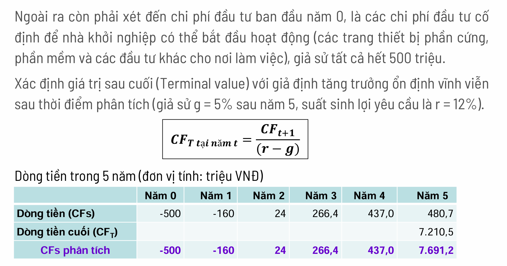
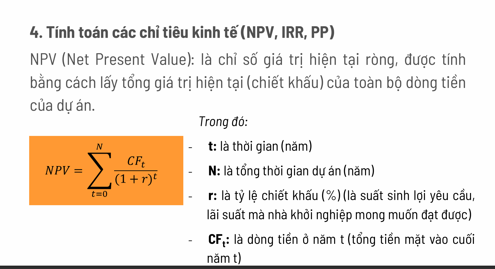
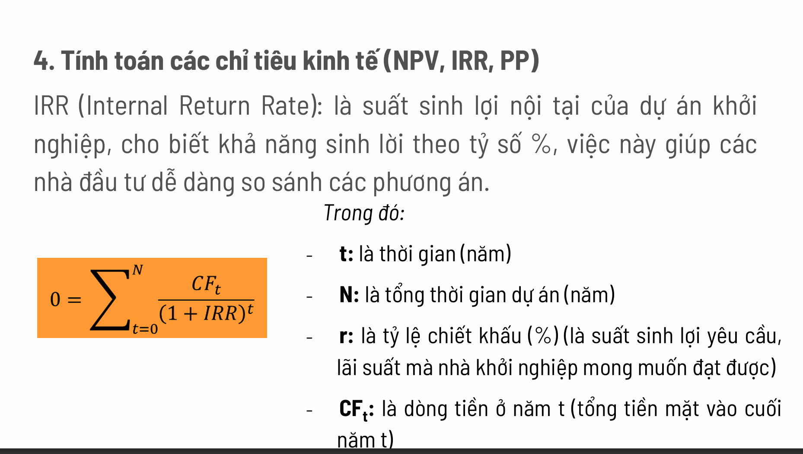
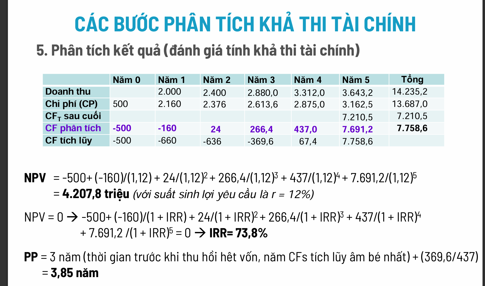

Chào bạn, chương **"Phân tích khả thi tài chính"** trong tài liệu này là một phần cực kỳ quan trọng đối với bất kỳ Startup nào. Nó không chỉ là những con số khô khan, mà là câu trả lời cho câu hỏi sống còn: **"Ý tưởng này có kiếm ra tiền không và có đáng để đầu tư không?"**

Dựa trên các slide bạn cung cấp, tôi sẽ giải thích logic của chương này theo 3 trụ cột chính để bạn dễ hiểu và dễ nhớ nhất:

---

### PHẦN 1: TIỀN ĐẾN TỪ ĐÂU? (Mô hình doanh thu & Định giá)

Trước khi tính toán lời lãi, bạn cần biết mình bán cái gì và bán giá bao nhiêu.

**1. Lựa chọn mô hình doanh thu (Slide 3-5):**
Đừng chỉ nghĩ đơn giản là "bán hàng lấy tiền". Slide gợi ý nhiều cách kiếm tiền khác nhau:
*   Bán đứt/Cho thuê sản phẩm.
*   Thu phí dịch vụ/thuê bao (subscription - ví dụ như Netflix).
*   Nhượng quyền, phí môi giới, quảng cáo...
*   *Tư duy:* Bạn cần xem xét 4 yếu tố: **Khách hàng** (họ thích trả tiền kiểu gì?), **Giá trị** bạn mang lại, **Đối thủ** đang làm gì, và khả năng **Vận hành** của bạn.

**2. Thiết lập khung giá (Slide 6-11):**
Đây là nghệ thuật định giá.
*   **Đừng định giá dựa trên chi phí (Cost-based):** Đừng tính kiểu "vốn 10 đồng, bán 12 đồng".
*   **Hãy định giá dựa trên giá trị (Value-based):** Khách hàng nhận được lợi ích bao nhiêu thì thu bấy nhiêu.
*   **Chiến lược cho từng nhóm khách (Slide 9-10):**
    *   *Nhóm thích công nghệ (Innovators):* Bán giá cao cũng được, họ thích cái mới.
    *   *Nhóm đại trà (Majority):* Cần giá hợp lý và rõ ràng hơn.
    *   *Lời khuyên:* Nên định giá cao rồi giảm dần (hớt váng) hơn là định giá thấp rồi tăng lên (sẽ bị khách phản ứng).

---

### PHẦN 2: TÍNH TOÁN HIỆU QUẢ TRÊN TỪNG KHÁCH HÀNG (Unit Economics)

Đây là phần quan trọng nhất với Startup. Nếu bán cho 1 khách mà lỗ, thì càng bán nhiều càng chết. Bạn cần nắm 2 chỉ số sinh tử: **LTV** và **COCA**.

**1. LTV (Lifetime Value) - Giá trị trọn đời của khách hàng (Slide 12-15):**
*   **Ý nghĩa:** Một khách hàng từ lúc đến cho đến lúc bỏ đi sẽ mang lại tổng cộng bao nhiêu **lợi nhuận** (đã trừ chi phí phục vụ)?
*   **Cách tính:** Tính tổng dòng tiền lời từ khách đó trong khoảng 5 năm, nhưng phải quy về giá trị hiện tại (NPV) - tức là 1 triệu của 5 năm sau không bằng 1 triệu bây giờ.
*   *Ví dụ:* Bán phần mềm 10.000$ + phí bảo trì hàng năm. LTV sẽ là tổng số tiền này tích lũy qua các năm.

**2. COCA (Cost of Customer Acquisition) - Chi phí để có 1 khách hàng (Slide 16-19):**
*   **Ý nghĩa:** Bạn tốn bao nhiêu tiền (Marketing, Sale, tiếp khách, chạy ads...) để lôi kéo được 1 người mua hàng?
*   **Công thức:** Tổng chi phí Marketing & Sale / Số lượng khách hàng mới.
*   **Thực tế (Slide 18):** Năm đầu tiên COCA thường rất cao (do chưa ai biết đến, phải tốn tiền quảng cáo nhiều). Nhưng các năm sau COCA phải giảm dần thì mới tốt.

**3. Tỷ lệ vàng (Slide 17):**
> **LTV : COCA > 3 : 1**

Nghĩa là: Nếu bạn tốn 1 đồng để kiếm khách, khách đó phải mang lại cho bạn ít nhất 3 đồng lợi nhuận. Nếu thấp hơn, mô hình kinh doanh của bạn đang gặp nguy hiểm.

---

### PHẦN 3: ĐÁNH GIÁ TỔNG THỂ DỰ ÁN (Phân tích tài chính vĩ mô)

Sau khi tính toán từng khách hàng ổn rồi, bạn tính toán cho toàn bộ công ty trong 5 năm (Slide 21-32).

**Quy trình 5 bước (Slide 22):**

1.  **Nhận diện chi phí & lợi ích:** Liệt kê hết các khoản phải chi (thuê nhà, lương, điện nước...) và các nguồn thu. *Lưu ý:* Bỏ qua "chi phí chìm" (tiền đã mất không lấy lại được dù làm hay không).
2.  **Gán giá trị:** Điền số tiền cụ thể vào (Slide 25).
3.  **Xác định dòng tiền (Cash Flow) - Slide 26-27:**
4.  

    *   Lấy Thu - Chi = Dòng tiền mỗi năm.
    *   *Quan trọng:* Phải tính thêm **Terminal Value (Giá trị sau cuối)**. Tức là sau 5 năm, công ty bạn vẫn còn giá trị (thương hiệu, tài sản, khả năng sinh lời tiếp), phải cộng khoản này vào năm thứ 5.
5.  **Tính các chỉ số quyết định (Slide 28-30):**
    *   **NPV (Net Present Value):** Tổng lợi nhuận 5 năm quy đổi về tiền hiện tại.

        *   *Yêu cầu:* **NPV ≥ 0** (Dự án có lãi).
    *   **IRR (Internal Rate of Return):** Tỷ suất sinh lời nội bộ.

        *   *Yêu cầu:* **IRR ≥ Lãi suất mong đợi** (Ví dụ bạn muốn lãi 12%, mà tính ra IRR = 73% như Slide 32 là quá tuyệt vời).
    *   **PP (Payback Period):** Thời gian hoàn vốn.
        *   *Yêu cầu:* Càng ngắn càng tốt (Ví dụ slide 32 là 3,85 năm).

1.  **Kết luận (Slide 31):** Dựa vào 3 chỉ số trên để nói "Làm" hay "Không làm".

Chào bạn, phần **"Thiết lập khung giá ban đầu"** (từ Slide 6 đến Slide 11) là phần rất dễ gây nhầm lẫn vì nhiều Startup hay mắc sai lầm là: *Tính chi phí sản xuất rồi cộng thêm một chút lời*.

Slide trong tài liệu khuyên bạn **tuyệt đối không làm như vậy**. Dưới đây là giải thích chi tiết và sâu hơn về tư duy định giá đúng đắn:

### 1. Nguyên tắc cốt lõi: Định giá theo GIÁ TRỊ, không phải theo CHI PHÍ (Slide 7)

Đây là ý quan trọng nhất.
*   **Sai lầm (Cost-based):** Bạn làm ra cái phần mềm tốn 10 đồng, bạn bán 12 đồng để lời 2 đồng.
    *   *Vấn đề:* Khách hàng không quan tâm bạn tốn bao nhiêu công sức. Nếu phần mềm của bạn giúp họ kiếm được 1.000 đồng, họ sẵn sàng trả 100 đồng. Bạn bán 12 đồng là bạn đang "ném tiền qua cửa sổ".
*   **Đúng đắn (Value-based):** Bạn xác định sản phẩm giúp khách hàng tiết kiệm được bao nhiêu tiền hoặc kiếm thêm được bao nhiêu tiền, rồi thu một phần trong số đó.
    *   *Ví dụ:* Phần mềm của bạn giúp doanh nghiệp sa thải bớt 1 nhân sự (tiết kiệm 10 triệu/tháng). Bạn có thể bán phần mềm giá 2 triệu/tháng. Doanh nghiệp vẫn lời 8 triệu. Đó là giá trị.

### 2. Hai cơ chế giá phổ biến (Slide 6)

Khi mới bắt đầu, bạn cần chọn cách tính tiền:
*   **Giá cố định (Fixed Pricing):** Giống như menu quán ăn. Ai vào cũng một giá đó.
    *   *Ưu điểm:* Dễ quản lý, khách đỡ mất công mặc cả.
    *   *Áp dụng:* Bán lẻ, bán phần mềm đóng gói (SaaS), bán cho khách hàng phổ thông.
*   **Giá linh hoạt (Dynamic Pricing):** Giống như đi chợ hoặc mua bất động sản.
    *   *Thương lượng:* Tùy vào quy mô khách hàng to hay nhỏ mà đàm phán.
    *   *Thời gian/Tồn kho:* Vé máy bay, Grab (giờ cao điểm giá cao).
    *   *Áp dụng:* Bán B2B (doanh nghiệp lớn), dịch vụ tư vấn.

### 3. Chiến lược giá theo "Vòng đời chấp nhận công nghệ" (Slide 9-10)

Đây là phần tinh tế nhất. Không phải lúc nào cũng giữ một mức giá. Giá của bạn sẽ thay đổi tùy theo việc bạn đang bán cho ai trong 5 nhóm người sau:

1.  **Nhóm Tín đồ công nghệ (Innovators) & Người tiếp nhận sớm (Early Adopters):**
    *   *Họ là ai:* Người thích cái mới, muốn dùng sản phẩm để khoe hoặc để tạo lợi thế cạnh tranh trước đối thủ. Họ **không nhạy cảm về giá**.
    *   *Chiến lược giá:* **ĐỊNH GIÁ CAO (Hớt váng).**
    *   *Tại sao:* Vì họ mua "cảm giác người tiên phong" và "lợi ích công nghệ". Thu tiền cao để bù đắp chi phí R&D ban đầu.
2.  **Nhóm Số đông chấp nhận sớm (Early Majority):**
    *   *Họ là ai:* Người thực tế, chờ sản phẩm ổn định mới mua.
    *   *Chiến lược giá:* **Giá chuẩn/Giá thị trường.** Lúc này bạn cần có lãi trên quy mô lớn.
3.  **Nhóm Số đông chấp nhận trễ (Late Majority) & Bảo thủ (Laggards):**
    *   *Họ là ai:* Mua vì bắt buộc phải mua hoặc khi giá đã rất rẻ.
    *   *Chiến lược giá:* **Giảm giá/Khuyến mãi.**

> **Bài học:** Đừng bán rẻ ngay từ đầu. Hãy bán đắt cho những người cần bạn nhất (Early Adopters) để có tiền nuôi công ty, sau đó giảm dần khi mở rộng ra thị trường đại chúng.

### 4. Bảng kiểm tra trước khi chốt giá (Slide 8)

Trước khi đưa ra con số cuối cùng, hãy nhìn vào bảng ở Slide 8 và tự hỏi:

*   **DMU (Ai trả tiền?):** Nếu người trả tiền là Sếp (người giàu), bạn có thể định giá cao. Nếu người trả tiền là nhân viên/sinh viên, phải định giá thấp.
*   **Đối thủ (Neo giá):** Đối thủ đang bán 100k.
    *   Nếu bạn bán 200k: Bạn phải chứng minh mình xịn gấp đôi.
    *   Nếu bạn bán 50k: Khách sẽ nghi ngờ hàng đểu.
*   **Rủi ro:** Sản phẩm bạn mới ra mắt, khách sợ dùng bị lỗi.
    *   *Cách xử lý:* Giữ giá cao nhưng cho dùng thử miễn phí hoặc cam kết hoàn tiền (Slide 7 khuyên nên có chính sách linh hoạt cho người thử nghiệm sớm).

### 5. Lời khuyên "Xương máu" cho Startup (Slide 7)

Slide 7 có 2 ý cực hay mà bạn cần nhớ khi đi thi hoặc làm thật:

1.  **"Nên định giá cao rồi giảm, hơn là định giá thấp rồi tăng":**
    *   Nếu bạn bán 50k, sau này tăng lên 100k, khách sẽ chửi và bỏ đi.
    *   Nếu bạn bán 100k, nhưng giảm giá còn 50k cho khách quen, họ sẽ thấy sung sướng và trung thành.
2.  **Hiểu rõ sản phẩm thay thế:**
    *   Bạn bán phần mềm quản lý công việc. Đừng chỉ so giá với phần mềm đối thủ. Hãy so giá với "cuốn sổ tay" hoặc "Excel". Nếu khách thấy dùng Excel miễn phí vẫn ổn, họ sẽ không trả tiền cho bạn đâu, trừ khi bạn chứng minh được bạn tiết kiệm thời gian gấp 10 lần Excel.

### Tóm lại:
Thiết lập khung giá ban đầu là việc **tìm điểm cân bằng**: Đủ cao để thể hiện giá trị sản phẩm và có lời (LTV cao), nhưng cũng phải có lý do (Value) để thuyết phục những khách hàng đầu tiên (Early Adopters) rút ví.
Chào bạn, **Ước tính chi phí để có được một khách hàng (COCA - Cost of Customer Acquisition)** là một trong những chỉ số "sống còn" mà các nhà đầu tư sẽ soi kỹ nhất khi nhìn vào bảng tài chính của bạn.

Dựa trên Slide 16 đến Slide 20, tôi sẽ giải thích cặn kẽ về COCA theo 4 khía cạnh: Định nghĩa, Công thức tính đúng, Xu hướng theo thời gian và Tiêu chuẩn đánh giá.

---

### 1. Bản chất: COCA là gì? (Slide 16)

Hãy tưởng tượng bạn đang đi "mua" khách hàng. COCA chính là cái giá bạn phải trả để "mua" được một người chịu bỏ tiền ra dùng sản phẩm của bạn.

Nhiều người lầm tưởng COCA chỉ là tiền chạy quảng cáo Facebook/Google. **Sai hoàn toàn!**
Trong tài liệu này, COCA bao gồm **TẤT CẢ** chi phí liên quan đến bán hàng và tiếp thị:
*   Tiền lương nhân viên Sales & Marketing.
*   Tiền hoa hồng (commission).
*   Chi phí đi lại, tiếp khách, ăn uống (giải trí).
*   Tiền thuê gian hàng triển lãm, tổ chức sự kiện.
*   Tiền làm website, in tờ rơi, chạy quảng cáo...

### 2. Công thức tính chuẩn xác (Slide 16)

Công thức trong slide nhìn có vẻ phức tạp, nhưng bản chất rất logic:

$$COCA = \frac{\text{Tổng chi phí Sales & Marketing} - \text{Chi phí chăm sóc khách cũ}}{\text{Số lượng khách hàng MỚI}}$$

**Tại sao phải trừ "Chi phí chăm sóc khách cũ" (IBSE)?**
*   Vì COCA là chi phí để tìm **khách mới**.
*   Nếu nhân viên Sale của bạn dành 30% thời gian để hỗ trợ kỹ thuật hoặc nghe điện thoại phàn nàn từ khách hàng cũ, thì phần lương đó không được tính vào COCA (nó là chi phí vận hành/giữ chân khách).

### 3. Ví dụ thực tế về cách tính (Phân tích Slide 19)

Slide 19 đưa ra một bảng tính rất hay để bạn hình dung sự thay đổi của COCA qua 3 năm. Hãy nhìn kỹ vào đó:

*   **Năm 1:**
    *   Bạn thuê 1 Sale + 1 Kỹ thuật + Chi phí đi lại/Web... = Tổng chi 394 triệu.
    *   Bạn chỉ kiếm được **1 khách hàng** (vì mới khởi nghiệp, chưa ai biết, quy trình chưa trơn tru).
    *   -> **COCA năm 1 = 394 triệu/khách.** (Rất đắt đỏ).

*   **Năm 3:**
    *   Bạn tuyển thêm người, tổng chi phí tăng lên hơn 1 tỷ đồng (1.032,5 triệu).
    *   Nhưng nhờ uy tín đã có, quy trình tốt, bạn kiếm được **7 khách hàng**.
    *   -> **COCA năm 3 = 1.032,5 / 7 = 147,5 triệu/khách.**

> **Bài học:** COCA thường **rất cao ở giai đoạn đầu** và sẽ **giảm dần** theo thời gian khi thương hiệu lớn mạnh và quy trình bán hàng hiệu quả hơn. (Biểu đồ Slide 17 thể hiện rõ đường màu đỏ COCA đi xuống dốc).

### 4. Chỉ số vàng: LTV và COCA (Slide 17)

Biết COCA là bao nhiêu rồi thì sao? Làm sao biết là đắt hay rẻ?
Bạn phải so sánh nó với **LTV (Giá trị trọn đời khách hàng)** mà tôi đã giải thích ở phần trước.

Quy tắc vàng của David Skok (Slide 17):
> **Tỷ lệ LTV : COCA ≥ 3 : 1**

*   **Nghĩa là:** Nếu bạn bỏ ra **1 đồng** để "mua" khách (COCA), khách đó phải mang lại cho bạn ít nhất **3 đồng** lợi nhuận (LTV).
*   **Tại sao là 3?** Vì bạn còn phải trả tiền thuê nhà, tiền điện, tiền quản lý, tiền thuế... Nếu chỉ kiếm được 1 hòa 1 (1:1) hoặc 2:1, công ty bạn sẽ lỗ vốn và phá sản.

### 5. Tại sao COCA ban đầu lại cao? (Slide 18 - Case Study dầu khí)

Slide 18 đưa ra ví dụ về một dự án năng lượng để giải thích vì sao ban đầu "mua khách" lại tốn kém thế:
1.  **Chu trình bán hàng dài:** Mất cả năm trời mới chốt được đơn (trong 1 năm đó vẫn phải trả lương nhân viên mà chưa có doanh thu).
2.  **Chi phí nhân sự cao:** Phải thuê kỹ sư giỏi, cố vấn đắt tiền mới thuyết phục được khách mua hệ thống phức tạp.
3.  **Chi phí giáo dục thị trường:** Khách chưa hiểu công nghệ mới là gì, phải tốn tiền đi giải thích, demo.

### Tóm lại, khi làm bài hoặc lập dự án:

1.  **Đừng ảo tưởng:** Đừng nghĩ chỉ tốn vài đồng quảng cáo là có khách. Hãy liệt kê cả lương của chính bạn (nếu bạn đi bán hàng) vào chi phí này.
2.  **Chấp nhận lỗ ngắn hạn:** Năm đầu COCA cao ngất ngưởng là bình thường.
3.  **Chứng minh tương lai:** Quan trọng là bạn phải chỉ ra được làm cách nào để giảm COCA trong các năm sau (tăng hiệu suất nhân viên, khách tự giới thiệu khách...).
4.  **Luôn nhớ tỷ lệ 3:1:** Kiếm được 3 đồng mới được chi 1 đồng tìm khách.