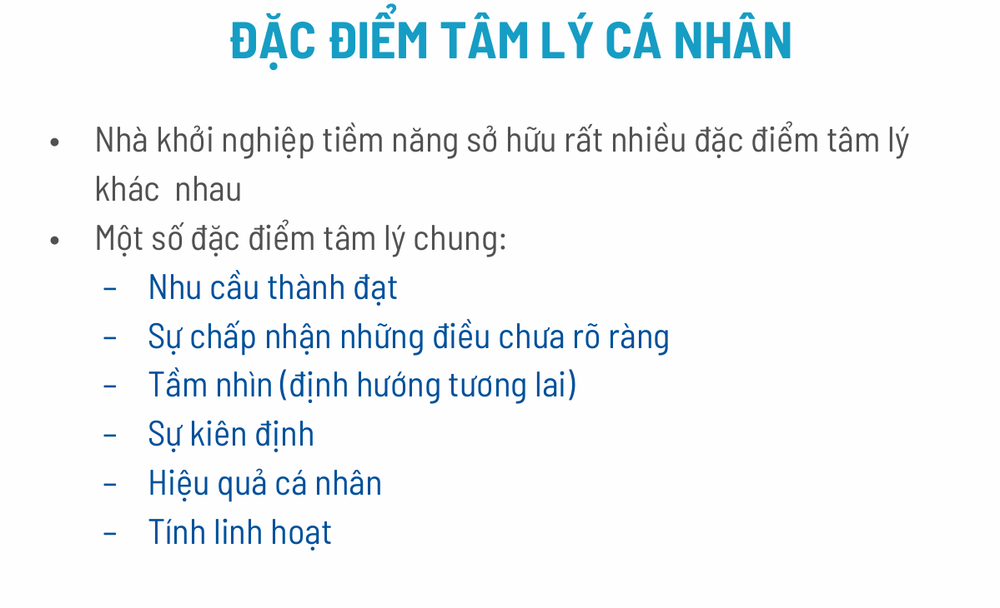
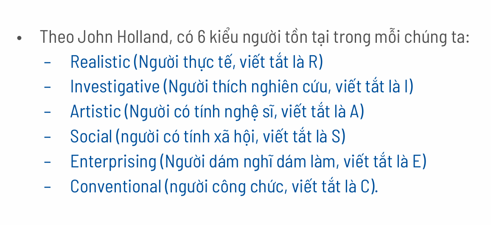
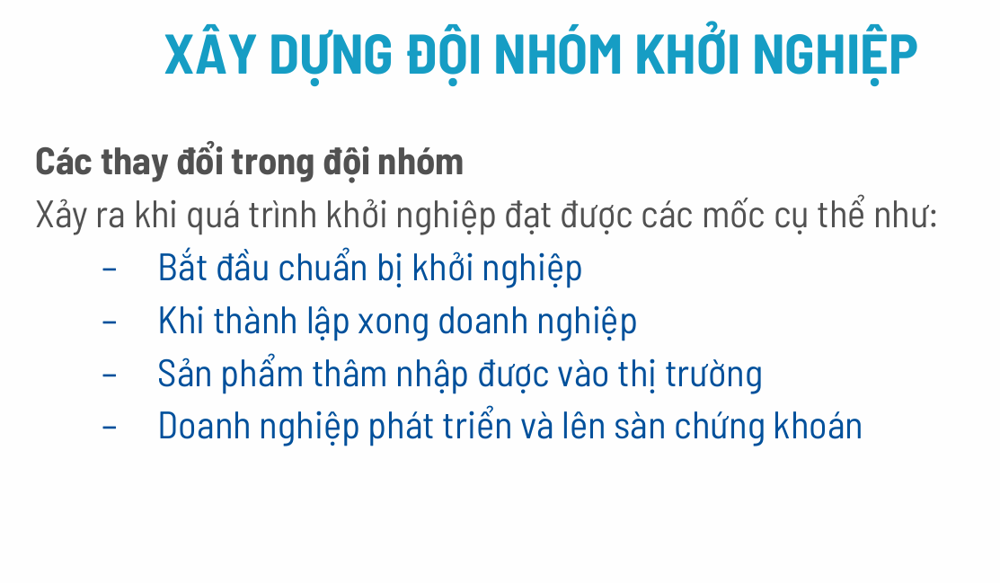

### PHẦN 1: CHUẨN BỊ CÁ NHÂN (Slide 2 - 22)
Trước khi muốn lãnh đạo người khác, nhà khởi nghiệp (Founder) phải hiểu rõ và lãnh đạo được chính mình. Slide nhấn mạnh 5 khía cạnh cần đánh giá:

#### 1. Đặc điểm tâm lý (Slide 4 - 6)
Khởi nghiệp là con đường đầy rủi ro và không chắc chắn. Bạn cần tự hỏi mình có những tâm lý này không:
*   **Chấp nhận sự không rõ ràng:** Bạn có dám làm khi chưa biết chắc kết quả không?
*   **Nhu cầu thành đạt & Tầm nhìn:** Bạn có khát khao thành công và nhìn xa trông rộng không?
*   **Sự kiên định & Linh hoạt:** Bạn có đủ lì lợm để theo đuổi mục tiêu nhưng cũng đủ nhanh nhạy để thay đổi khi cần không?
*   *Cách đánh giá:* Slide cung cấp mã QR để làm bài test. Nếu điểm > 3 là tốt, gần 5 là thế mạnh, < 3 là điểm yếu cần khắc phục.

#### 2. Tố chất khởi nghiệp (Slide 7 - 9)
Dựa theo lý thuyết của John Holland, con người chia làm 6 nhóm (RIASEC).

*   **Quy tắc vàng cho Founder (Slide 9):** Một nhà khởi nghiệp lý tưởng nên là sự kết hợp của 3 nhóm:
    *   **E (Enterprising):** Dám nghĩ dám làm, thích kinh doanh, dẫn dắt.
    *   **A (Artistic):** Có tính nghệ sĩ, sáng tạo, không rập khuôn.
    *   **I (Investigative):** Thích nghiên cứu, tìm tòi cái mới.

#### 3. Kinh nghiệm và Kỹ năng (Slide 12 - 15)
Không chỉ cần "máu lửa", bạn cần kỹ năng thực tế:
*   Bạn đã có kinh nghiệm quản lý hay kinh doanh chưa?
*   **Bài tập SWOT bản thân (Slide 15):** Bạn cần kẻ bảng ra, tự mình đánh giá điểm mạnh/yếu, sau đó nhờ người thân/bạn bè đánh giá bạn. Sự chênh lệch giữa cách bạn nhìn mình và người khác nhìn bạn sẽ cho bạn cái nhìn khách quan nhất.

#### 4. Nhận thức về Liêm chính (Slide 16 - 18)
Đây là nền tảng đạo đức.
*   Liêm chính không chỉ là không trộm cắp, mà là hành xử phù hợp chuẩn mực xã hội và **có trách nhiệm** với nhân viên, cộng đồng.
*   Giá trị đạo đức của người đứng đầu sẽ quyết định văn hóa của cả công ty sau này.

#### 5. Cân bằng cuộc sống & Công việc (Slide 19 - 22)
Đây là vấn đề thực tế: Founder thường làm việc 16-20 tiếng/ngày -> Bỏ bê gia đình/bản thân -> Stress -> Hiệu quả công việc giảm.
*   **Vòng luẩn quẩn:** Mất cân bằng dẫn đến stress, stress lại làm việc kém đi.
*   **Giải pháp (Slide 22):** Quản lý thời gian, biết cách giao việc (đừng ôm đồm), tìm kiếm sự hỗ trợ từ cộng đồng khởi nghiệp và Mentor.

---

### PHẦN 2: CHUẨN BỊ ĐỘI NHÓM (Slide 23 - 33)
Sau khi "tu thân", bước tiếp theo là "tề gia" (xây dựng đội ngũ). Slide chia ra 2 cách hình thành đội nhóm:

#### Cách 1: Có ý tưởng trước -> Tìm người sau (Slide 24)
*   **Quy trình:** Bạn có ý tưởng -> Bạn xác định mình thiếu kỹ năng gì (ví dụ bạn giỏi kỹ thuật thì thiếu người bán hàng) -> Tuyển dụng -> Phỏng vấn -> Chọn người.
*   *Lưu ý:* Cách này chuyên nghiệp nhưng tốn thời gian tìm người phù hợp và tin tưởng được.

#### Cách 2: Có đội nhóm trước -> Tìm ý tưởng sau (Slide 25 - 29)
Đây là cách phổ biến ở sinh viên hoặc nhóm bạn bè, gia đình.
*   **Nguồn gốc:** Bạn học, đồng nghiệp cũ, người nhà, hoặc những người cùng là khách hàng của một sản phẩm nào đó.
*   **Lợi thế:** Hiểu nhau, tin tưởng nhau, có sẵn sự ăn ý.
*   **Rủi ro (Slide 26):**
    *   Nếu cả nhóm học cùng một ngành (VD: toàn dân lập trình) -> **Thiếu hụt kỹ năng** (ai sẽ bán hàng? ai làm tài chính?). => *Giải pháp: Phải mời thêm người ngoài.*
    *   Nếu nhóm đa dạng kỹ năng -> Rất tốt, không cần tuyển thêm.

#### Quá trình phát triển của Đội nhóm (Slide 30 - 33)
Đội nhóm không đứng yên mà luôn biến động:
*   **Giai đoạn êm ả:** Cần xây dựng sự tin cậy và chia sẻ tri thức.
*   **Giai đoạn biến động (Slide 31-32):** Nhóm sẽ thay đổi hoặc tan vỡ khi gặp các cột mốc lớn (thành lập công ty, lên sàn chứng khoán) hoặc gặp **Khủng hoảng** (hết tiền, sản phẩm thất bại, cãi nhau).
*   *Bài học:* Mâu thuẫn là tất yếu, quan trọng là sự đồng lòng và khả năng ra quyết định khó khăn.

---

### PHẦN 3: CỐ VẤN KHỞI NGHIỆP (MENTOR) (Slide 34 - 35)
Startup thường thiếu kinh nghiệm, nên cần người dẫn đường (Mentor).
*   **Bản chất:** Quan hệ tự nguyện, hai chiều. Mentor thường rất bận rộn, nên tìm được Mentor giỏi là rất khó.
*   **Quy trình 4 bước (Slide 35):**
    1.  Làm quen & Thống nhất nguyên tắc.
    2.  Xác định vấn đề & Ưu tiên.
    3.  Triển khai giải quyết.
    4.  Kết thúc & Nâng cấp mục tiêu.

---

### TỔNG KẾT BÀI HỌC GIÚP BẠN HIỂU
Để khởi nghiệp thành công, bạn không thể đi một mình và cũng không thể đi với một cái đầu rỗng. Bài học này nhắn nhủ:

1.  **Hiểu mình:** Bạn có đủ "cứng" về tâm lý và đạo đức không? Bạn có tố chất (Sáng tạo + Dám làm + Nghiên cứu) không?
2.  **Chọn bạn mà chơi:** Đội nhóm tốt là đội nhóm bù trừ được điểm yếu cho nhau (người làm kỹ thuật đi với người làm kinh doanh), chứ không phải chỉ là chơi thân với nhau.
3.  **Giữ cái đầu lạnh:** Chuẩn bị tinh thần cho stress và mâu thuẫn nội bộ.
4.  **Tìm thầy giỏi:** Hãy tìm Mentor để bớt đi đường vòng.