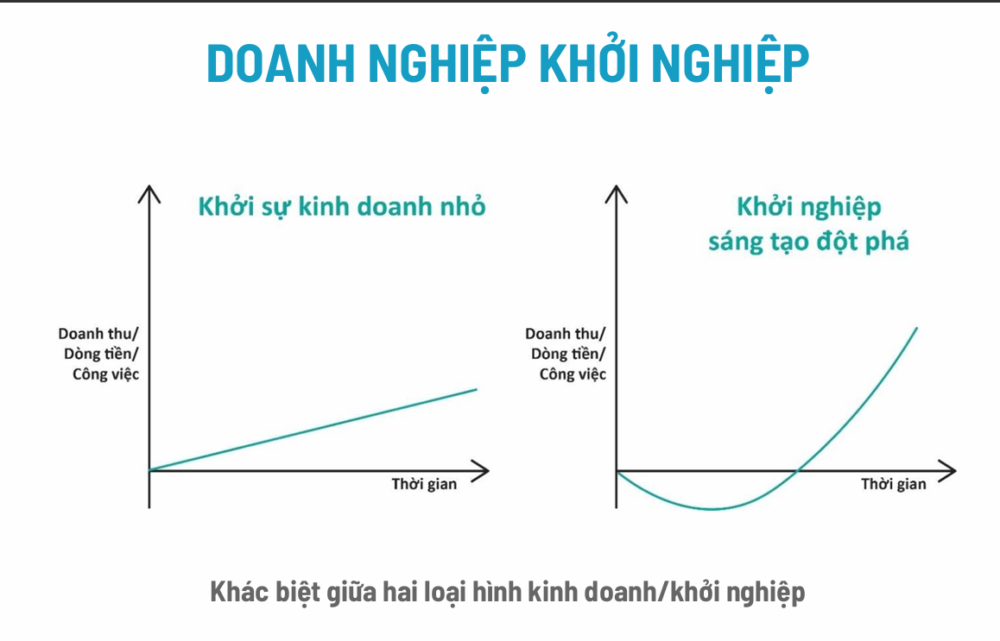

Chào bạn, dựa trên tài liệu PDF bạn cung cấp ("Khái niệm và Quy trình Khởi nghiệp Đổi mới Sáng tạo"), tôi sẽ giải thích chi tiết và hệ thống lại toàn bộ nội dung bài học để bạn dễ dàng nắm bắt.

Bài học này đi từ việc định nghĩa các khái niệm nền tảng cho đến quy trình thực tế để xây dựng một startup. Dưới đây là phần giải thích cụ thể theo từng mục nội dung trong slide:

---

### PHẦN 1: HỆ THỐNG CÁC KHÁI NIỆM CƠ BẢN

Để hiểu về khởi nghiệp đổi mới sáng tạo, trước hết chúng ta cần bóc tách từng từ khóa:

#### 1. Đổi mới sáng tạo (Innovation) là gì? (Slide 3)
Nhiều người nhầm lẫn giữa "Sáng tạo" (Creativity) và "Đổi mới sáng tạo" (Innovation). Slide đã đưa ra công thức rất hay:
> **Đổi mới sáng tạo = Sáng tạo + Đổi mới (trên nền tảng sáng tạo)**

*   **Hiểu đơn giản:** Sáng tạo chỉ là nghĩ ra ý tưởng mới. Còn đổi mới sáng tạo là **biến ý tưởng đó thành giá trị thực tế** (sản phẩm, công nghệ, quy trình) mang lại lợi ích cho cộng đồng và có thể thương mại hóa (bán được).

#### 2. Phân loại Đổi mới sáng tạo (Slide 4 & 9)
Để dễ hình dung, người ta chia làm 2 cách phân loại:

*   **Theo đối tượng áp dụng:**
    *   *Sản phẩm:* Tạo ra món đồ/app mới (Ví dụ: Momo thay thế ví tiền, ELSA dùng AI dạy tiếng Anh).
    *   *Quy trình:* Cách làm việc mới hiệu quả hơn.
    *   *Tiếp thị:* Cách bán hàng mới (Ví dụ: VeXeRe, TicketBox thay đổi cách mua vé truyền thống sang online, không cần xếp hàng).
    *   *Tổ chức:* Thay đổi cấu trúc công ty (Ví dụ: Tiki thay đổi cấu trúc để bán hàng chục ngàn sản phẩm).
*   **Theo góc độ nhìn nhận (Mức độ tác động):**
    *   *Gia tăng/Duy trì:* Cải tiến nhỏ trên cái cũ.
    *   *Đột phá/Phá vỡ:* Tạo ra cái hoàn toàn mới, thay đổi cuộc chơi (như cách Grab thay đổi xe ôm).

#### 3. Khởi nghiệp & Nhà khởi nghiệp (Slide 10 & 11)
*   **Khởi nghiệp (Entrepreneurship):** Không chỉ là mở công ty, mà là quá trình tạo ra sự gia tăng của cải, gắn liền với một sản phẩm cụ thể và đòi hỏi sự năng động, tầm nhìn.
*   **Nhà khởi nghiệp (Entrepreneur):** Là người nhận diện được cơ hội. Họ có ý tưởng -> đánh giá nó -> quyết định hành động để biến nó thành sản phẩm cung cấp cho thị trường.

#### 4. Phân biệt: Doanh nghiệp nhỏ vs. Doanh nghiệp Đổi mới sáng tạo (Quan trọng - Slide 12 & 13)
Đây là phần cốt lõi để bạn hiểu mình đang làm loại hình nào:

*   **Doanh nghiệp kinh doanh nhỏ (SME):**
    *   Thường là gia đình, nhóm nhỏ.
    *   Phục vụ thị trường địa phương (ví dụ: mở quán phở, shop quần áo).
    *   *Đồ thị tăng trưởng (Slide 13):* Đường thẳng đi lên từ từ (tuyến tính). Doanh thu có ngay nhưng tăng trưởng chậm.
*   **Doanh nghiệp Khởi nghiệp Đổi mới sáng tạo (Startup/IDE):**
    *   Dựa trên một nhóm có chuyên môn đa dạng.
    *   Phục vụ thị trường khu vực hoặc toàn cầu (muốn bán cho hàng triệu người).
    *   *Đồ thị tăng trưởng (Slide 13 - Hình chữ J):* Ban đầu thường **đi xuống** (lỗ vốn, dòng tiền âm) do phải đầu tư nghiên cứu, phát triển sản phẩm. Nhưng khi đã thành công, nó sẽ **tăng trưởng đột phá** (dựng đứng lên).

---

### PHẦN 2: QUY TRÌNH KHỞI NGHIỆP ĐỔI MỚI SÁNG TẠO (Slide 14-18)

Quy trình này gồm 4 giai đoạn chính, đi từ con số 0 đến khi có kế hoạch kinh doanh hoàn chỉnh:

#### Giai đoạn 1: Xác định ý tưởng và phân tích thị trường (Slide 15)
*   **Ý tưởng đến từ đâu?**
    1.  Quan sát nỗi đau của khách hàng (nhu cầu chưa được đáp ứng).
    2.  Sự thay đổi chính sách vĩ mô.
    3.  Sở hữu một công nghệ mới.
*   **Hành động:** Sau khi có ý tưởng, bạn chưa làm sản phẩm ngay mà phải **phân tích thị trường**. Phải biết mình bán cho ai (phân khúc) và thị trường mục tiêu là gì.

#### Giai đoạn 2: Thiết kế sản phẩm và phân tích cạnh tranh (Slide 16)
*   **Thiết kế:** Làm ra sản phẩm mẫu (Prototype). Áp dụng tư duy "Khởi nghiệp tinh gọn" (Lean Startup) - làm nhanh, sửa nhanh để đỡ tốn kém.
*   **Phân tích cạnh tranh:** Nhìn ra xung quanh xem đối thủ là ai, ngành này đang hoạt động thế nào. Tìm ra "vị thế" của mình (mình có gì hơn họ?).

#### Giai đoạn 3: Xây dựng quy trình bán hàng & Tài chính (Slide 17)
*   **Bán hàng:** Chuyển từ người xem -> người mua. Cần xác định rõ ai là người dùng cuối, ai là người trả tiền.
*   **Tài chính:** Đây là bước tính toán tính khả thi.
    *   Dự đoán doanh thu, chi phí.
    *   Lên kế hoạch tài chính cho 3-5 năm tới.
    *   *Mục đích:* Để xem dự án có "sống" được không và cần bao nhiêu tiền.

#### Giai đoạn 4: Phát triển mô hình & Kế hoạch kinh doanh (Slide 18)
*   **Mô hình kinh doanh (Business Model):** Bức tranh tổng thể về cách công ty kiếm tiền và tạo ra giá trị.
*   **Kế hoạch kinh doanh (Business Plan):** Tài liệu chi tiết hóa mọi thứ.
    *   Dùng để gọi vốn đầu tư (thuyết phục nhà đầu tư).
    *   Dùng để nhân viên hiểu rõ hướng đi của công ty.

---

### TÓM TẮT BÀI HỌC
Bài giảng này muốn nhắn nhủ bạn rằng: **Khởi nghiệp đổi mới sáng tạo khác với việc mở cửa hàng buôn bán thông thường.**

1.  Nó cần sự **đổi mới** (về công nghệ, quy trình hoặc sản phẩm).
2.  Nó chấp nhận rủi ro ban đầu (biểu đồ đi xuống) để đổi lấy sự **tăng trưởng đột phá** sau này.
3.  Nó cần tuân thủ **quy trình 4 bước**: Có ý tưởng -> Làm mẫu & so sánh -> Tính toán tiền nong/cách bán -> Lên kế hoạch chi tiết để gọi vốn và thực thi.

Hy vọng cách giải thích này giúp bạn nắm vững kiến thức trong file PDF! Nếu cần làm rõ thêm phần nào (ví dụ: các ví dụ thực tế như Momo hay VeXeRe), bạn cứ hỏi nhé.