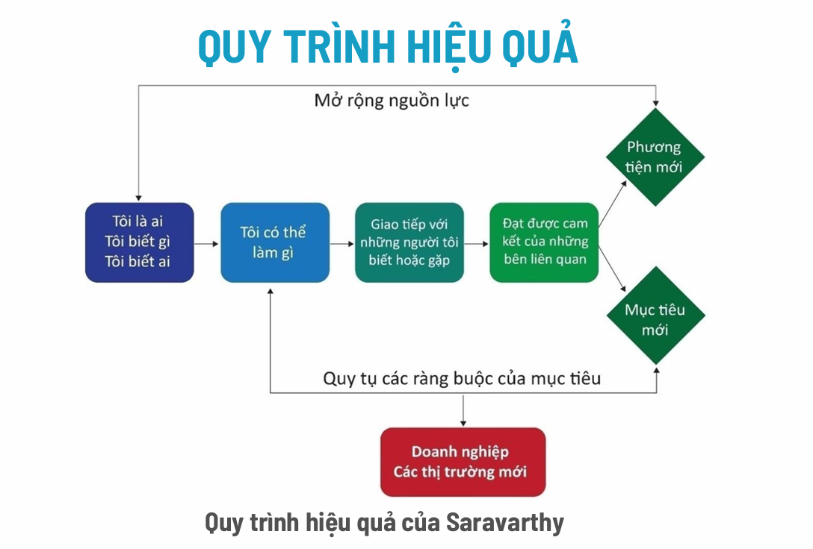
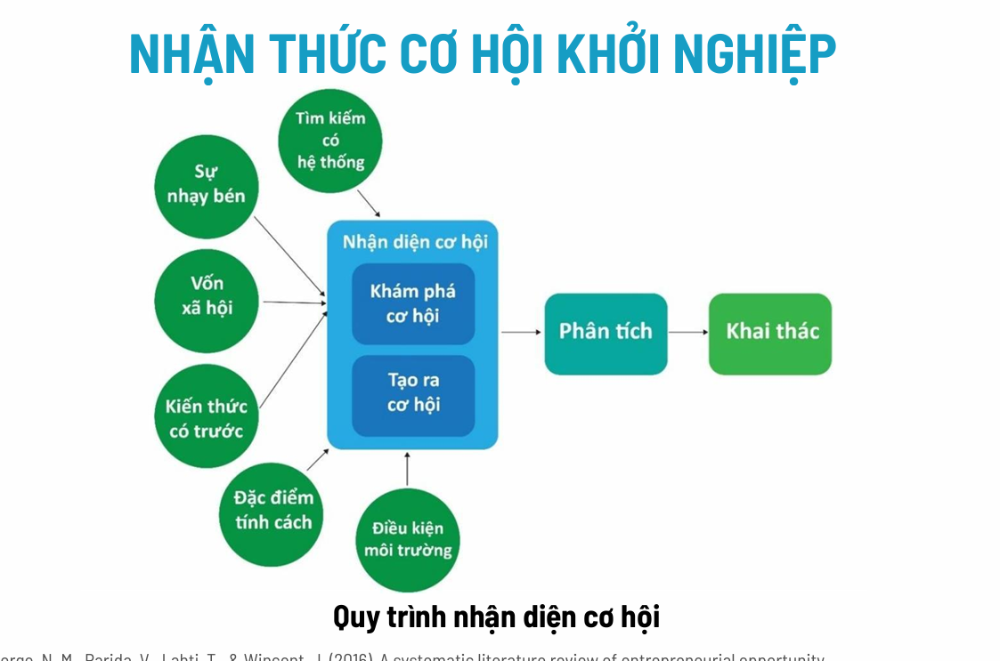

### PHẦN 1: XÂY DỰNG Ý TƯỞNG KHỞI NGHIỆP (Slide 3 - 18)

Ý tưởng khởi nghiệp không tự nhiên sinh ra, nó thường đến từ 2 hướng tiếp cận chính:

#### 1. Khởi nghiệp do "Thị trường kéo" (Market Pull)
*   **Bản chất:** Bạn nhìn thấy **"nỗi đau"** hoặc **nhu cầu** của khách hàng trước, sau đó tìm sản phẩm/công nghệ để giải quyết nó.
*   **Đặc điểm:** Rủi ro thấp hơn vì chắc chắn có người cần. Phù hợp với người có kinh nghiệm trong ngành.
*   **Ví dụ (Slide 5):** Anh Lê Duy Nghiêm thấy các doanh nghiệp bán lẻ rất cần hiểu khách hàng -> Anh tạo ra DataBrain (FacePass) dùng AI để giải quyết nhu cầu đó.

#### 2. Khởi nghiệp do "Công nghệ đẩy" (Technology Push)
*   **Bản chất:** Bạn có trong tay một **công nghệ mới/đột phá**, và bạn đi tìm xem công nghệ này áp dụng được vào đâu để bán.
*   **Đặc điểm:** Rủi ro cao vì có thể tạo ra thứ không ai cần. Cần vốn lớn. Dành cho dân kỹ thuật/nghiên cứu.
*   **Cảnh báo (Slide 8):** Đừng quá say mê công nghệ mà quên mất khách hàng. Khách hàng trả tiền cho **giá trị** họ nhận được, chứ không trả tiền vì công nghệ của bạn "ngầu".
*   **Ví dụ (Slide 7):** GCalls dùng công nghệ WebRTC để tạo nút gọi trực tiếp trên web, giúp việc mua bán online có tính "con người" hơn.

**💡 Lời khuyên (Slide 9):** Ý tưởng tốt nhất thường là sự **kết hợp cả hai**: Có công nghệ tốt giải quyết đúng nhu cầu thị trường.

#### 3. Đánh giá tiềm lực bản thân (Slide 11 - 13)
Dù ý tưởng hay đến đâu, bạn phải trả lời câu hỏi: **"Tại sao lại là tôi?"**. Bạn cần xem xét 8 yếu tố của bản thân (Bảng xuất phát điểm):
1.  **Tri thức:** Bạn học gì?
2.  **Năng lực:** Bạn giỏi gì nhất?
3.  **Mối quan hệ:** Bạn quen ai?
4.  **Tài chính:** Vốn ở đâu?
5.  **Tiếng tăm:** Uy tín cá nhân.
6.  **Kinh nghiệm:** Đã từng làm gì?
7.  **Đam mê:** Bạn thích lĩnh vực nào (Y tế, giáo dục...)?
8.  **Cam kết:** Bạn có dám đánh đổi thời gian công sức không?

---

### PHẦN 2: TỪ Ý TƯỞNG ĐẾN CƠ HỘI (Slide 19 - 24)

Đây là phần cốt lõi để phân biệt "người mơ mộng" và "doanh nhân".

#### 1. Sự khác biệt (Slide 20)
*   **Ý tưởng (Idea):** Chỉ là một suy nghĩ trong đầu, một ấn tượng.
*   **Cơ hội (Opportunity):** Là ý tưởng đã được kiểm chứng, có thể tạo ra sản phẩm bán được giá cao hơn chi phí sản xuất và thị trường đang thiếu.

#### 2. Công thức của Cơ hội (Slide 21)
> **Cơ hội = Nhu cầu thị trường ("Nỗi đau") + Giải pháp sáng tạo + Khả năng sinh lời**

#### 3. Quy trình nhận diện cơ hội (Slide 23-24)
Bạn không chỉ ngồi chờ cơ hội đến, mà phải đi qua 3 bước:
1.  **Cảm nhận:** Thấy thị trường thiếu cái gì đó.
2.  **Nhận diện:** Kết nối nhu cầu đó với nguồn lực mình có.
3.  **Tạo kết nối mới:** Đưa ra giải pháp khớp với nhu cầu.

---

### PHẦN 3: CÁC PHƯƠNG PHÁP TIẾP CẬN CƠ HỘI (Slide 25 - 34)

Làm sao để tìm ra cơ hội? Tài liệu đưa ra 3 phương pháp cụ thể:

#### Phương pháp 1: Quan sát xu hướng môi trường (Slide 26 - 29)
Phân tích sự thay đổi của 4 yếu tố vĩ mô (mô hình PEST):
*   **Kinh tế:** Thu nhập tăng hay giảm? (Ví dụ: Dân ĐNA giàu lên -> thích mua sắm online).
*   **Xã hội:** Dân số già hay trẻ? Thói quen thay đổi ra sao? (Ví dụ: Thích cá nhân hóa, thích hàng ngoại).
*   **Công nghệ:** Có gì mới? (Ví dụ: AI, Blockchain, 4G/5G).
*   **Chính trị/Pháp luật:** Nhà nước đang ủng hộ hay cấm đoán? (Ví dụ: Chính sách hỗ trợ startup).

#### Phương pháp 2: Phỏng vấn khách hàng (Slide 30 - 31)
*   **Cách làm:** Hỏi trực tiếp.
*   **Ưu điểm:** Hiểu được suy nghĩ sâu bên trong (insight).
*   **Nhược điểm:** Khách hàng thường... nói dối (vì lịch sự hoặc không muốn trả lời), khó hẹn gặp.

#### Phương pháp 3: Quan sát khách hàng (Slide 32 - 33)
*   **Cách làm:** Nhìn cách họ hành động trong thực tế mà không can thiệp.
*   **Ưu điểm:** Thấy được hành vi trung thực nhất (họ làm gì chứ không phải họ nói gì).

#### 💡 Chiến lược tối ưu (Slide 34 - Rất quan trọng):
Nên kết hợp cả hai theo trình tự:
1.  **Quan sát trước:** Để xem họ thực sự làm gì, dùng sản phẩm thế nào.
2.  **Phỏng vấn sau:** Để hỏi sâu vào những chỗ mình chưa hiểu khi quan sát.

---

### TÓM TẮT ĐỂ HIỂU BÀI VÀ ĐI THI
Để nắm vững chương này, bạn hãy nhớ logic sau:
1.  Đừng chỉ ngồi nghĩ ra ý tưởng ngẫu nhiên. Hãy nhìn vào **thị trường** (họ đau ở đâu) hoặc **công nghệ** (mình có vũ khí gì).
2.  Ý tưởng chỉ đáng giá 0 đồng nếu không biến thành **Cơ hội** (phải bán được và có lời).
3.  Muốn tìm cơ hội, hãy nhìn ra vĩ mô (Kinh tế, Xã hội...) và nhìn vào vi mô (Quan sát, Phỏng vấn khách hàng).
4.  Luôn soi chiếu lại **Bản thân** (Kiến thức, Tiền bạc, Đam mê) xem mình có đủ sức làm cơ hội đó không.