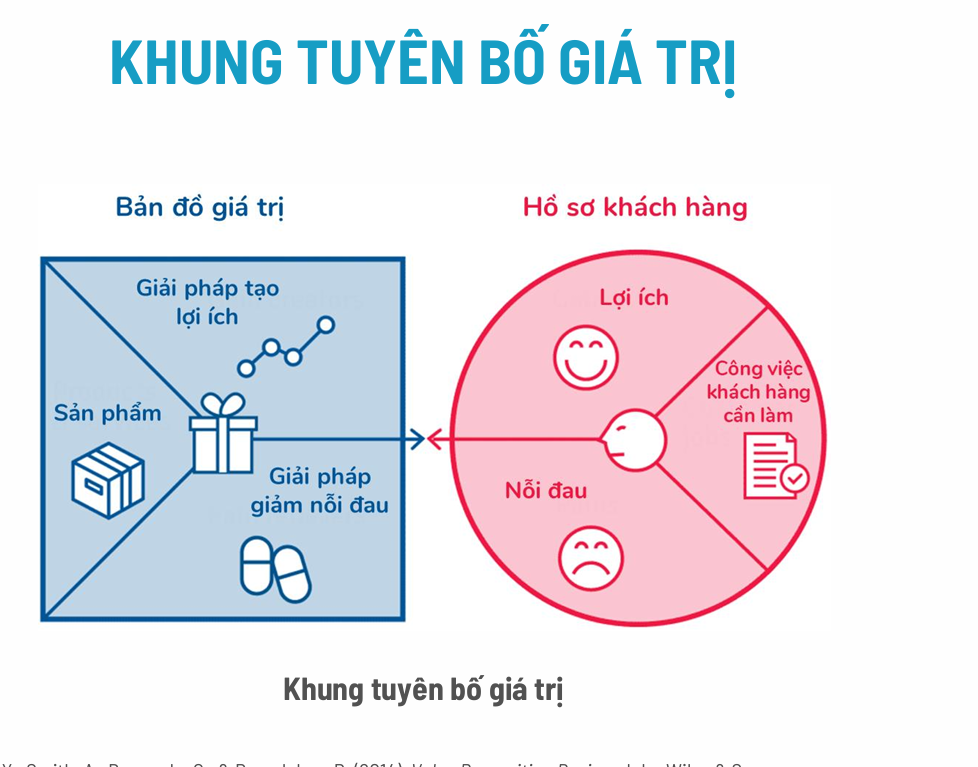
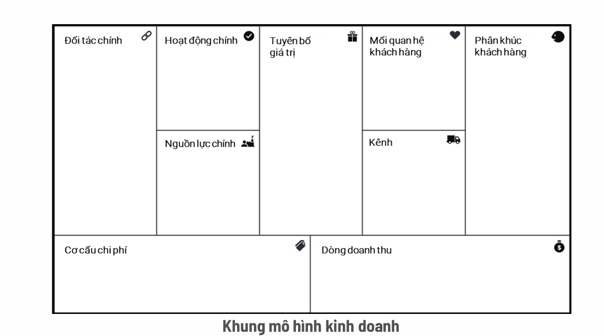
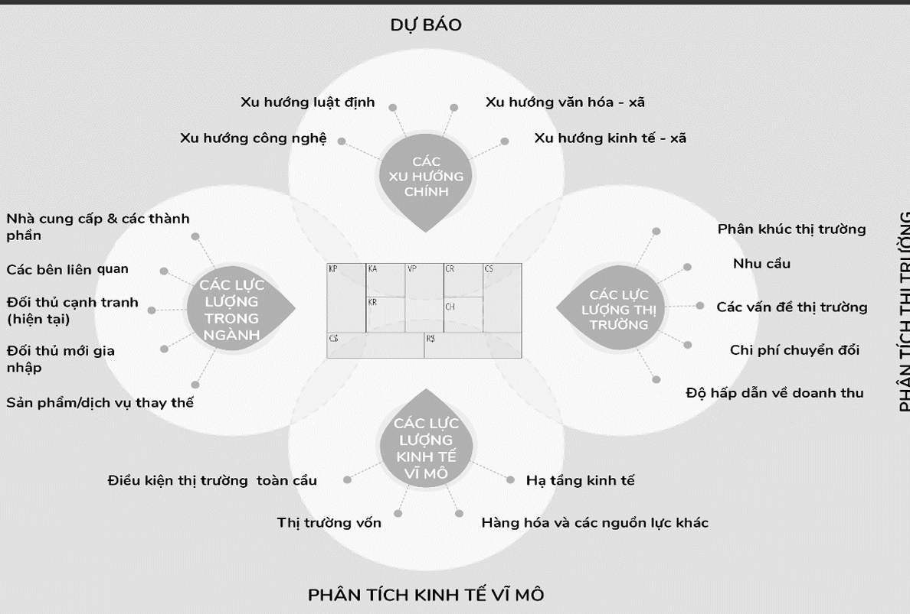
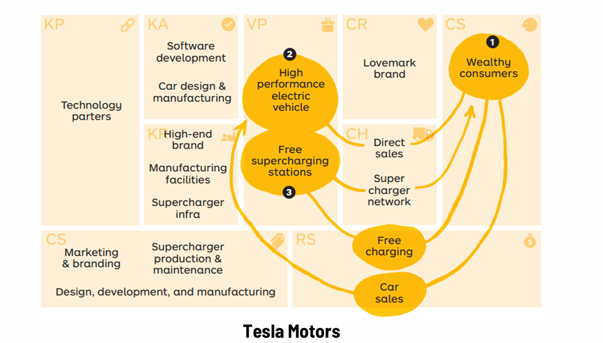
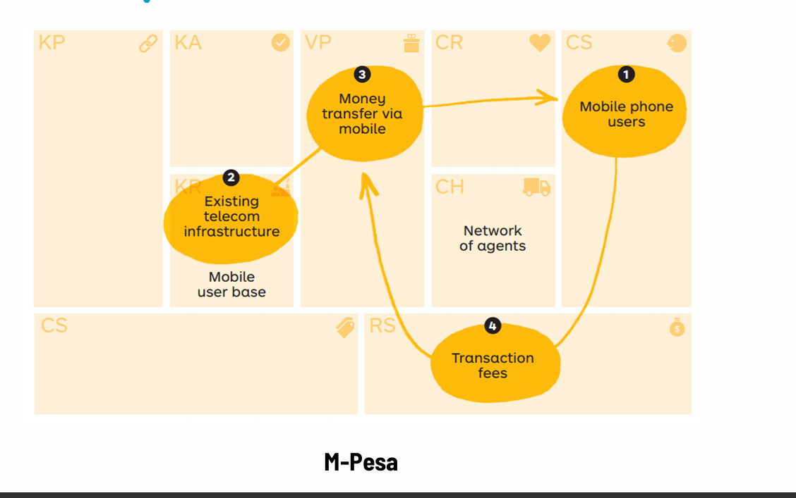

Chào bạn, tôi đã đọc kỹ toàn bộ tài liệu PDF về **"Khởi nghiệp: Mô hình Kinh doanh"** của TS. Tạ Quốc Dũng. Đây là một bài giảng rất bài bản và quan trọng đối với bất kỳ ai muốn khởi nghiệp.

Để giúp bạn hiểu sâu bài này, tôi sẽ giải thích chi tiết từng phần theo mạch logic của các slide, đồng thời mở rộng thêm ý nghĩa thực tế để bạn dễ hình dung.

Nội dung bài học được chia thành 4 trụ cột chính:
1.  **Khái niệm:** Bản chất mô hình kinh doanh là gì?
2.  **Phân loại:** Các kiểu mô hình kinh doanh phổ biến.
3.  **Công cụ:** Cách thiết kế mô hình (BMC, VPC, Bản đồ môi trường).
4.  **Dạng thức & Quy trình:** Các mẫu chiến lược và các bước phát triển.

---

### 1. Khái niệm Mô hình Kinh doanh (Slide 3)

**Định nghĩa cốt lõi:**
Mô hình kinh doanh (Business Model) không chỉ là "bán cái gì". Nó trả lời cho câu hỏi: **Làm thế nào công ty tồn tại và phát triển?**

Slide đưa ra công thức 3 phần:
*   **Tạo ra giá trị (Create):** Bạn làm ra sản phẩm gì, giải quyết vấn đề gì cho khách hàng?
*   **Chuyển giao giá trị (Deliver):** Bạn đưa sản phẩm đó đến tay khách hàng bằng kênh nào (Online, cửa hàng, đại lý...)?
*   **Thu hồi giá trị (Capture):** Bạn kiếm tiền bằng cách nào để bù đắp chi phí và có lãi?

**Cách hiểu dân dã (từ slide):** Đó là cách "kiếm cơm" của tổ chức.
*   *Lời khuyên cho Startup:* Đừng chỉ sao chép mô hình cũ. Hãy đổi mới sáng tạo mô hình kinh doanh để tạo lợi thế cạnh tranh.

---

### 2. Phân loại Mô hình Kinh doanh (Slide 4 - 10)

Bài giảng chia làm 2 nhóm lớn:

#### A. Mô hình kinh doanh Chuẩn (Standard)
Đây là những cách làm ăn truyền thống, đã tồn tại lâu đời và được chứng minh là hiệu quả (Slide 5-6).
*   **Bán lẻ truyền thống (Traditional Retail):** Mua đi bán lại kiếm lời (Ví dụ: Tiki, Shopee, Amazon).
*   **Nhà sản xuất/Bán lẻ:** Tự làm tự bán (Ví dụ: Vinamilk, Tesla).
*   **Nhượng quyền (Franchise):** Bạn có công thức thành công và bán quyền kinh doanh cho người khác (Ví dụ: KFC, Highlands Coffee).
*   **Thuê bao (Subscription):** Thu phí định kỳ (Ví dụ: Netflix, Spotify).
*   **Quảng cáo (Advertising):** Miễn phí cho người dùng, thu tiền từ người muốn quảng cáo (Ví dụ: Facebook, Google).

#### B. Mô hình kinh doanh Phá vỡ (Disruptive) - *Rất quan trọng cho Startup*
Đây là những mô hình làm thay đổi hoàn toàn cuộc chơi (Slide 7):
1.  **Đột phá thị trường mới (New Market):** Phục vụ những khách hàng mà trước đây chưa ai quan tâm (Ví dụ: Google Ads cho phép doanh nghiệp nhỏ quảng cáo - trước đây chỉ doanh nghiệp lớn mới có tiền quảng cáo TV).
2.  **Đột phá thị trường bình dân (Low-end Market):** Cung cấp sản phẩm "đủ dùng" với giá rẻ hơn hẳn (Ví dụ: Vietjet Air, Uber giá rẻ).

#### C. Xu hướng hiện đại: Kinh tế chia sẻ & Nền tảng đa phương (Slide 8-10)
*   **Kinh tế chia sẻ:** Tận dụng tài nguyên dư thừa (xe nhàn rỗi, phòng trống) để kinh doanh.
*   **Nền tảng đa phương (Multi-sided Platform):** Kết nối hai nhóm người phụ thuộc lẫn nhau.
    *   *Ví dụ:* Grab kết nối tài xế và khách đi xe. Airbnb kết nối chủ nhà và khách du lịch.
    *   *Tại Việt Nam:* Các startup đang nổi lên trong mảng này như Luxstay (Du lịch), eDoctor (Y tế), Edu2Review (Giáo dục).

---

### 3. Công cụ phát triển Mô hình Kinh doanh (Slide 11 - 20)

Đây là phần **"thực chiến"** nhất của bài. Để xây dựng mô hình, bạn cần 3 công cụ chính, đi từ chi tiết ra tổng quan:

#### Công cụ 1: Khung Tuyên bố giá trị (Value Proposition Canvas - VPC) - *Slide 14-17*
Đây là bước "Zoom in" (soi chi tiết). Bạn dùng khung này để đảm bảo **Sản phẩm khớp với Nhu cầu khách hàng**.
*   **Vòng tròn (Hồ sơ khách hàng):**
    *   *Việc cần làm (Jobs):* Khách muốn làm gì? (VD: Đi từ A đến B).
    *   *Nỗi đau (Pains):* Khó khăn họ gặp phải là gì? (VD: Đợi taxi lâu, bị chặt chém giá).
    *   *Lợi ích (Gains):* Họ mong muốn gì? (VD: Xe sạch, đến đúng giờ).
*   **Hình vuông (Bản đồ giá trị):**
    *   *Sản phẩm/Dịch vụ:* Bạn cung cấp cái gì? (VD: App đặt xe).
    *   *Thuốc giảm đau:* Bạn giải quyết khó khăn của họ thế nào? (VD: Biết trước giá, thấy xe trên bản đồ).
    *   *Yếu tố tạo lợi ích:* Bạn làm họ vui hơn thế nào? (VD: Thanh toán thẻ tiện lợi).

#### Công cụ 2: Khung Mô hình kinh doanh (Business Model Canvas - BMC) - *Slide 12-13*
Đây là bức tranh toàn cảnh gồm 9 ô (như hình vẽ trong slide 12):
1.  **Phân khúc khách hàng:** Bạn bán cho ai?
2.  **Tuyên bố giá trị:** Tại sao họ mua của bạn?
3.  **Kênh:** Tiếp cận họ qua đâu?
4.  **Quan hệ khách hàng:** Giữ chân họ thế nào?
5.  **Dòng doanh thu:** Tiền đến từ đâu?
6.  **Nguồn lực chính:** Bạn cần tài nguyên gì (tiền, nhân sự, công nghệ)?
7.  **Hoạt động chính:** Hằng ngày bạn phải làm gì quan trọng nhất?
8.  **Đối tác chính:** Ai giúp đỡ bạn (nhà cung cấp, đối tác)?
9.  **Cơ cấu chi phí:** Bạn phải chi tiền cho những khoản nào?

#### Công cụ 3: Bản đồ môi trường (Environment Map) - *Slide 18-20*
Đây là bước "Zoom out" (nhìn xa). Startup không sống trong lồng kính, bạn chịu ảnh hưởng bởi 4 lực lượng bên ngoài:
1.  **Xu hướng chính:** Công nghệ, xã hội đang đi về đâu?
2.  **Lực lượng thị trường:** Nhu cầu thị trường ra sao?
3.  **Lực lượng ngành:** Đối thủ cạnh tranh là ai?
4.  **Kinh tế vĩ mô:** Tình hình kinh tế chung, luật pháp thế nào?

---

### 4. Các dạng thức & Quy trình (Slide 21 - 26)

#### Dạng thức (Patterns)
Đây là các chiến lược mẫu. Slide 22 đưa ra 3 ví dụ hay:
*   **Phân khúc khách hàng (Tesla):** *Dạng thức sáng chế*. Tesla bắt đầu bán xe thể thao đắt tiền cho người giàu (nhóm nhỏ) để lấy tiền nuôi công nghệ và xây trạm sạc, sau đó mới làm xe rẻ hơn cho đại chúng.
*   **Tận dụng hạ tầng (M-Pesa):** *Dạng thức dịch chuyển*. Dùng hạ tầng viễn thông có sẵn để làm dịch vụ chuyển tiền ngân hàng ở Châu Phi (nơi ít ngân hàng nhưng nhiều điện thoại).

#### Quy trình phát triển (Slide 25)
Khởi nghiệp không phải là lập kế hoạch rồi cứ thế làm. Nó là một vòng lặp:
1.  Phát triển khung mô hình (trên giấy).
2.  Kiểm định tuyên bố giá trị (hỏi khách hàng xem họ có cần không).
3.  Kiểm định sản phẩm (làm thử MVP/Prototype).
4.  Thử nghiệm mô hình kinh doanh (bán thử).
> **Lặp lại cho đến khi sẵn sàng mở rộng.**

### Tóm lại, bài học này muốn nhắn nhủ bạn:
Khởi nghiệp không chỉ là có một ý tưởng sản phẩm hay. Bạn cần trả lời được: **Bán cho ai? Bán như thế nào? Kiếm tiền ra sao?** và **Môi trường bên ngoài có ủng hộ không?**. Hãy dùng các công cụ (VPC, BMC) để vẽ ra kế hoạch đó thay vì chỉ giữ trong đầu.
Chào bạn, tôi hiểu vì sao bạn cảm thấy phần **"Các dạng thức mô hình kinh doanh" (Business Model Patterns)** từ Slide 21 đến Slide 24 hơi khó hiểu. Đây là phần mang tính tư duy chiến lược cao, thường đòi hỏi sự liên kết giữa các thành phần.

Hãy tưởng tượng thế này: Nếu *Khung mô hình kinh doanh (BMC)* là các "nguyên liệu" (khách hàng, kênh, giá trị...), thì **Dạng thức (Pattern)** chính là các **"công thức nấu ăn"** hoặc **"thế cờ"** đã được chứng minh là thành công. Bạn không cần phải sáng tạo lại từ đầu, bạn có thể áp dụng các "thế cờ" này vào doanh nghiệp của mình.

Dưới đây là giải thích chi tiết và bình dân hóa các nội dung trong slide:

---

### 1. Bản chất của "Dạng thức" (Slide 21)
Slide này phân loại dạng thức thành 2 mục đích sử dụng:
*   **Dạng thức sáng chế (Invent Patterns):** Dành cho Startup mới toanh. Giúp bạn định hình cách chơi ngay từ đầu để xâm nhập thị trường.
*   **Dạng thức dịch chuyển (Shift Patterns):** Dành cho công ty cũ đang gặp khó khăn. Giúp họ thay đổi cách làm cũ để tồn tại (ví dụ: Từ bán đĩa CD chuyển sang cho thuê bao nhạc số như Spotify).

---

### 2. Các ví dụ về Dạng thức chiến lược (Slide 22)
Slide này mô tả 3 cách tư duy (pattern) phổ biến để tìm ra mô hình kinh doanh mới, tập trung vào **Khách hàng** và **Hạ tầng**:

#### Dạng thức 1: "Người đi khai phá" (Visionary)
*   **Cách làm:** Tưởng tượng ra một thị trường chưa từng tồn tại và thuyết phục khách hàng rằng họ cần nó.
*   **Ví dụ (Tesla, iPhone):** Trước iPhone, không ai nghĩ mình cần một cái điện thoại không bàn phím để lướt web cả ngày. Apple đã "mở khóa" nhu cầu này. Trước Tesla, xe điện bị coi là yếu ớt, Tesla chứng minh xe điện có thể chạy nhanh và sang trọng.
*   **Bài học:** Đừng chỉ hỏi khách hàng muốn gì (vì họ sẽ nói muốn con ngựa nhanh hơn), hãy đưa cho họ thứ họ không ngờ tới (chiếc ô tô).

#### Dạng thức 2: "Tái sử dụng tài nguyên" (Repurposer)
*   **Cách làm:** Bạn đã có sẵn công nghệ hoặc hạ tầng cho mục đích A, giờ hãy nghĩ cách dùng nó để kiếm tiền từ mục đích B.
*   **Ví dụ (AWS - Amazon Web Services):** Amazon xây dựng hệ thống máy chủ khổng lồ chỉ để bán sách/hàng hóa online. Họ nhận ra hệ thống này quá mạnh và dư thừa, nên họ tách ra cho thuê máy chủ (Cloud). Giờ đây AWS còn lãi hơn cả việc bán hàng.
*   **Bài học:** Hãy nhìn lại xem công ty bạn đang có cái gì dư thừa không? (Dữ liệu, xe vận chuyển, nhà kho...) và biến nó thành tiền.

#### Dạng thức 3: "Bình dân hóa" (Democratizer)
*   **Cách làm:** Biến những thứ xa xỉ, chỉ người giàu mới có, thành thứ ai cũng dùng được.
*   **Ví dụ (M-Pesa):** Dịch vụ ngân hàng thường chỉ dành cho người có tiền. M-Pesa (ở Châu Phi) cho phép người nghèo chuyển tiền qua điện thoại "cục gạch" mà không cần tài khoản ngân hàng.
*   **Bài học:** Tìm cách giảm giá thành hoặc đơn giản hóa dịch vụ để phục vụ số đông.

---

### 3. Phân tích sâu 2 Case Study điển hình (Slide 23 & 24)
Đây là phần quan trọng nhất để hiểu cách các khối trong mô hình kinh doanh tương tác với nhau.

#### Case 1: Tesla Motors (Slide 23) - Chiến lược "Lấy mỡ nó rán nó"
Biểu đồ trong slide vẽ các mũi tên nối các ô lại với nhau. Hãy nhìn theo luồng đi này:

1.  **Nhắm vào người giàu trước (CS - Wealthy consumers):** Tesla biết công nghệ mới rất đắt. Họ không bán xe giá rẻ ngay. Họ bán xe thể thao hiệu suất cao (Roadster) cho người giàu.
2.  **Giá trị mang lại (VP):** Xe điện chạy nhanh, sang trọng (High performance electric vehicle).
3.  **Dùng tiền để tái đầu tư (Key Resources):** Lợi nhuận từ bán xe sang được dùng để xây dựng mạng lưới trạm sạc (Supercharger network) và phát triển công nghệ sản xuất.
4.  **Tạo lợi thế cạnh tranh:** Khi đã có trạm sạc khắp nơi + thương hiệu mạnh $\rightarrow$ Họ mới bắt đầu sản xuất xe giá rẻ hơn (Model S, Model 3) cho thị trường đại chúng.

**$\rightarrow$ Tóm lại:** Dạng thức của Tesla là: **Bán đắt số lượng ít $\rightarrow$ Lấy tiền xây hạ tầng $\rightarrow$ Bán rẻ số lượng nhiều.**

#### Case 2: M-Pesa (Slide 24) - Chiến lược "Đứng trên vai người khổng lồ"
M-Pesa là dịch vụ chuyển tiền qua điện thoại ở Kenya.
1.  **Vấn đề:** Người dân không có tài khoản ngân hàng, nhưng ai cũng có điện thoại di động.
2.  **Tận dụng cái có sẵn (Key Resources - KR):** Thay vì xây dựng chi nhánh ngân hàng (rất tốn kém), M-Pesa tận dụng **hạ tầng viễn thông có sẵn** của nhà mạng Safaricom.
3.  **Hoạt động (KA):** Biến các tiệm tạp hóa nhỏ lẻ thành "đại lý" (Network of agents). Người dân đưa tiền mặt cho đại lý để nạp tiền vào điện thoại, sau đó bắn tiền qua tin nhắn.
4.  **Doanh thu (RS):** Thu phí giao dịch nhỏ trên mỗi lần chuyển.

**$\rightarrow$ Tóm lại:** Dạng thức của M-Pesa là: **Không xây mới hạ tầng đắt đỏ, mà "ký sinh" vào hạ tầng viễn thông đã có để cung cấp dịch vụ tài chính.**

### Tổng kết
Phần này muốn dạy bạn rằng: Khi thiết kế mô hình kinh doanh, đừng chỉ điền vào các ô trống một cách rời rạc. Hãy nghĩ về **mối quan hệ** và **chiến lược** giữa các ô đó:
*   Bạn có thể bán cho người giàu trước để nuôi người nghèo sau không? (Như Tesla).
*   Bạn có thể dùng tài sản có sẵn để đẻ ra dịch vụ mới không? (Như AWS, M-Pesa).

Đó chính là "Dạng thức". Hy vọng cách giải thích này giúp bạn "thông" được phần khó này!
Rất hay! Việc bạn đặt câu hỏi này chứng tỏ bạn đang thực sự muốn "đào sâu" vào tư duy kinh doanh chứ không chỉ học thuộc lòng.

Sau khi rà soát lại toàn bộ file, tôi thấy có **3 điểm cực kỳ đắt giá** nhưng trong slide trình bày khá cô đọng (dạng hình ảnh/sơ đồ), nếu lướt qua sẽ rất dễ bỏ phí bản chất sâu xa của nó.

Tôi muốn làm rõ 3 điểm này để bạn có cái nhìn sắc bén hơn:

---

### 1. Bí mật của "Hiệu ứng Bánh đà" (Slide 9)
Trong slide 9, có một sơ đồ vòng tròn của Amazon với các mũi tên. Đây không chỉ là hình vẽ cho đẹp, đây là **"Vũ khí hạt nhân"** của Amazon và các nền tảng lớn (Grab, Shopee, Airbnb).

**Cụ thể là:**
*   Hầu hết mọi người nghĩ kinh doanh là đường thẳng: *Mua hàng $\rightarrow$ Bán hàng $\rightarrow$ Lấy lãi.*
*   Nhưng Amazon tư duy theo vòng tròn (Bánh đà - Flywheel):
    1.  **Trải nghiệm khách hàng tốt** $\rightarrow$ Dẫn đến **Lưu lượng truy cập (Traffic)** cao.
    2.  Traffic cao $\rightarrow$ Thu hút nhiều **Người bán (Sellers)** tham gia vào sàn.
    3.  Nhiều người bán $\rightarrow$ **Sản phẩm đa dạng** và cạnh tranh giá rẻ hơn.
    4.  Sản phẩm rẻ và đa dạng $\rightarrow$ Lại làm **Trải nghiệm khách hàng tốt hơn**.

$\rightarrow$ **Điểm mấu chốt:** Khi cái bánh đà này bắt đầu quay, nó sẽ quay ngày càng nhanh và tạo ra quán tính khổng lồ.
*   **Bài học cho bạn:** Khi thiết kế mô hình (đặc biệt là dạng nền tảng), hãy tự hỏi: *Làm sao để hành động của khách hàng A tạo ra lợi ích cho khách hàng B?* (Ví dụ: Càng nhiều người dùng Facebook thì Facebook càng vui, càng nhiều người chạy Grab thì khách càng dễ bắt xe).

---

### 2. Tư duy "Sân khấu" và "Hậu trường" trong BMC (Slide 12)
Slide 12 đưa ra 9 ô của Khung mô hình kinh doanh (BMC). Nếu nhìn rời rạc thì rất khó nhớ. Tôi sẽ chỉ bạn cách nhìn BMC như một **Nhà hát** để bạn không bao giờ quên:

Hãy chia khung BMC làm đôi theo chiều dọc:

*   **Phần bên Phải (Sân khấu - Front Stage):** Nơi tiếp xúc với khán giả (Khách hàng).
    *   Gồm: *Khách hàng, Quan hệ khách hàng, Kênh phân phối, Tuyên bố giá trị.*
    *   Tư duy ở đây là: **Cảm xúc, Thương hiệu, Sự tiện lợi.**
*   **Phần bên Trái (Hậu trường - Back Stage):** Nơi diễn ra công việc bếp núc, kỹ thuật để vở kịch diễn ra suôn sẻ.
    *   Gồm: *Đối tác chính, Hoạt động chính, Nguồn lực chính.*
    *   Tư duy ở đây là: **Logic, Hiệu quả, Tiết kiệm chi phí.**
*   **Phần đáy (Kết quả tài chính):**
    *   Bên trái tốn tiền (Chi phí).
    *   Bên phải kiếm tiền (Doanh thu).

$\rightarrow$ **Bài học:** Một Startup thất bại thường do: Sân khấu thì hoành tráng (Marketing giỏi) nhưng Hậu trường rối tung (Vận hành kém, chi phí cao) hoặc ngược lại. Mô hình kinh doanh tốt là sự cân bằng giữa *Cảm xúc bên phải* và *Logic bên trái*.

---

### 3. Sự nguy hiểm của "Bản đồ môi trường" (Slide 18-19)
Slide này học viên thường bỏ qua vì nghĩ nó là lý thuyết vĩ mô chán ngắt. Nhưng thực tế, đây là **"Tử huyệt"** của startup.

Hãy hình dung: Bạn xây dựng một con tàu rất đẹp (Mô hình kinh doanh xịn), động cơ tốt (Sản phẩm tốt). Nhưng nếu bạn thả con tàu đó vào một vùng biển đang có bão (Môi trường xấu), con tàu vẫn chìm.

*   **Slide 19 nhắc đến "Xu hướng công nghệ" và "Luật định":**
    *   *Ví dụ thực tế:* Uber/Grab khi vào Việt Nam có mô hình kinh doanh cực hay. Nhưng họ lao đao nhiều năm vì vấn đề **Luật định** (không được coi là taxi, cũng không phải xe hợp đồng). Nếu không lường trước "Lực lượng môi trường" này, doanh nghiệp có thể bị cấm hoạt động dù sản phẩm rất tốt.
    *   *Ví dụ khác:* Kodak bán máy ảnh phim rất chạy (Mô hình tốt), nhưng bỏ qua **Xu hướng công nghệ** (Môi trường chuyển sang kỹ thuật số) $\rightarrow$ Phá sản.

$\rightarrow$ **Bài học:** Khi làm bài tập #3 (Slide 20), đừng làm cho có. Hãy nghiêm túc xem xét xem liệu 3-5 năm nữa, công nghệ hay luật pháp có thay đổi gì giết chết mô hình của bạn không.

### Tóm lại
Ngoài những gì đã giải thích ở các câu trước, tôi muốn bạn ghi nhớ thêm 3 tư duy này:
1.  **Tạo vòng lặp tăng trưởng (Bánh đà)** thay vì đi đường thẳng.
2.  **Cân bằng giữa Sân khấu (bán hàng)** và **Hậu trường (vận hành)**.
3.  **Luôn nhìn trời (Môi trường)** trước khi ra khơi, đừng chỉ nhìn con tàu của mình.

Hy vọng những điểm nhấn này giúp bạn nắm trọn vẹn tinh thần của chương này!
Chào bạn, đây là bộ 10 câu trắc nghiệm tiếp theo, được thiết kế để "quét" vào những góc khuất hơn của slide và kiểm tra khả năng liên kết kiến thức của bạn.

Vì bạn được mang tài liệu, hãy chú ý kỹ phần **"Mẹo tra cứu"** tôi ghi kèm mỗi câu.

---

### PHẦN 1: KHÁI NIỆM & PHÂN LOẠI (Nâng cao)

**Câu 11:** Theo Slide 3, khi nói đến khái niệm Mô hình kinh doanh theo "nghĩa hẹp", người ta thường ám chỉ đến thành phần nào sau đây?
A. Chiến lược Marketing.
B. Mô hình doanh thu (Revenue model).
C. Quy trình sản xuất.
D. Văn hóa doanh nghiệp.

**Câu 12:** Dựa vào Slide 5, điểm khác biệt cơ bản nhất giữa "Mô hình Nhượng quyền" (Franchise) so với "Chuỗi cửa hàng bán lẻ tự sở hữu" (như Thế Giới Di Động) là gì?
A. Bên nhượng quyền không trực tiếp sở hữu và vận hành các cửa hàng con, mà chỉ cấp phép phương thức kinh doanh.
B. Bên nhượng quyền bán sản phẩm giá rẻ hơn.
C. Bên nhượng quyền không cần làm Marketing.
D. Bên nhượng quyền chỉ hoạt động Online.

**Câu 13:** Một Startup ra mắt ứng dụng cho phép mọi người cho thuê lại máy khoan, máy cắt cỏ, thang gấp... đang để không trong nhà kho của họ cho hàng xóm thuê. Theo Slide 8, đây là ví dụ điển hình của:
A. Kinh tế chia sẻ (Sharing economy).
B. Mô hình Đấu giá (Auction).
C. Mô hình Sản xuất (Manufacturer).
D. Mô hình Quảng cáo (Advertising).

**Câu 14:** Theo định nghĩa tại Slide 7, "Mô hình đột phá thị trường mới" (New market disruption) thường nhắm vào đối tượng nào?
A. Những khách hàng giàu có nhất thị trường.
B. Những khách hàng đang sử dụng sản phẩm của đối thủ cạnh tranh.
C. Những thị trường chưa từng tồn tại hoặc khách hàng chưa được khai thác (non-consumers).
D. Những khách hàng trung thành.

---

### PHẦN 2: CÔNG CỤ & THIẾT KẾ (BMC, VPC)

**Câu 15:** Trong Khung BMC (Slide 12), nếu bạn là một Youtuber kiếm tiền, và Youtube trả tiền cho bạn dựa trên lượt xem. Vậy "Youtube" sẽ xuất hiện ở ô nào trong mô hình kinh doanh của cá nhân bạn?
A. Phân khúc khách hàng (Vì họ trả tiền cho bạn).
B. Đối tác chính (Vì họ cung cấp nền tảng).
C. Có thể là cả A và B tùy góc nhìn (Youtube vừa là nơi bạn kiếm tiền, vừa là đối tác hạ tầng).
D. Nguồn lực chính.
*(Gợi ý: Câu này cần tư duy biện luận, nhưng trong bối cảnh đơn giản, Youtube là nền tảng chi trả).*

**Câu 16:** Nhìn vào Slide 16 (VPC của Uber), mục "Đặt/hủy dễ dàng" nằm trong phần "Lợi ích" (Gains) của Hồ sơ khách hàng. Vậy bên phía khung vuông (Bản đồ giá trị), yếu tố nào tương ứng giúp tạo ra lợi ích này?
A. Hệ thống thanh toán tự động hoàn.
B. 24/7/365 có taxi (Sẵn sàng mọi lúc).
C. Đánh giá tài xế.
D. Đi xe UberX.

**Câu 17:** Trong Khung Mô hình kinh doanh (BMC - Slide 12), ô "Các nguồn lực chính" (Key Resources) mô tả điều gì?
A. Những việc quan trọng nhất công ty phải làm.
B. Những tài sản quan trọng nhất (vật lý, trí tuệ, nhân sự, tài chính) để vận hành mô hình.
C. Những nhóm người mà công ty muốn phục vụ.
D. Số tiền công ty phải chi trả.

---

### PHẦN 3: MÔI TRƯỜNG, DẠNG THỨC & QUY TRÌNH

**Câu 18:** Dựa vào Slide 19 (Bản đồ môi trường), yếu tố "Đối thủ cạnh tranh hiện tại" và "Đối thủ mới gia nhập" nằm trong nhóm lực lượng nào?
A. Các xu hướng chính (Key Trends).
B. Các lực lượng thị trường (Market Forces).
C. Các lực lượng trong ngành (Industry Forces).
D. Các lực lượng kinh tế vĩ mô (Macro-economic Forces).

**Câu 19:** Theo Slide 21, nếu công ty Kodak (đã suy thoái vì máy ảnh phim) cố gắng thay đổi hoàn toàn để chuyển sang làm mảng in ấn kỹ thuật số để cạnh tranh trở lại. Họ đang áp dụng nhóm dạng thức nào?
A. Dạng thức sáng chế (Invent patterns).
B. Dạng thức dịch chuyển (Shift patterns).
C. Dạng thức sao chép (Copy patterns).
D. Dạng thức độc quyền (Monopoly patterns).

**Câu 20:** Theo quy trình phát triển mô hình kinh doanh ở Slide 25, bước nào nên được thực hiện NGAY SAU KHI "Phát triển khung mô hình kinh doanh"?
A. Mở bán rộng rãi ra thị trường.
B. Gọi vốn đầu tư.
C. Kiểm định tuyên bố giá trị với khách hàng.
D. Kiểm định sản phẩm với Prototype.

---

### ĐÁP ÁN VÀ GIẢI THÍCH CHI TIẾT

**11. B**
*   **Tra cứu:** Slide 3, gạch đầu dòng thứ 2.
*   **Trích dẫn:** *"Theo nghĩa hẹp, mô hình kinh doanh là mô hình doanh thu (revenue model)."*

**12. A**
*   **Tra cứu:** Slide 5, dòng "Mô hình kinh doanh nhượng quyền".
*   **Giải thích:** Đặc điểm là *"cấp phép và phương thức kinh doanh cho các doanh nghiệp khác"*. Nghĩa là người khác làm chủ cửa hàng đó, không phải công ty mẹ.

**13. A**
*   **Tra cứu:** Slide 8.
*   **Giải thích:** Từ khóa *"hoạt động mua, cung cấp hoặc chia sẻ quyền truy cập... dựa trên mạng lưới ngang hàng"*. Việc cho thuê đồ cũ trong kho chính là chia sẻ tài nguyên dư thừa.

**14. C**
*   **Tra cứu:** Slide 7, dòng đầu tiên.
*   **Giải thích:** *"Nhắm vào các thị trường chưa được các doanh nghiệp khai thác, cũng như chưa từng tồn tại"*.

**15. C** (Đây là câu hỏi tư duy tình huống)
*   **Giải thích:** Trong BMC, một đối tượng có thể đóng nhiều vai trò. Với Youtuber: Youtube cung cấp hạ tầng (Đối tác/Nguồn lực), nhưng Youtube cũng là người trả tiền (Dòng doanh thu đến từ Youtube $\rightarrow$ Youtube đóng vai trò Khách hàng trả tiền). Nếu đề thi bắt chọn 1, đáp án A (Khách hàng/Nguồn tiền) hoặc B (Đối tác) đều có lý, nhưng C là chính xác nhất về bản chất Nền tảng đa phương. *Tuy nhiên, nếu xét thuần túy theo Slide 12, "Đối tác chính" là nơi cung cấp nguồn lực, nên B là lựa chọn an toàn trong khuôn khổ lý thuyết.*

**16. B**
*   **Tra cứu:** Slide 16.
*   **Giải thích:** Bạn hãy nối dòng kẻ ngang. Bên phải là "Lợi ích: Đặt/hủy dễ dàng". Bên trái, giải pháp tương ứng là tính sẵn sàng của dịch vụ. Thực tế, "Ứng dụng di động" (nút bấm) mới là cái trực tiếp, nhưng trong các đáp án trên, việc **"24/7/365 có taxi"** là yếu tố hỗ trợ việc đặt xe dễ dàng bất cứ lúc nào (tạo ra Gain). *Lưu ý: Slide 16 không vẽ đường nối cụ thể cho ý này, nhưng đây là suy luận logic về Value Map.*

**17. B**
*   **Tra cứu:** Slide 12, ô "Nguồn lực chính".
*   **Giải thích:** Phân biệt danh từ (Tài sản - Nguồn lực) và động từ (Hoạt động).

**18. C**
*   **Tra cứu:** Slide 19.
*   **Giải thích:** Nhìn vào góc bên Trái của hình tròn trung tâm. Nhóm **"Các lực lượng trong ngành" (Industry Forces)** bao gồm: Nhà cung cấp, Đối thủ cạnh tranh, Đối thủ mới, Sản phẩm thay thế.

**19. B**
*   **Tra cứu:** Slide 21.
*   **Giải thích:** *"Dạng thức dịch chuyển (shift patterns) giúp cải thiện đáng kể một mô hình... đang suy thoái"*. Kodak đang suy thoái và muốn thay đổi $\rightarrow$ Shift.

**20. C**
*   **Tra cứu:** Slide 25 (Sơ đồ vòng tròn).
*   **Giải thích:**
    *   Bước 1: Phát triển khung.
    *   Mũi tên chỉ sang Bước 2: **Kiểm định tuyên bố giá trị với khách hàng**.
    *   (Rất nhiều bạn chọn nhầm sang làm sản phẩm mẫu - Prototype, nhưng theo slide này, phải kiểm tra xem khách có CẦN không (Bước 2) rồi mới làm mẫu thử (Bước 3)).

Chúc bạn ôn tập thật tốt! Với 20 câu hỏi này cộng với phần giải thích tư duy ở trên, bạn hoàn toàn có thể tự tin xử lý bài thi.