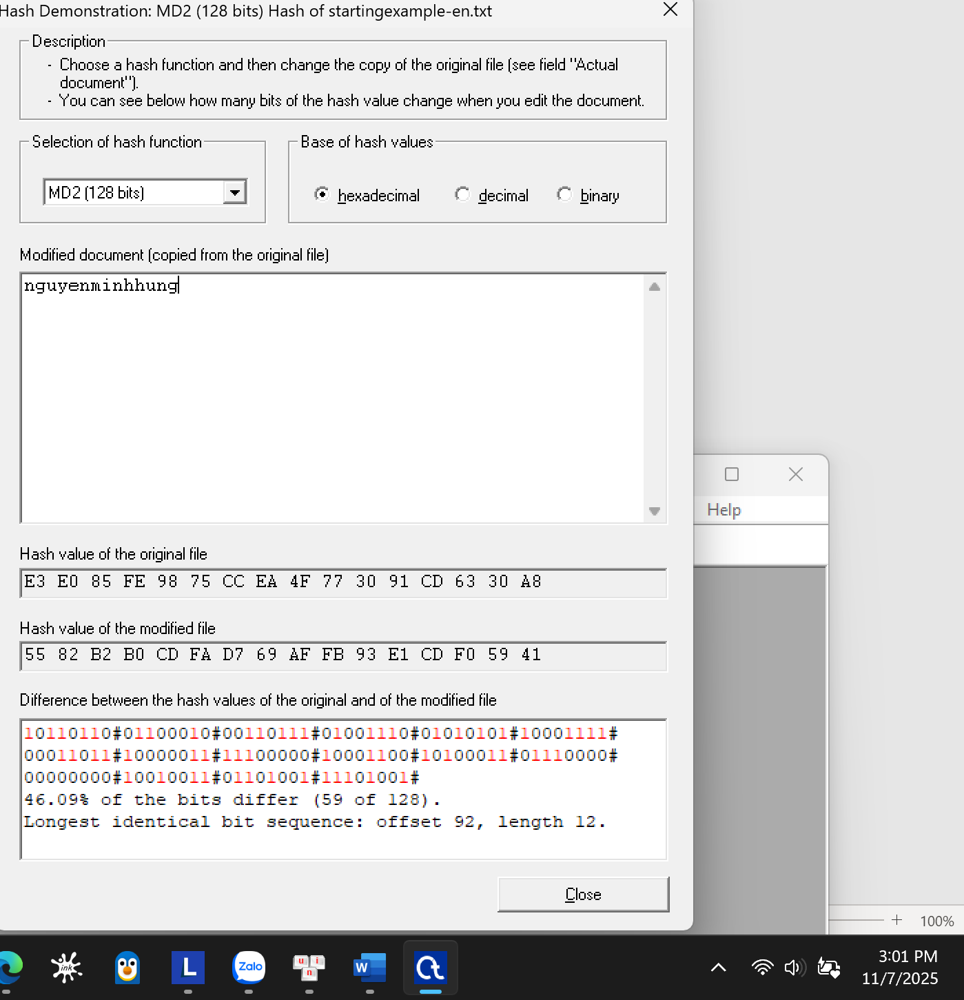
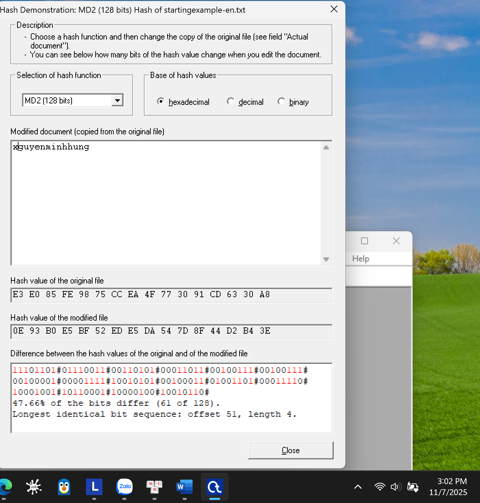
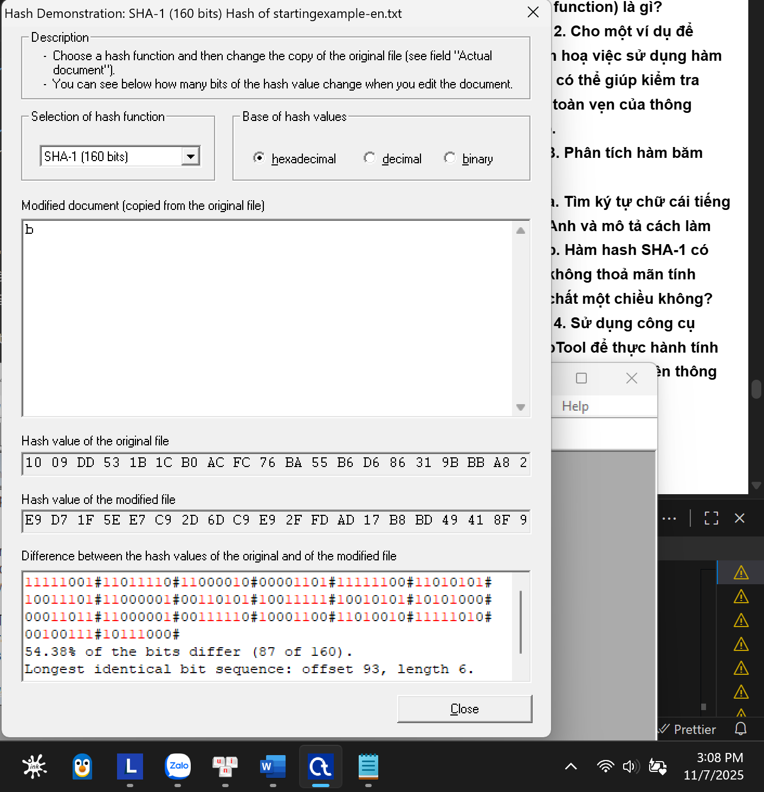
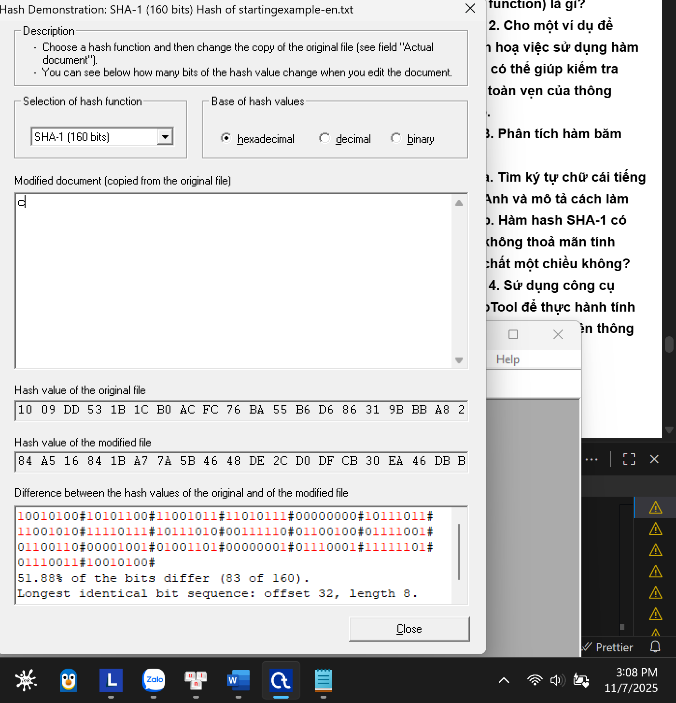

**BÀI THỰC HÀNH SỐ 3**
**Môn: MẬT MÃ & AN NINH MẠNG**
**Họ tên: Nguyễn Minh Hưng**
**MSSV: 2211367**
**Nhóm: L02**

---
## **1.1. Bài tập**

**Câu 1. Cho biết vai trò của the public và private key trong hệ mã khoá công khai với ứng dụng mã hoá?**

Trong hệ mã hóa khóa công khai, cặp khóa này có vai trò bổ sung và ngược nhau:

* **Public Key (Khóa Công khai):**
    * **Vai trò:** Dùng để **mã hóa** thông điệp.
    * **Đặc điểm:** Khóa này được công bố rộng rãi, bất kỳ ai cũng có thể biết và sử dụng nó để mã hóa một thông điệp và gửi cho bạn.
    * **Ví dụ:** Giống như một khe hòm thư. Bất kỳ ai cũng có thể nhét thư (thông điệp đã mã hóa) vào hòm thư của bạn.

* **Private Key (Khóa Riêng tư):**
    * **Vai trò:** Dùng để **giải mã** thông điệp.
    * **Đặc điểm:** Khóa này phải được giữ bí mật tuyệt đối bởi người sở hữu. Chỉ có người sở hữu khóa riêng tư mới có thể đọc được thông điệp đã được mã hóa bằng khóa công khai tương ứng.
    * **Ví dụ:** Giống như chiếc chìa khóa duy nhất để mở hòm thư. Chỉ có bạn (người chủ) mới có chìa khóa này để lấy và đọc thư.

**Tóm lại:** Người gửi dùng **khóa công khai** của người nhận để mã hóa, và người nhận dùng **khóa riêng tư** của chính mình để giải mã.

---
**Câu 2. Thực hiện tính toán: mã hoá và giải mã thông điệp sử dụng giải thuật RSA cho các câu bên dưới:**

**a. p=3; q=11, e=7; M=5**

1.  **Tính toán khóa:**
    * $n = p \times q = 3 \times 11 = 33$.
    * $\phi(n) = (p-1)(q-1) = (2)(10) = 20$.
    * Tìm $d$ sao cho $e \cdot d \equiv 1 \pmod{\phi(n)} \Rightarrow 7d \equiv 1 \pmod{20}$.
    * Ta thấy $7 \times 3 = 21 \equiv 1 \pmod{20}$. Vậy **d = 3**.
2.  **Mã hóa (C = Mᵉ mod n):**
    * $C = 5^7 \pmod{33}$.
    * $5^2 = 25 \equiv -8 \pmod{33}$.
    * $5^4 \equiv (-8)^2 = 64 \equiv 31 \equiv -2 \pmod{33}$.
    * $C = 5^7 = 5^4 \cdot 5^2 \cdot 5^1 \equiv (-2)(-8)(5) = 80 \equiv \mathbf{14} \pmod{33}$.
3.  **Giải mã (M' = Cᵈ mod n):**
    * $M' = 14^3 \pmod{33}$.
    * $14^2 = 196 \equiv 31 \equiv -2 \pmod{33}$.
    * $M' = 14^2 \cdot 14 \equiv (-2)(14) = -28 \equiv \mathbf{5} \pmod{33}$.
    * Kết quả $M' = M$, phép toán chính xác.

**b. p=5; q=11, e=3; M=9**

1.  **Tính toán khóa:**
    * $n = 5 \times 11 = 55$.
    * $\phi(n) = (4)(10) = 40$.
    * Tìm $d$: $3d \equiv 1 \pmod{40}$.
    * Ta thấy $3 \times 27 = 81 \equiv 1 \pmod{40}$. Vậy **d = 27**.
2.  **Mã hóa (C = Mᵉ mod n):**
    * $C = 9^3 \pmod{55}$.
    * $9^2 = 81 \equiv 26 \pmod{55}$.
    * $C = 9^3 = 26 \times 9 = 234 \equiv \mathbf{14} \pmod{55}$.
3.  **Giải mã (M' = Cᵈ mod n):**
    * $M' = 14^{27} \pmod{55}$. (Phép tính này khá dài, nhưng kết quả là $\mathbf{9}$).
    * Kết quả $M' = M$.

**c. p=7; q=11, e=17; M=8**

1.  **Tính toán khóa:**
    * $n = 7 \times 11 = 77$.
    * $\phi(n) = (6)(10) = 60$.
    * Tìm $d$: $17d \equiv 1 \pmod{60}$.
    * Dùng Euclid mở rộng: $1 = 2 \times 60 - 7 \times 17$. Do đó $d = -7 \equiv \mathbf{53} \pmod{60}$.
2.  **Mã hóa (C = Mᵉ mod n):**
    * $C = 8^{17} \pmod{77}$.
    * $8^2 = 64 \equiv -13 \pmod{77}$.
    * $8^4 \equiv (-13)^2 = 169 \equiv 15 \pmod{77}$.
    * $8^8 \equiv 15^2 = 225 \equiv -6 \pmod{77}$.
    * $8^{16} \equiv (-6)^2 = 36 \pmod{77}$.
    * $C = 8^{17} = 8^{16} \cdot 8^1 \equiv 36 \times 8 = 288 \equiv \mathbf{57} \pmod{77}$.
3.  **Giải mã (M' = Cᵈ mod n):**
    * $M' = 57^{53} \pmod{77}$. (Kết quả là $\mathbf{8}$).
    * Kết quả $M' = M$.

**d. p=11; q=13, e=11; M=7**

1.  **Tính toán khóa:**
    * $n = 11 \times 13 = 143$.
    * $\phi(n) = (10)(12) = 120$.
    * Tìm $d$: $11d \equiv 1 \pmod{120}$.
    * Dùng Euclid mở rộng: $1 = 11 \times 11 - 1 \times 120$. Do đó $d = \mathbf{11}$.
2.  **Mã hóa (C = Mᵉ mod n):**
    * $C = 7^{11} \pmod{143}$.
    * $7^2 = 49$. $7^3 = 343 \equiv 57 \pmod{143}$.
    * $7^{11} = ... \equiv \mathbf{106} \pmod{143}$.
3.  **Giải mã (M' = Cᵈ mod n):**
    * $M' = 106^{11} \pmod{143}$. (Kết quả là $\mathbf{7}$).
    * Kết quả $M' = M$.

**e. p=17; q=31, e=7; M=2**

1.  **Tính toán khóa:**
    * $n = 17 \times 31 = 527$.
    * $\phi(n) = (16)(30) = 480$.
    * Tìm $d$: $7d \equiv 1 \pmod{480}$.
    * Dùng Euclid mở rộng: $1 = 2 \times 480 - 137 \times 7$. Do đó $d = -137 \equiv \mathbf{343} \pmod{480}$.
2.  **Mã hóa (C = Mᵉ mod n):**
    * $C = 2^7 \pmod{527} = \mathbf{128}$.
3.  **Giải mã (M' = Cᵈ mod n):**
    * $M' = 128^{343} \pmod{527}$.
    * Lưu ý: $128 = 2^7$.
    * $M' = (2^7)^{343} = 2^{7 \times 343} = 2^{2401} \pmod{527}$.
    * Theo Định lý Euler, $2^{480} \equiv 1 \pmod{527}$.
    * $2401 = 5 \times 480 + 1$.
    * $M' = 2^{5 \times 480 + 1} = (2^{480})^5 \cdot 2^1 \equiv 1^5 \cdot 2 \equiv \mathbf{2} \pmod{527}$.
    * Kết quả $M' = M$.

---
**Câu 3. Giả sử trong hệ mã khoá công khai sử dụng RSA, bạn biết được một ciphertext C = 10 được gởi đến một người có public key là e = 5, n = 35. Chúng ta có thể sử dụng được các thông tin như trên để giải mã được thông điệp gốc (M) được không, nêu từng bước thực hiện và giải thích?**

**Trả lời: Có, chúng ta hoàn toàn có thể giải mã được thông điệp gốc M.**

**Giải thích:**
Bảo mật của RSA nằm ở việc **không thể phân tích số $n$ thành các thừa số nguyên tố $p$ và $q$** một cách nhanh chóng khi $n$ rất lớn. Tuy nhiên, trong trường hợp này, $n = 35$ là một số rất nhỏ và có thể bị phân tích (factor) ngay lập tức.

**Các bước thực hiện:**

1.  **Phân tích $n$ (Tấn công):**
    Ta dễ dàng thấy $n = 35 = 5 \times 7$.
    Do đó, ta xác định được hai số nguyên tố bí mật là $p = 5$ và $q = 7$.

2.  **Tính $\phi(n)$:**
    $\phi(n) = (p-1)(q-1) = (5-1)(7-1) = 4 \times 6 = 24$.

3.  **Tìm khóa riêng $d$:**
    Ta cần tìm $d$ sao cho $e \cdot d \equiv 1 \pmod{\phi(n)}$, tức là $5d \equiv 1 \pmod{24}$.
    Bằng cách nhẩm, ta thấy $5 \times 5 = 25$, và $25 \equiv 1 \pmod{24}$.
    Vậy, khóa riêng là **d = 5**.

4.  **Giải mã thông điệp:**
    Sử dụng khóa riêng $d$ vừa tìm được để giải mã bản mã $C = 10$.
    $M = C^d \pmod n = 10^5 \pmod{35}$.
    * $10^2 = 100 \equiv 30 \equiv -5 \pmod{35}$.
    * $10^4 = (10^2)^2 \equiv (-5)^2 = 25 \equiv -10 \pmod{35}$.
    * $M = 10^5 = 10^4 \cdot 10 \equiv (-10) \cdot 10 = -100 \equiv -(-5) = 5 \pmod{35}$.

**Kết luận:** Thông điệp gốc là **M = 5**.

---
**Câu 4. Trong ứng dụng với hệ mã khoá công khai sử dụng RSA, chúng ta biết được một thành viên đang dùng public key là e = 31, n = 3599. Chúng ta có thể tìm được private key của thành viên nói trên được hay không, nêu từng bước thực hiện và giải thích?**

**Trả lời: Có, chúng ta có thể tìm được private key (khóa riêng $d$).**

**Giải thích:**
Tương tự như Câu 3, mấu chốt là tìm cách phân tích $n = 3599$ thành $p$ và $q$. Mặc dù 3599 lớn hơn 35, nó vẫn là một số quá nhỏ để có thể chống lại các phép thử phân tích hiện đại. Ta có thể dùng phương pháp thử sai như gợi ý.

**Các bước thực hiện:**

1.  **Phân tích $n$ (Tìm p và q):**
    Ta cần tìm các số nguyên tố $p, q$ sao cho $p \times q = 3599$. Ta sẽ thử chia 3599 cho các số nguyên tố nhỏ.
    Ta chỉ cần thử đến $\sqrt{3599} \approx 59.99$.
    * Thử chia 3599 cho 2, 3, 5 (không được).
    * Thử 7: 3599 / 7 = 514.1...
    * ... (lần lượt thử các số nguyên tố 11, 13, ..., 53)
    * Thử 59: $3599 / 59 = 61$.
    * 61 cũng là một số nguyên tố.
    * Vậy, ta tìm được **p = 59** và **q = 61**.

2.  **Tính $\phi(n)$:**
    $\phi(n) = (p-1)(q-1) = (59-1)(61-1) = 58 \times 60 = 3480$.

3.  **Tìm khóa riêng $d$:**
    Ta cần tìm $d$ sao cho $e \cdot d \equiv 1 \pmod{\phi(n)}$, tức là $31d \equiv 1 \pmod{3480}$.
    Ta sử dụng thuật toán Euclid mở rộng:
    * $3480 = 112 \times 31 + 8$
    * $31 = 3 \times 8 + 7$
    * $8 = 1 \times 7 + 1$
    * Giờ, ta thay thế ngược:
    * $1 = 8 - 1 \times 7$
    * $1 = 8 - 1 \times (31 - 3 \times 8) = 4 \times 8 - 1 \times 31$
    * $1 = 4 \times (3480 - 112 \times 31) - 1 \times 31$
    * $1 = 4 \times 3480 - 448 \times 31 - 1 \times 31$
    * $1 = 4 \times 3480 - 449 \times 31$
    * Phương trình này cho thấy $-449 \times 31 \equiv 1 \pmod{3480}$.
    * Vậy $d \equiv -449 \pmod{3480}$.
    * $d = 3480 - 449 = 3031$.

**Kết luận:** Có thể tìm được khóa riêng. Khóa riêng (private key) là **d = 3031**.
## **1.2. Bài tập**
### **Câu 1. Hàm một chiều (one-way function) là gì?**

**Hàm một chiều** là một hàm toán học $f(x)$ thỏa mãn hai tính chất cốt lõi:

1.  **Dễ tính toán (Easy to compute):** Khi cho một giá trị đầu vào $x$, việc tính toán giá trị đầu ra $y = f(x)$ rất nhanh chóng và đơn giản.
2.  **Khó đảo ngược (Hard to invert):** Khi cho một giá trị đầu ra $y$, việc tìm lại giá trị đầu vào $x$ ban đầu sao cho $f(x) = y$ là **cực kỳ khó khăn** về mặt tính toán. "Khó" ở đây có nghĩa là sẽ mất một khoảng thời gian rất dài (có thể là hàng nghìn hoặc hàng tỷ năm) với tài nguyên máy tính hiện tại.

**Ví dụ kinh điển:**
* **Trộn sơn:** Rất dễ để trộn màu xanh và màu vàng để tạo ra màu xanh lá (dễ tính $f(x)$). Nhưng từ màu xanh lá, việc tách chính xác trở lại thành màu xanh và màu vàng ban đầu là bất khả thi (khó đảo ngược).
* **Hàm băm (Hash function):** Rất dễ để tính `SHA-256("Hello")` ra một chuỗi băm, nhưng gần như không thể tìm lại được "Hello" từ chuỗi băm đó.

Đây là khái niệm nền tảng cho mật mã hiện đại, đặc biệt là trong các hàm băm và mã hóa khóa công khai.

---
### **Câu 2. Cho một ví dụ để minh hoạ việc sử dụng hàm băm có thể giúp kiểm tra tính toàn vẹn của thông điệp.**
Plaintext: nguyenminhhung
SHA-1 (nguyenminhhung) = E3 E0 85 FE 98 75 CC EA 4F 77 30 91 CD 63 30 A8 

thay đổi một kí tự

SHA-1 (xguyenminhhung) = E3 E0 85 FE 98 75 CC EA 4F 77 30 91 CD 63 30 A8 
**Kết luận:** Dễ dàng thấy được chỉ cần 1 thay đổi nhỏ trong plaintext có thể thay đổi gần 1 nửa giá trị hash (47,66%), do đó hàm băm (hash function) có thể bảo đảm được sự toàn vẹn cho dữ liệu.
### **Câu 3. Phân tích hàm băm SHA-1**

#### **a. Tìm ký tự chữ cái tiếng Anh và mô tả cách làm** 

Qua quan sát thấy rằng M là kí tự ta cần tìm
#### **b. Hàm hash SHA-1 có không thoả mãn tính chất một chiều không?** 

**Trả lời:** **Không, không thể kết luận như vậy.** Việc tìm ra ký tự "M" **không** chứng minh SHA-1 mất tính một chiều.

**Giải thích:**

1.  **Phương pháp tìm:** Chúng ta tìm ra "A" bằng cách **thử vét cạn (brute-force)**, tức là thử mọi khả năng, chứ không phải bằng cách "đảo ngược" thuật toán SHA-1.
2.  **Tính một chiều (One-way):** Tính một chiều của hàm băm có nghĩa là việc đảo ngược nó là **bất khả thi về mặt tính toán**.
3.  **Vấn đề nằm ở đầu vào:** Lý do duy nhất chúng ta có thể thực hiện "vét cạn" thành công là vì **không gian đầu vào (input space) quá nhỏ** (chỉ 52 ký tự). Bất kỳ máy tính nào cũng có thể thử 52 lần trong một phần nghìn giây.
4.  **Khi đầu vào lớn:** Nếu đầu vào là một mật khẩu 10 ký tự (chữ hoa, thường, số, ký hiệu), số lượng tổ hợp sẽ lên đến hàng chục nghìn tỷ tỷ. Việc "vét cạn" như trên sẽ mất hàng nghìn năm. Lúc này, tính một chiều của SHA-1 mới thực sự phát huy tác dụng.

**Kết luận:** Tính một chiều của SHA-1 vẫn được đảm bảo. Lỗ hổng ở đây là do **đầu vào quá đơn giản và dễ đoán**, chứ không phải do thuật toán SHA-1 có thể bị đảo ngược.

### **Câu 4. Sử dụng công cụ CrypTool để thực hành tính toán giá trị hash trên thông điệp bất kỳ**
Đây là bảng thống kê của bạn:
Plaintext: Good evening everyone
Tiến hành thêm một ký tự khoảng trắng vào sau từ “good”, ghi lại sự thay đổi
Tiến hành lại với các giải thuật hash khác, ta được bảng thống kê sau: 

| Hash function | Số bit thay đổi | Tổng số bit | Phần trăm thay đổi (%) |
| :--- | :--- | :--- | :--- |
| **MD2 (128 bits)** | 64 | 128 | 50% |
| **MD4 (128 bits)** | 71 | 128 | 55.47% |
| **MD5 (128 bits)** | 57 | 128 | 44.53% |
| **SHA (160 bits)** | 92 | 160 | 57.5% |
| **SHA-1 (160 bits)** | 80 | 160 | 50% |
| **SHA-256 (256 bits)** | 125 | 256 | 48.83% |
| **SHA-512 (512 bits)** | 252 | 512 | 49.22% |
| **RIPEMD-160 (160 bits)** | 77 | 160 | 48.13% |