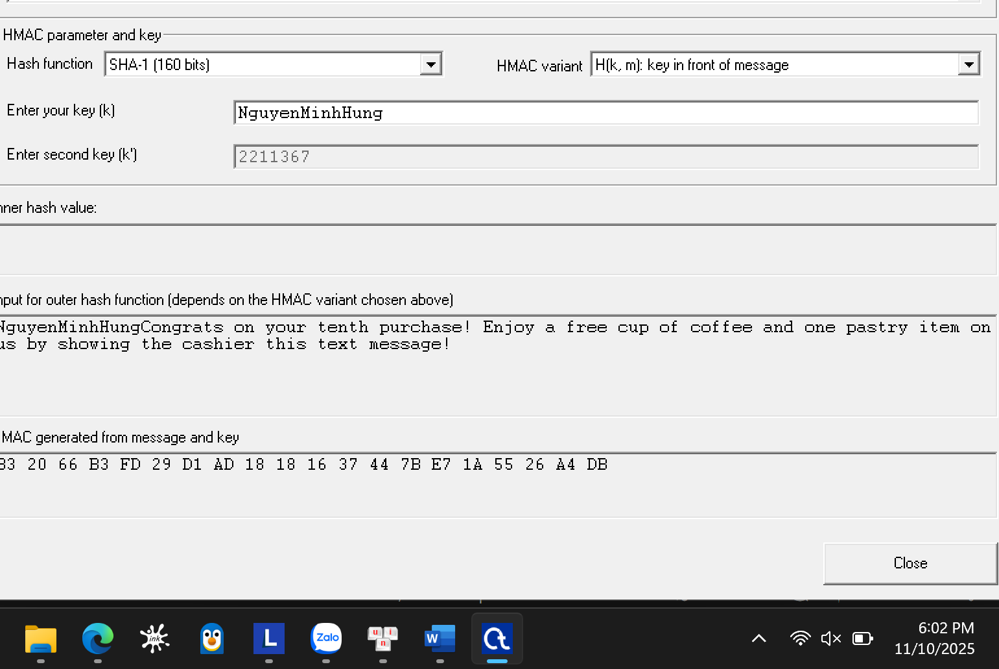
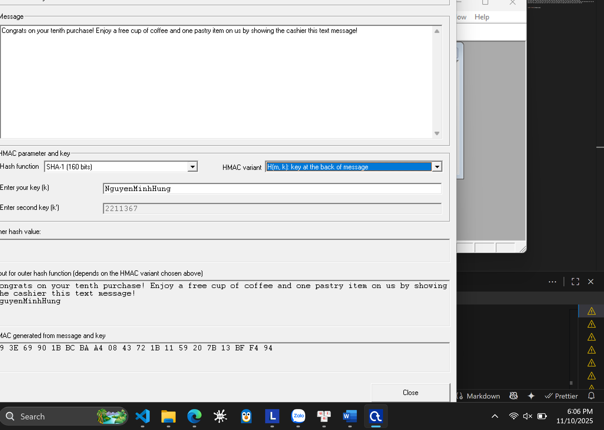
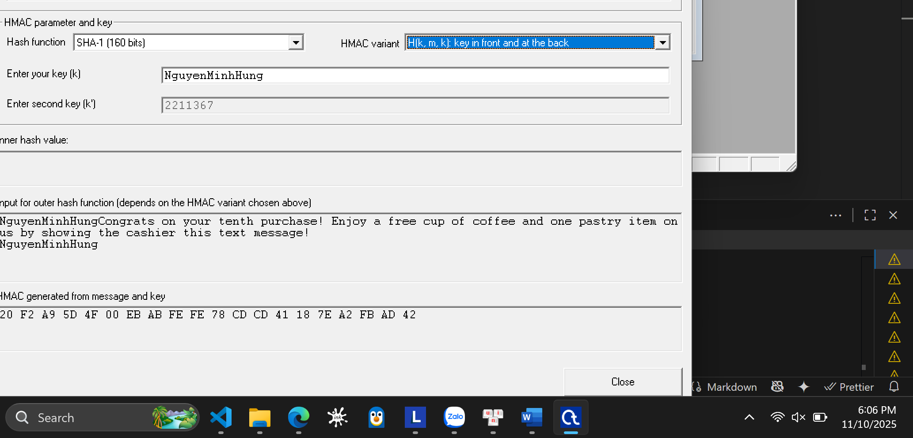
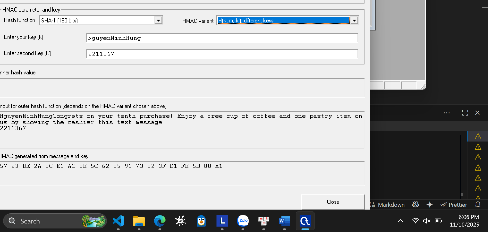
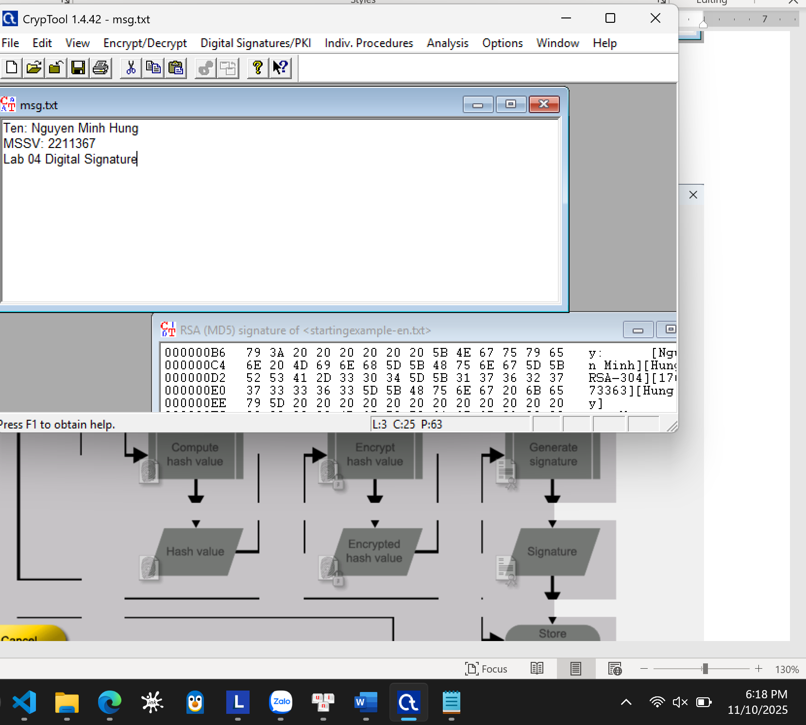
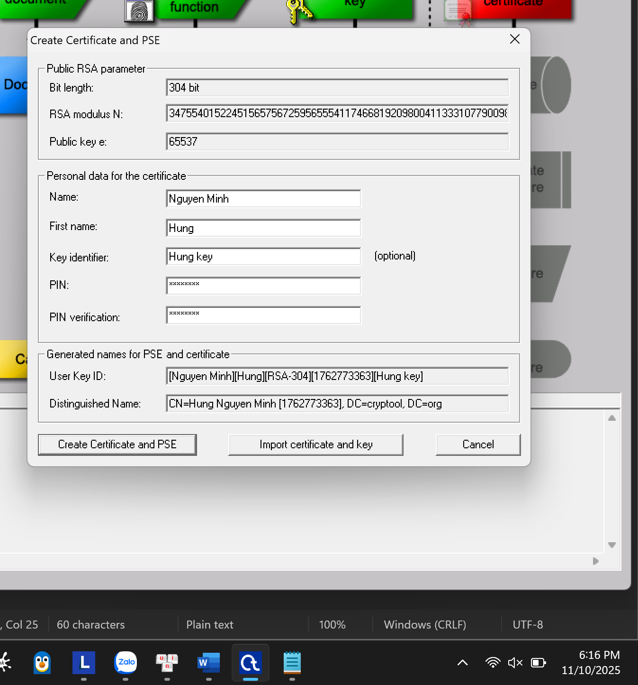
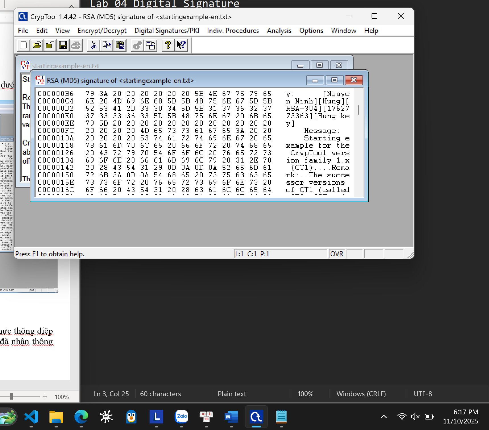

# BÀI THỰC HÀNH SỐ 4

**Môn:** MẬT MÃ & AN NINH MẠNG
**Họ tên:** Nguyễn Minh Hưng
**MSSV:** 2211367
**Nhóm:** L02

---

## Phần 1. Mã xác thực thông điệp MAC

### Câu 1.

**Thông điệp:**

```
Congrats on your tenth purchase! Enjoy a free cup of coffee and one pastry item on us by showing the cashier this text message!
```

**Khóa:** `NguyenMinhHung`
**Khóa K’ (nếu có):**

---

### Hash function: MD5 (128 bits)

| Phương thức | Giá trị                                         |
| ----------- | ----------------------------------------------- |
| H(k,m)      | 9B 58 E3 19 DD 01 62 F8 E7 32 FE 04 E2 FB 6A 94 |
| H(m,k)      | 7B 3A F7 85 FA 2E 21 23 20 A9 10 28 0F C2 2D A8 |
| H(k,m,k)    | 93 ED 78 13 F5 3C 71 72 DD 40 82 27 2E 08 71 11 |
| H(k,m,k’)   | 92 E3 47 36 CB 9A 2D 88 9A 18 0E B1 6F C6 D8 5F |
| H(k,H(k,m)) | D0 E7 B7 F2 FE 6F 2C CC 38 1D 9D 81 60 E4 99 DD |

---

### Hash function: SHA-1 (160 bits)

| Phương thức | Giá trị                                                     |
| ----------- | ----------------------------------------------------------- |
| H(k,m)      | B3 20 66 B3 FD 29 D1 AD 18 18 16 37 44 7B E7 1A 55 26 A4 DB |
| H(m,k)      | 09 3E 69 90 1B BC BA A4 08 43 72 1B 11 59 20 7B 13 BF F4 94 |
| H(k,m,k)    | 20 F2 A9 5D 4F 00 EB AB FE FE 78 CD CD 41 18 7E A2 FB AD 42 |
| H(k,m,k’)   | 57 23 BE 2A 8C E1 AC 5E 5C 62 55 91 73 52 3F D1 FE 5B 88 A1 |
| H(k,H(k,m)) | 6A 58 96 2C 1B 35 54 59 40 E0 71 44 E3 56 46 54 50 D0 87 9F |

---

### Hash function: SHA-256 (256 bits)

| Phương thức | Giá trị                                                                                         |
| ----------- | ----------------------------------------------------------------------------------------------- |
| H(k,m)      | 3E 08 97 D9 8A 7C F9 AC 98 BB E5 F3 EF 41 C2 7E 9D 5E BC B3 91 1B 79 1E 16 A9 FC FD C4 2E 52 B0 |
| H(m,k)      | 69 65 8D 88 3B 22 CE CF F9 AB 2E EC A2 7D A6 63 35 4F F1 B3 61 0C 98 00 DE A3 2B 3A D1 E1 64 00 |
| H(k,m,k)    | 59 A4 2C F8 5F 0B 48 B7 DE 22 73 A4 E1 C5 17 39 19 18 25 74 C4 85 80 1F 6A A0 C5 0E 3E 91 8D 17 |
| H(k,m,k’)   | 84 8E C4 79 89 04 2B 12 79 77 53 34 2F F7 E6 44 62 F0 A0 FC 96 6F B3 5D 43 E8 CD FF F8 A8 84 33 |
| H(k,H(k,m)) | DE F7 A8 F4 E4 87 B0 8F E0 8E D0 48 4C 2B 1B A0 3B 22 AC 75 80 86 0F 30 02 C3 61 66 66 FB 7B 2A |

---

### Hash function: SHA-512 (512 bits)

| Phương thức | Giá trị                                                                                                                                                                                         |
| ----------- | ----------------------------------------------------------------------------------------------------------------------------------------------------------------------------------------------- |
| H(k,m)      | 3B 5D 06 AE B3 96 42 7E 0C EB 2B 94 AE 0E 37 82 4E EA 5D CB 5D 52 5C 53 8F 07 BF 62 71 91 4E 1D 2A 58 AC A4 BA D4 EC DD B4 A5 42 B8 5D 2C 27 85 6F 07 71 C6 CC 80 10 89 F6 03 C7 D5 E9 77 34 69 |
| H(m,k)      | F4 9D AF 41 8B 2B 2F FA 2C 0A 17 3A 0A 8D DA 7E B6 68 94 C0 D6 D3 FA DA 3B 95 EE EB 68 4E 3A 8D F6 62 68 B1 23 9D 88 75 9A F3 4E E8 C7 CC 1C 1C 68 5B A6 27 34 5E 92 72 9B AA 1A 5A 8C 35 CC AA |
| H(k,m,k)    | 49 68 B7 2B 89 E5 51 CF D4 E1 3B CA 78 0A 0A 98 84 2E 40 EB B0 C0 D6 63 60 C6 B6 86 53 D7 A2 A0 61 EF F1 24 7F BA 85 85 46 78 8D 23 8A 15 E9 D2 0C 66 8D 96 E3 3B CB E6 3E 74 5C 73 D3 93 F0 C5 |
| H(k,m,k’)   | 23 28 D4 6B 0C 65 CC 2E 80 DC 96 F2 C8 B5 FF 97 70 96 EF CE E0 BE D0 53 65 C8 D3 B2 2B FB EF 40 DD 88 6F 5D E2 96 49 84 F4 39 C9 E1 6E 15 4E C9 83 67 EE A2 84 04 2E 73 4C 31 C7 A8 39 3E FB A1 |
| H(k,H(k,m)) | 59 CE 99 84 57 AF 52 EF C1 A8 53 50 60 68 43 CD 92 3A 90 D8 8F C4 94 4B DB 96 38 59 6B 64 57 53 70 5B 03 D7 19 93 6A 20 95 06 1A FC EF 97 3C 98 3E 24 DD EF 1D BB DD F8 E6 2F ED 92 8A C7 D5 D5 |

---

### Hình ảnh minh họa







### Câu 2. Những hình thức tấn công dựa trên xác thực thông điệp

| Loại tấn công                            | Mục tiêu chính     | Đặc điểm nổi bật                          | Ứng dụng                                        |
| ---------------------------------------- | ------------------ | ----------------------------------------- | ----------------------------------------------- |
| Tấn công ngày sinh nhật                  | Hàm băm            | Khai thác xung đột hàm băm (collisions).  | Phá vỡ tính toàn vẹn dữ liệu, kiểm tra hàm băm. |
| Tấn công phân tích khai thác mã cấu trúc | Thuật toán mật mã  | Phân tích toán học cấu trúc thuật toán.   | Tấn công DES, AES, hoặc hàm băm yếu.            |
| Tấn công brute-force                     | Khóa hoặc mật khẩu | Dễ thực hiện, nhưng tốn nhiều tài nguyên. | Tấn công mật khẩu yếu, khóa ngắn.               |

---

### Câu 3. Sự khác nhau giữa mã xác thực thông điệp (MAC) và hàm băm (Hash)

| Tiêu chí                | MAC                                                                                 | Hash                                                                            |
| ----------------------- | ----------------------------------------------------------------------------------- | ------------------------------------------------------------------------------- |
| Mục đích chính          | Xác thực thông điệp, đảm bảo tính toàn vẹn và xác thực giữa các bên.                | Tạo giá trị băm cố định từ dữ liệu, đảm bảo tính toàn vẹn của dữ liệu.          |
| Khóa bí mật             | Cần sử dụng khóa bí mật để tính toán và xác minh MAC.                               | Không sử dụng khóa, chỉ dựa trên dữ liệu đầu vào.                               |
| Đầu vào                 | - Dữ liệu (Message)<br>- Khóa bí mật (Key)                                          | Chỉ cần dữ liệu đầu vào.                                                        |
| Đầu ra                  | Mã xác thực (MAC) có độ dài cố định, phụ thuộc vào cả dữ liệu và khóa.              | Giá trị băm (Hash value) có độ dài cố định, chỉ phụ thuộc vào dữ liệu đầu vào.  |
| Tính xác thực           | Đảm bảo tính xác thực: Chỉ các bên có khóa bí mật mới có thể tạo hoặc xác minh MAC. | Không đảm bảo tính xác thực vì không có khóa bí mật.                            |
| Khả năng chống xung đột | Tốt, vì có thêm yếu tố khóa bí mật.                                                 | Tốt, nhưng phụ thuộc vào thuật toán băm (SHA-256 an toàn hơn MD5 hoặc SHA-1).   |
| Ứng dụng chính          | - Xác thực thông điệp trong giao tiếp bảo mật (TLS, IPSec)<br>- Bảo vệ giao dịch    | - Tạo dấu vân tay cho dữ liệu<br>- Kiểm tra tính toàn vẹn của file hoặc dữ liệu |
| Ví dụ thuật toán        | HMAC (Hash-based MAC), CMAC, CBC-MAC                                                | MD5, SHA-1, SHA-256                                                             |

## Phần 2. Chữ ký số
### Câu 1.Mô phỏng chữ ký số bằng chương trình Cryptool, thực hiện theo các bước như hướng dẫn tham khảo bên dưới, với đầu vào là tập tin msg.txt chứa thông tên đầy đủ và mã số sinh viên. Chụp ảnh màn hình từng bước như phần tham khảo.



### Câu 2: Các yêu cầu của chữ ký số

Một chữ ký số phải đảm bảo:
* **Tính xác thực:** Chứng minh đúng người gửi đã ký.
* **Tính toàn vẹn:** Đảm bảo thông điệp không bị sửa đổi.
* **Tính chống thoái thác:** Người gửi không thể chối bỏ việc mình đã ký.
* **Tính không thể giả mạo:** Không ai khác có thể tạo ra chữ ký giả mạo.

---
### Câu 3: Tranh chấp MAC và giải pháp Chữ ký số

#### Vấn đề của MAC (Mã xác thực thông điệp)

* **Nguyên nhân:** Cả người gửi (An) và người nhận (Ba) đều dùng chung một **khóa bí mật**.
* **Tranh chấp 1 (An thoái thác):** An gửi tin nhắn, sau đó chối bỏ. An đổ lỗi rằng chính Ba đã tự tạo tin nhắn giả mạo (vì Ba cũng biết khóa).
* **Tranh chấp 2 (Ba giả mạo):** Ba tự tạo tin nhắn giả, dùng khóa chung để tạo MAC, và nói dối là An gửi.
* **Kết luận:** Không thể chứng minh ai là người thực sự tạo ra MAC.

#### Giải pháp bằng Chữ ký số

* **Cách hoạt động:** An ký bằng **Khóa riêng tư** (chỉ An có). Ba kiểm tra bằng **Khóa công khai** (ai cũng có) của An.
* **Kết quả:**
    * An không thể thoái thác (vì chỉ Khóa riêng tư của An mới tạo được chữ ký đó).
    * Ba không thể giả mạo (vì Ba không có Khóa riêng tư của An).
* Chữ ký số cung cấp **tính chống thoái thác**, điều mà MAC không thể làm được.