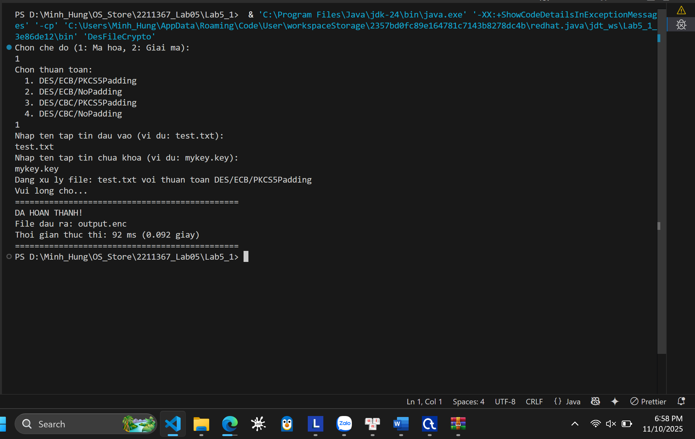
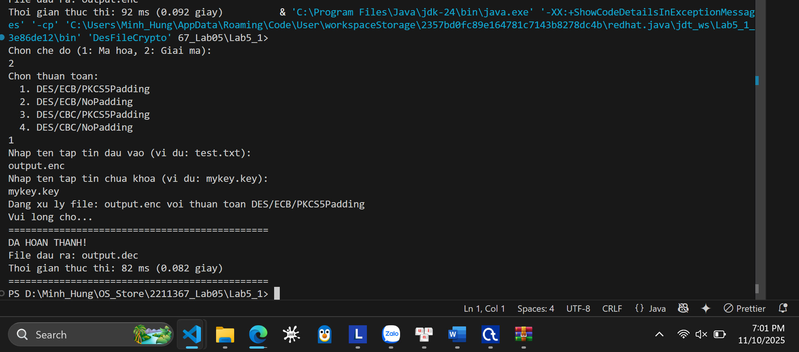
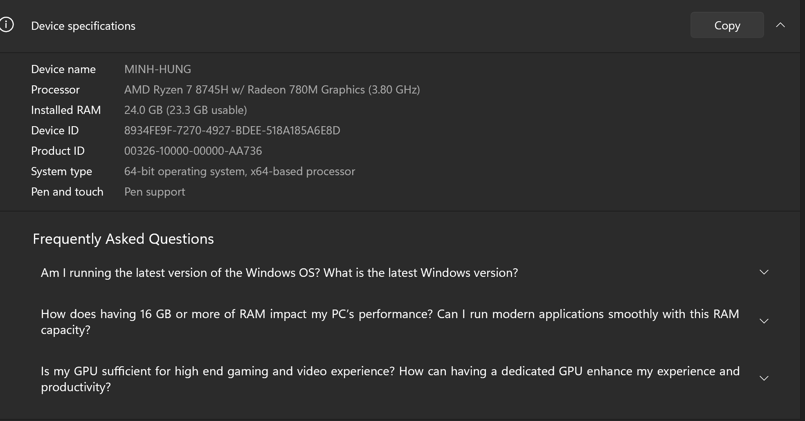
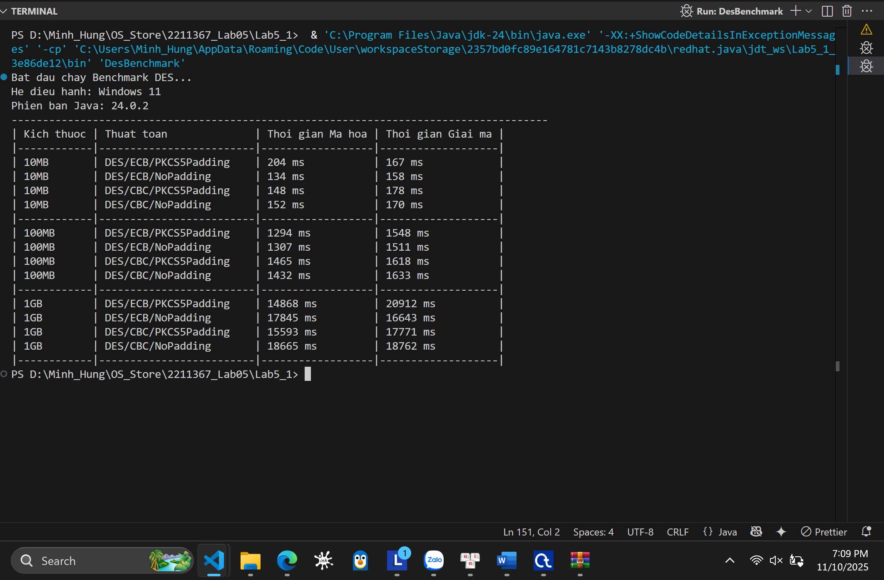
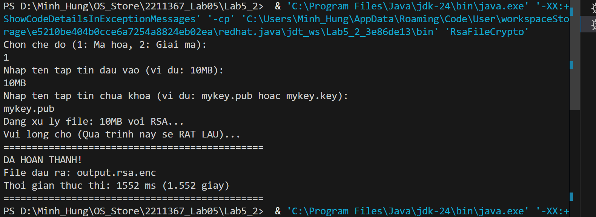
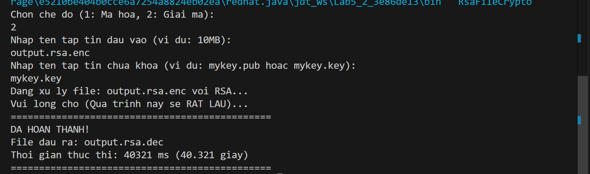
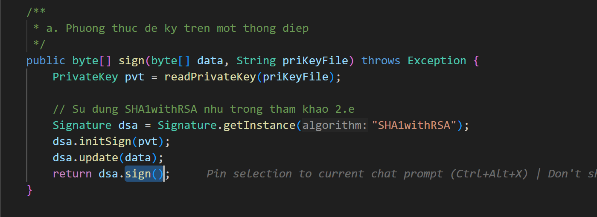
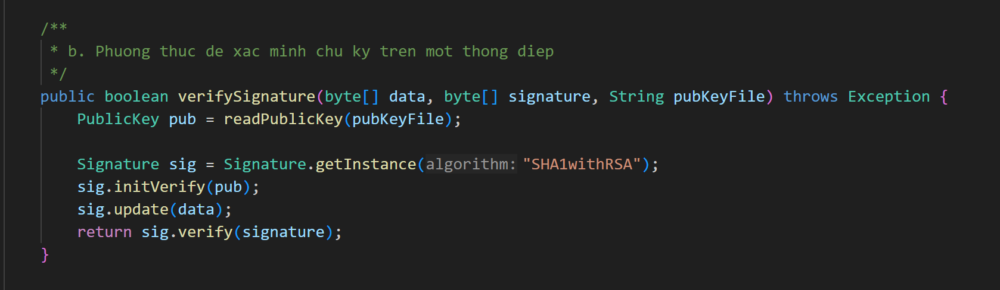
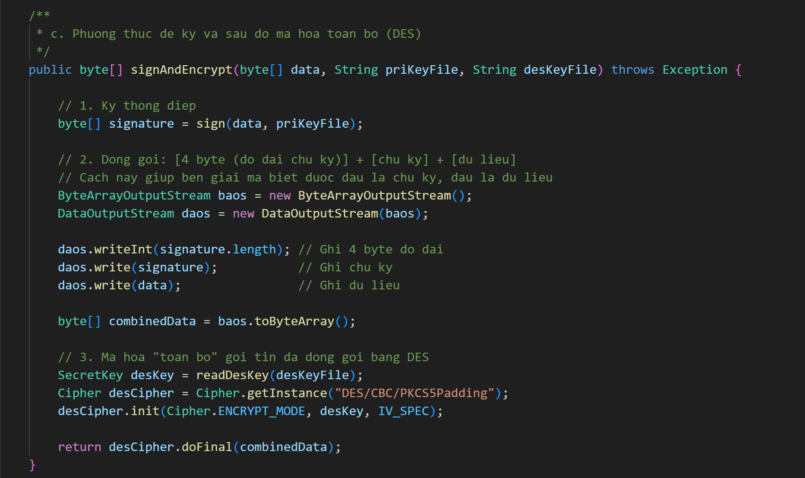
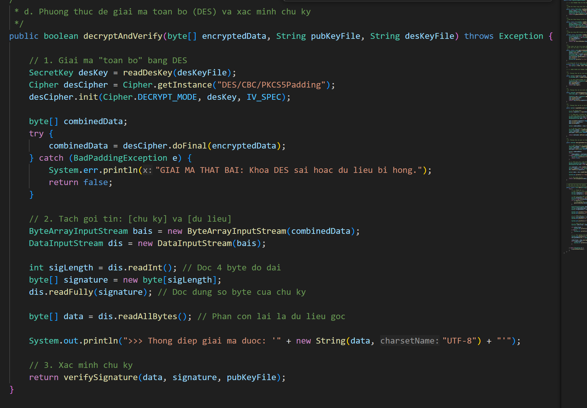

# BÀI THỰC HÀNH SỐ 5

**Môn:** MẬT MÃ & AN NINH MẠNG
**Họ tên:** Nguyễn Minh Hưng
**MSSV:** 2211367
**Nhóm:** L02

---

## 1.a

### Mã hóa

### Giải mã

---

## 1.b

### Cấu hình máy

---

## 2. Mã hóa & Giải mã

### Mã hóa

### Giải mã

---

## So sánh thời gian mã hóa/giải mã file 10MB (Câu 2)

### **1. Dữ liệu thực nghiệm**

####  Mã hóa RSA (Bất đối xứng)

* **Mã hóa (với Khóa Public):** `1552 ms` (≈ **1.55 giây**)
* **Giải mã (với Khóa Private):** `40321 ms` (≈ **40.32 giây**)

####  Mã hóa DES (Đối xứng)

* **Thời gian Mã hóa (Trung bình):**
  (204 + 134 + 148 + 152) / 4 = **159.5 ms** (≈ **0.16 giây**)
* **Thời gian Giải mã (Trung bình):**
  (167 + 158 + 178 + 170) / 4 = **168.25 ms** (≈ **0.17 giây**)

---

### **2. Phân tích & So sánh**

####  **Kết luận 1: DES (Đối xứng) nhanh hơn RSA (Bất đối xứng) rất nhiều**

* **Mã hóa:** RSA (`1552 ms`) **chậm hơn** DES (`159.5 ms`) khoảng **9.7 lần**.
* **Giải mã:** RSA (`40321 ms`) **chậm hơn** DES (`168.25 ms`) khoảng **240 lần**.

---

####  **Kết luận 2: Giải mã RSA chậm hơn đáng kể so với mã hóa RSA**

* **Mã hóa RSA:** 1.5 giây
* **Giải mã RSA:** hơn 40 giây
* **Nguyên nhân:**

  * RSA dùng **số mũ công khai `e` nhỏ** (ví dụ `65537`) → phép toán `C = M^e mod n` **nhanh**.
  * Giải mã dùng **khóa riêng `d` rất lớn** → phép toán `M = C^d mod n` **rất chậm**.

---

####  **Kết luận 3: DES có tốc độ ổn định và cực nhanh**

* Các chế độ DES đều **mã hóa và giải mã file 10MB trong < 0.2 giây**.
* **Thời gian mã hóa ≈ thời gian giải mã**, phản ánh đúng đặc tính của thuật toán **đối xứng**.

# Câu 3. Hiện thực các phương thức ký và xác minh chữ ký số

**Yêu cầu:**
Dựa trên các đoạn mã tham khảo ở phần *2e)*, hãy hoàn thiện chương trình và hiện thực các phương thức theo sơ đồ sau:

---

## a. Phương thức ký trên một thông điệp — `sign()`

**Mục đích:**
Tạo chữ ký số cho thông điệp bằng khóa bí mật của người gửi.

**Nguyên lý hoạt động:**

1. Băm thông điệp bằng một hàm băm an toàn (SHA-256, SHA-512, …).
2. Mã hóa giá trị băm bằng **khóa riêng (Private Key)** để tạo chữ ký số.
3. Trả về chữ ký số dưới dạng chuỗi hoặc mảng byte.

## b. Phương thức xác minh chữ ký — `verifySignature()`

**Mục đích:**
Xác thực rằng thông điệp chưa bị thay đổi và chữ ký được tạo bởi đúng người sở hữu khóa riêng.

**Nguyên lý hoạt động:**

1. Băm lại thông điệp gốc.
2. Giải mã chữ ký bằng **khóa công khai (Public Key)**.
3. So sánh giá trị băm vừa tính với giá trị băm giải mã được từ chữ ký.

## c. Phương thức ký và mã hóa toàn bộ thông điệp — `signAndEncrypt()`

**Mục đích:**

* Bảo đảm **tính xác thực + toàn vẹn** (bằng chữ ký số).
* Bảo đảm **tính bí mật** (bằng mã hóa đối xứng – DES).

**Nguyên lý hoạt động:**

1. Gọi hàm `sign()` để tạo chữ ký số cho thông điệp.
2. Gộp **thông điệp + chữ ký** lại thành một chuỗi.
3. Mã hóa toàn bộ chuỗi đó bằng **DES** với khóa đối xứng đã chia sẻ.

---

## d. Phương thức giải mã và xác minh chữ ký — `decryptAndVerify()`

**Mục đích:**
Giải mã thông điệp được mã hóa (DES) và kiểm tra tính xác thực bằng khóa công khai.

**Nguyên lý hoạt động:**

1. Giải mã dữ liệu nhận được bằng **khóa đối xứng DES**.
2. Tách thông điệp và chữ ký.
3. Gọi hàm `verifySignature()` để kiểm tra chữ ký.
