# BÀI THỰC HÀNH SỐ 7

| Thông tin  | Chi tiết              |
| ---------- | --------------------- |
| **Môn**    | Mật Mã & An Ninh Mạng |
| **Họ tên** | Nguyễn Minh Hưng      |
| **MSSV**   | 2211367               |
| **Nhóm**   | L02                   |

---

# IV. NỘI DUNG THỰC HIỆN

---

## 1. Đồ hình mạng triển khai

### a. Thiết lập WAN
- Cấu hình trên VMware: Chọn Network Adapter 1.
- Chế độ: Bridged (Automatic).
- Mục đích: Để pfSense có thể kết nối Internet trực tiếp, tải gói tin cập nhật và đóng vai trò Gateway cho các mạng con bên trong.
- Interface trong pfSense: em0.

### b. Thiết lập LAN, DMZ

1. Giao diện LAN:
   - Cấu hình VMware: Custom (VMnet2).
   - Tên Interface trong pfSense: em1.
   - Mục đích: Mạng nội bộ dành cho máy trạm (Kali Linux), được bảo vệ kỹ lưỡng.

2. Giao diện DMZ:
   - Cấu hình VMware: Custom (VMnet3).
   - Tên Interface trong pfSense: em2.
   - Mục đích: Vùng phi quân sự dành cho máy chủ (CentOS Web Server), cho phép truy cập từ ngoài nhưng bị hạn chế truy cập ngược vào LAN.
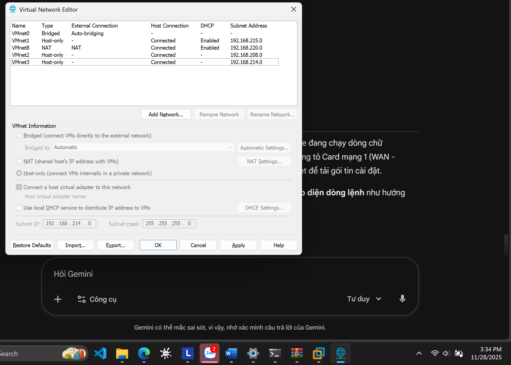
---

## 2. Tìm hiểu và cài đặt pfSense

### a. pfSense là gì?
pfSense là một bản phân phối phần mềm tường lửa (Firewall) và bộ định tuyến (Router) mã nguồn mở dựa trên hệ điều hành FreeBSD.
- Chức năng chính: Stateful Packet Filtering (Lọc gói tin theo trạng thái), Routing, VPN (IPsec, OpenVPN), DHCP Server, DNS Server, Load Balancing (Cân bằng tải).
- Ưu điểm: Miễn phí, cộng đồng hỗ trợ lớn, tính năng mạnh mẽ tương đương các thiết bị tường lửa thương mại đắt tiền, giao diện quản trị qua Web trực quan.
### b. Các bước cài đặt pfSense trên VMWare (kèm hình ảnh)
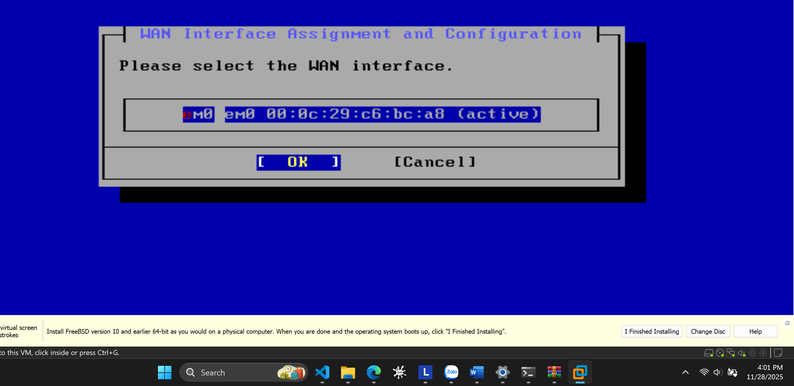
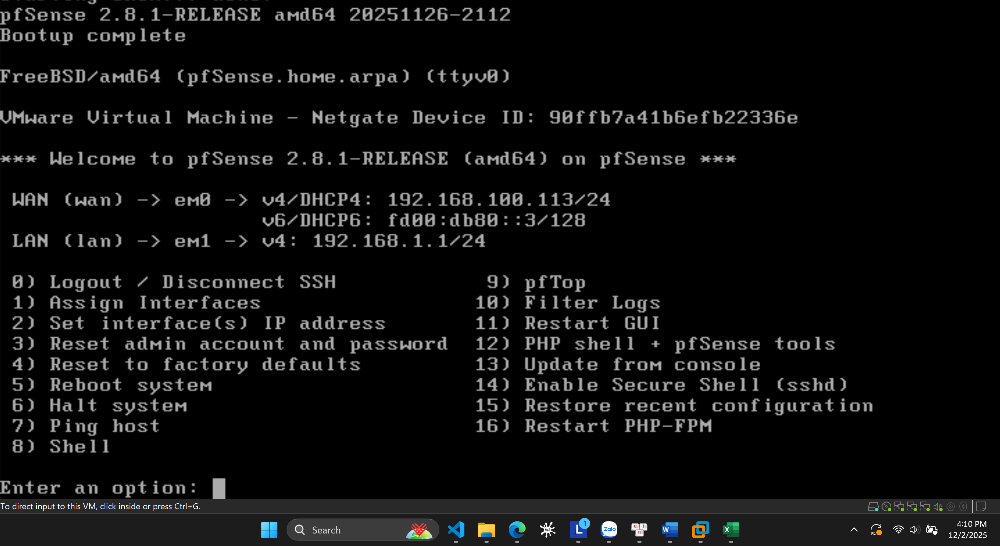
## 3. Cấu hình pfSense, máy trạm, máy chủ

### a. Cấu hình mạng pfSense

* Cấu hình giao diện WAN (Bridged)
* Cấu hình LAN – IP tĩnh: **192.168.1.1/24**
* Cấu hình DMZ – IP tĩnh: **192.168.2.1/24**
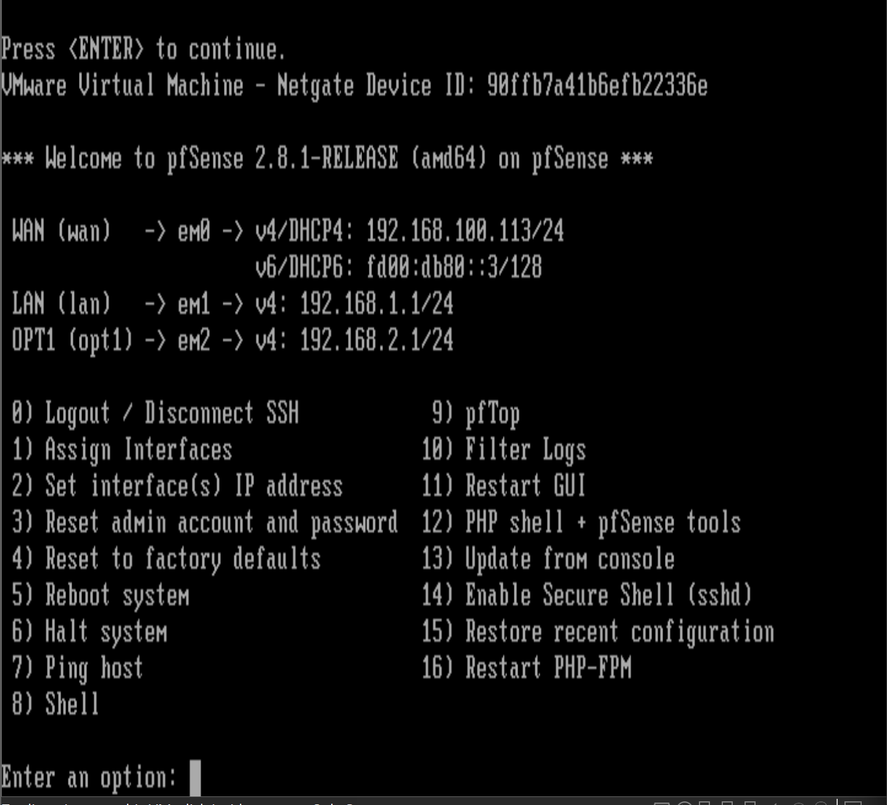

### b. Cấu hình máy trạm (Kali Linux)

* Cấu hình LAN (Internal Network – LAN) IP tĩnh/động
- Thiết lập Card mạng trên VMware: Kết nối vào VMnet2 (tương ứng vùng LAN).
- Chế độ cấu hình IPv4: IP Động (DHCP Client).
- Kết quả: Máy trạm nhận được IP từ pfSense (Ví dụ: 192.168.1.100/24).
- Default Gateway nhận được: 192.168.1.1.
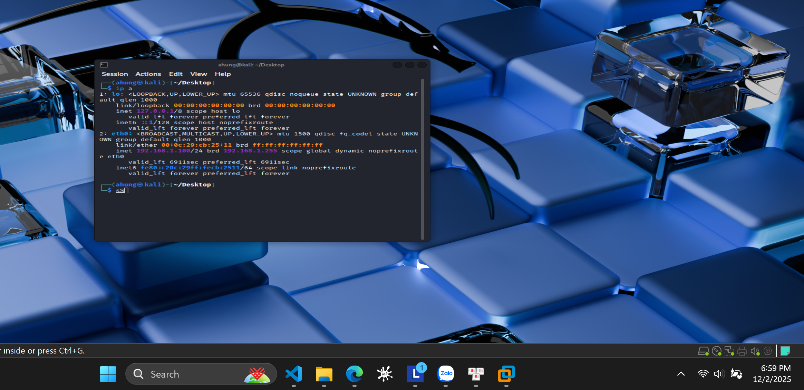

* Kiểm tra kết nối:
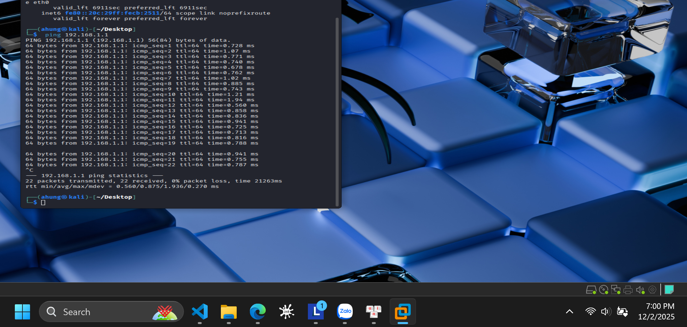
---

### c. Cấu hình máy chủ (CentOS 7)

* Cấu hình DMZ (Internal Network – DMZ), IP tĩnh
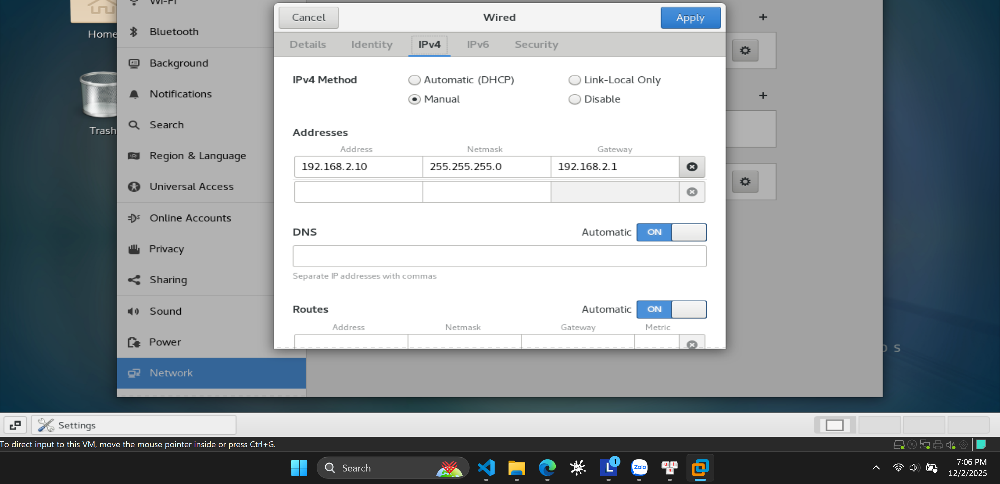
- Thiết lập Card mạng trên VMware: Kết nối vào VMnet3 (tương ứng vùng DMZ).
- Chế độ cấu hình IPv4: IP Tĩnh (Manual).
- IP Address: 192.168.2.10
- Subnet Mask: 255.255.255.0 (/24)
- Default Gateway: 192.168.2.1 (Trỏ về cổng DMZ của pfSense).
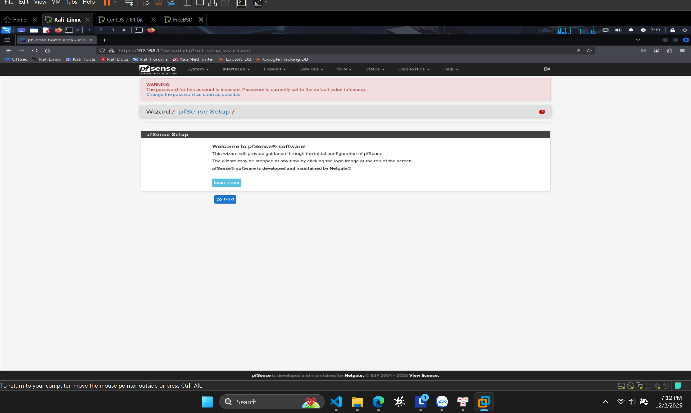
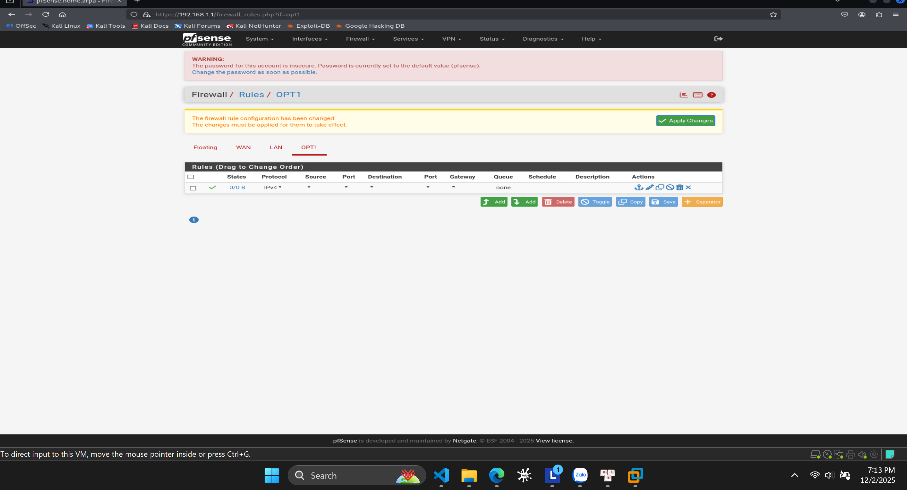
* Kiểm tra kết nối:
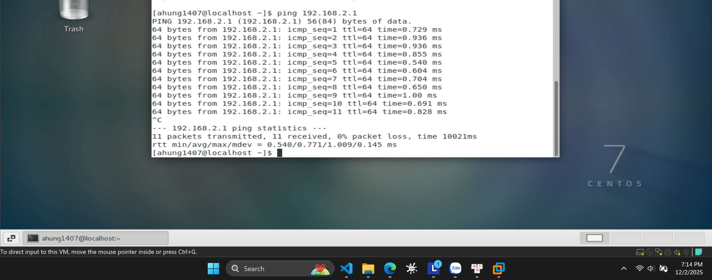

---

## 4. Cấu hình cơ bản tường lửa pfSense

### a. Cấu hình Outbound LAN
- Vào Firewall > Rules > LAN.
- Kiểm tra Rule mặc định: "Default allow LAN to any rule".
- Ý nghĩa: Cho phép toàn bộ lưu lượng từ mạng LAN (Source: LAN net) đi đến bất kỳ đâu (Destination: Any).
- Vào Firewall > NAT > Outbound: Chọn chế độ "Automatic outbound NAT" để tự động chuyển đổi địa chỉ IP nội bộ LAN sang IP WAN khi ra Internet.

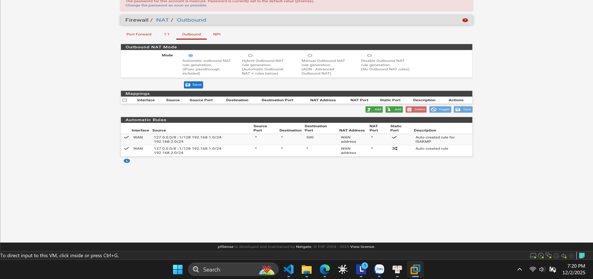
### b. Cấu hình Outbound DMZ
- Vào Firewall > Rules > DMZ (OPT1).
- Tạo Rule mới để cho phép Server truy cập Internet:
  + Action: Pass
  + Interface: DMZ
  + Protocol: Any
  + Source: DMZ net
  + Destination: Any
- Kết quả: Cho phép máy chủ trong vùng DMZ thực hiện các kết nối ra ngoài (ví dụ: cập nhật phần mềm, đồng bộ thời gian).
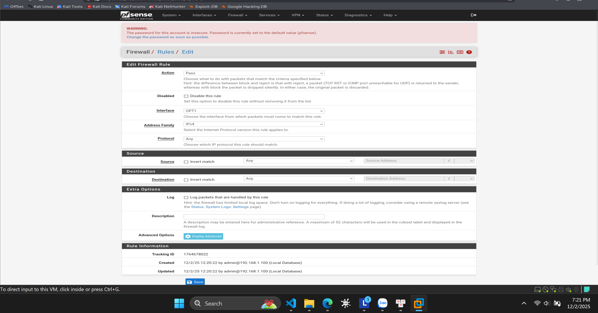

### c. Cấu hình bổ sung Outbound LAN
- Vào Interfaces > LAN.
- Tại mục "Reserved Networks", tích chọn "Block bogon networks".
- Ý nghĩa: Ngăn chặn lưu lượng từ các địa chỉ IP giả mạo hoặc chưa được cấp phát (bogon) đi vào giao diện LAN, tăng cường bảo mật cho mạng nội bộ.
Lưu ý: Do mạng WAN thực tế sử dụng dải 192.168.1.0/24, nên để tránh xung đột IP, giao diện LAN đã được cấu hình sang dải 192.168.10.1/24.
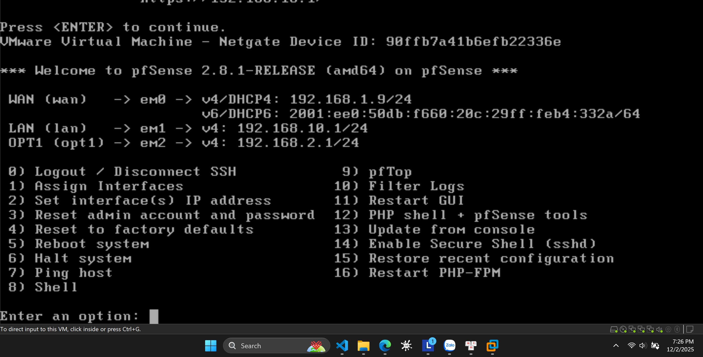
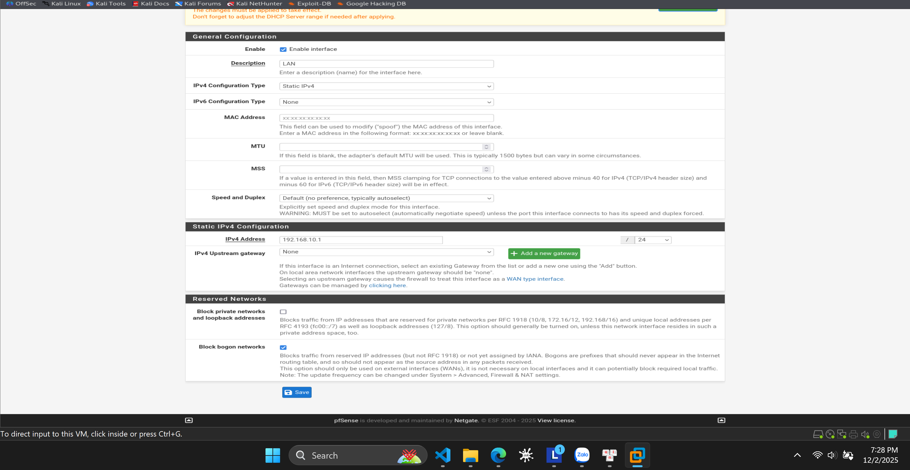
### d. Cấu hình bổ sung Outbound DMZ
- Mục đích: Ngăn chặn các kết nối từ vùng DMZ xâm nhập vào vùng mạng nội bộ (LAN) để đảm bảo an toàn nếu máy chủ DMZ bị tấn công.
- Thực hiện: Vào Firewall > Rules > Tab DMZ.
- Tạo Rule mới với Action là "Block".
- Source: DMZ net (Địa chỉ mạng vùng DMZ).
- Destination: LAN net (Địa chỉ mạng vùng LAN).
- Vị trí Rule: Đặt Rule Block này nằm trên cùng, trước Rule cho phép ra Internet (Allow Any).
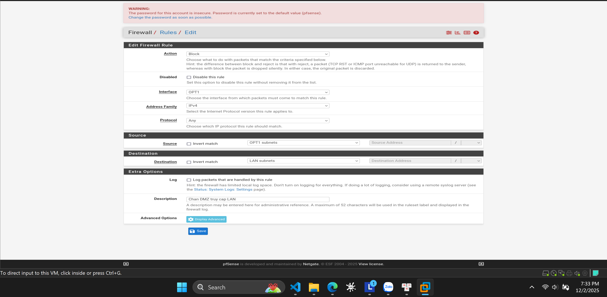
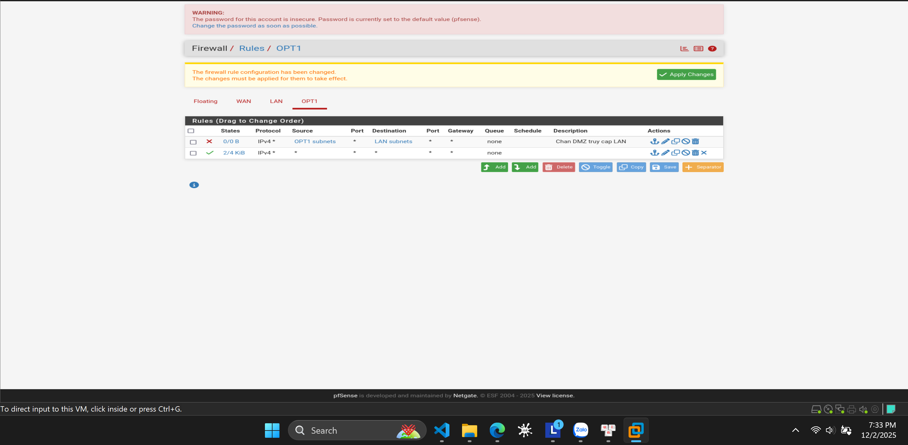

### e. Kiểm tra hoạt động tường lửa
1. Kiểm tra từ vùng LAN (Kali Linux):
   - Truy cập Internet (Google.com): Thành công.
   - Ping kiểm tra kết nối đến Server DMZ (192.168.2.10):
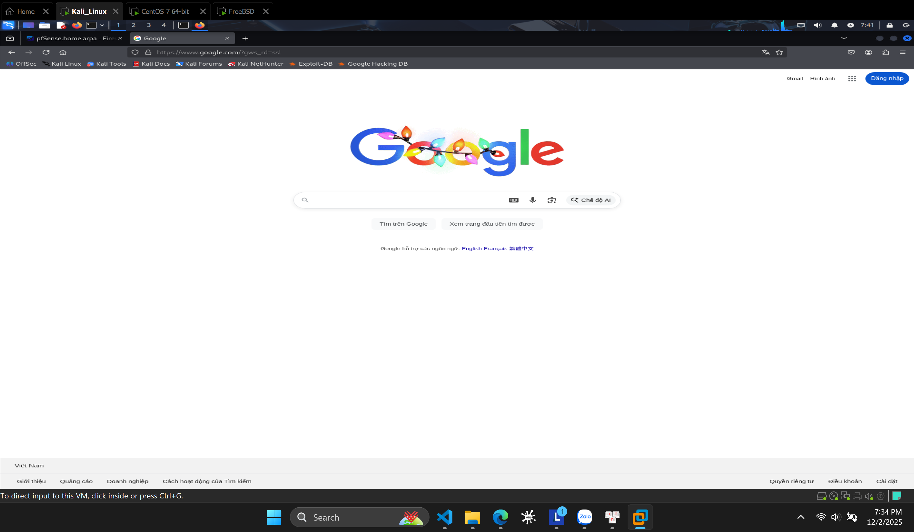

2. Kiểm tra từ vùng DMZ (CentOS 7):
   - Ping kiểm tra kết nối ra Internet (8.8.8.8):
     $ ping 8.8.8.8
     => Kết quả: Reply from 8.8.8.8... (Server ra được Internet để cập nhật).
   - Ping kiểm tra kết nối vào vùng LAN (192.168.1.1):
     $ ping 192.168.10.1
     => Kết quả: Packet filtered / Destination Host Unreachable (Tường lửa đã chặn thành công).
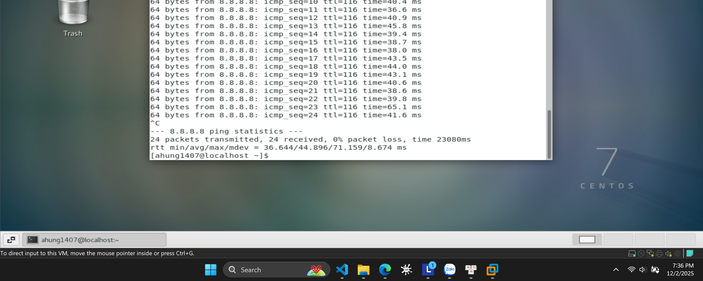
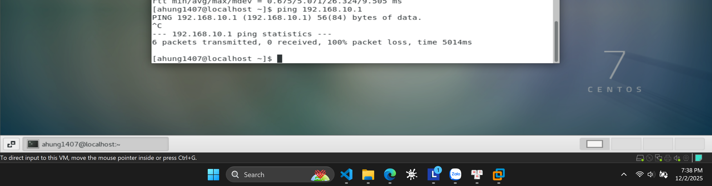
---

**– HẾT –**